# 🌱 FarmBalance — ERD (Entity-Relationship Diagram)

> **기반 문서**: 전체_통합.md (16개 엔티티)
> **DB**: PostgreSQL 16
> **ORM**: Spring Data JPA (Hibernate)
> **네이밍**: snake_case (DB) ↔ camelCase (Java Entity)

---

## 1. ER 다이어그램

```mermaid
erDiagram
    %% ===== 유저 도메인 =====
    users {
        bigint id PK
        varchar email UK
        varchar password
        varchar name
        varchar phone
        varchar role "GENERAL | FARMER | ADMIN | GOV"
        varchar region
        varchar status "ACTIVE | SUSPENDED"
        timestamp created_at
        timestamp updated_at
    }

    farms {
        bigint id PK
        bigint user_id FK
        varchar name
        varchar address
        decimal area_size "㎡"
        varchar soil_type
        varchar land_cert_image_url
        boolean land_cert_verified
        varchar status "PENDING | APPROVED | REJECTED"
        timestamp created_at
        timestamp updated_at
    }

    %% ===== 작물 도메인 =====
    crops {
        bigint id PK
        varchar code UK "ex: RICE_001"
        varchar name
        varchar category "곡류 | 채소 | 과일 | 특용"
        int growth_days
        decimal yield_per_sqm "㎡당 수확량(kg)"
        decimal avg_cost_per_sqm "㎡당 평균 비용(원)"
        jsonb climate_conditions
        varchar suitable_facility
        boolean is_active
        timestamp created_at
        timestamp updated_at
    }

    seed_registrations {
        bigint id PK
        bigint farm_id FK
        bigint crop_id FK
        varchar seed_type "SEED | SEEDLING | SAPLING"
        int quantity
        date purchase_date
        varchar source_store
        varchar receipt_image_url
        boolean verified
        timestamp created_at
    }

    crop_plans {
        bigint id PK
        bigint farm_id FK
        bigint seed_registration_id FK
        varchar crop_name
        date planting_date
        decimal target_yield "kg"
        decimal area "㎡"
        varchar status "PLANNED | IN_PROGRESS | COMPLETED | CANCELLED"
        boolean is_deleted "논리 삭제"
        timestamp created_at
        timestamp updated_at
    }

    harvests {
        bigint id PK
        bigint crop_plan_id FK
        decimal actual_yield "kg"
        date harvest_date
        varchar quality_grade "A | B | C | D"
        timestamp created_at
    }

    %% ===== 수급 도메인 =====
    balance_data {
        bigint id PK
        varchar region_code
        bigint crop_id FK
        int year
        varchar season "SPRING | SUMMER | AUTUMN | WINTER"
        decimal supply_forecast
        decimal demand_forecast
        decimal supply_ratio "공급/수요 비율(%)"
        varchar balance_status "EXCESS_WARN | EXCESS_CAUTION | BALANCED | SHORT_CAUTION | SHORT_WARN"
        timestamp calculated_at
        timestamp created_at
    }

    %% ===== 상점 도메인 =====
    products {
        bigint id PK
        bigint seller_id FK
        varchar name
        decimal price
        int stock
        text description
        varchar image_url
        varchar status "PENDING | ACTIVE | INACTIVE | REJECTED"
        timestamp created_at
        timestamp updated_at
    }

    orders {
        bigint id PK
        bigint buyer_id FK
        varchar order_number UK
        decimal total_amount
        varchar status "ORDERED | ACCEPTED | SHIPPED | COMPLETED | CANCELLED"
        varchar shipping_address
        timestamp created_at
        timestamp updated_at
    }

    order_items {
        bigint id PK
        bigint order_id FK
        bigint product_id FK
        int quantity
        decimal unit_price
        decimal subtotal
    }

    cart_items {
        bigint id PK
        bigint user_id FK
        bigint product_id FK
        int quantity
        timestamp created_at
    }

    %% ===== 커뮤니티 도메인 =====
    posts {
        bigint id PK
        bigint author_id FK
        varchar title
        text content
        varchar category "FREE | INFO | QNA"
        int view_count
        boolean is_notice
        boolean is_deleted
        timestamp created_at
        timestamp updated_at
    }

    comments {
        bigint id PK
        bigint post_id FK
        bigint author_id FK
        text content
        boolean accepted "답변 채택 여부"
        boolean is_deleted
        timestamp created_at
        timestamp updated_at
    }

    %% ===== 가게 도메인 =====
    stores {
        bigint id PK
        varchar name
        varchar address
        decimal lat
        decimal lng
        varchar phone
        varchar category
        varchar partner_status "NONE | PARTNER"
        boolean is_active
        timestamp created_at
        timestamp updated_at
    }

    %% ===== 정책 도메인 =====
    policy_data {
        bigint id PK
        varchar region_code
        varchar policy_name
        varchar category "보조금 | 자재지원 | 교육 | 기타"
        jsonb target_crops
        jsonb conditions
        decimal benefit_amount
        date application_deadline
        varchar source_url
        boolean is_active
        timestamp created_at
        timestamp updated_at
    }

    policy_matches {
        bigint id PK
        bigint user_id FK
        bigint policy_id FK
        bigint crop_id FK
        decimal match_score
        decimal estimated_benefit
        boolean document_generated
        varchar generated_doc_url
        timestamp created_at
    }

    %% ===== 알림 도메인 =====
    guide_messages {
        bigint id PK
        bigint sender_id FK "관리자/지자체"
        varchar target_type "ALL | REGION | CROP | USER"
        varchar target_value "지역코드 or 작물코드 등"
        varchar title
        text content
        varchar channel "IN_APP | SMS | EMAIL"
        timestamp sent_at
        timestamp created_at
    }

    notifications {
        bigint id PK
        bigint user_id FK
        varchar type "BALANCE_WARN | GUIDE | ORDER | POLICY | SYSTEM"
        varchar title
        text message
        varchar link
        boolean is_read
        timestamp created_at
    }

    %% ===== 관계 정의 =====
    users ||--o{ farms : "소유"
    users ||--o{ products : "판매"
    users ||--o{ orders : "주문"
    users ||--o{ cart_items : "장바구니"
    users ||--o{ posts : "작성"
    users ||--o{ comments : "작성"
    users ||--o{ policy_matches : "매칭이력"
    users ||--o{ notifications : "수신"

    farms ||--o{ seed_registrations : "종자등록"
    farms ||--o{ crop_plans : "파종계획"

    crops ||--o{ seed_registrations : "작물참조"
    crops ||--o{ balance_data : "수급데이터"
    crops ||--o{ policy_matches : "정책매칭"

    seed_registrations ||--o{ crop_plans : "계획연결"

    crop_plans ||--o| harvests : "수확실적"

    orders ||--|{ order_items : "주문항목"
    products ||--o{ order_items : "상품참조"
    products ||--o{ cart_items : "상품참조"

    posts ||--o{ comments : "댓글"

    policy_data ||--o{ policy_matches : "정책참조"

    users ||--o{ guide_messages : "발송"
```



---

## 2. 테이블 상세 명세

### 2.1 users (유저)

| 컬럼 | 타입 | 제약 | 설명 |
|------|------|------|------|
| id | BIGINT | PK, AUTO | 유저 고유 ID |
| email | VARCHAR(255) | UNIQUE, NOT NULL | 이메일 (로그인 ID) |
| password | VARCHAR(255) | NOT NULL | BCrypt 해싱 |
| name | VARCHAR(50) | NOT NULL | 이름 |
| phone | VARCHAR(20) | | 전화번호 |
| role | VARCHAR(20) | NOT NULL, DEFAULT 'GENERAL' | GENERAL / FARMER / ADMIN / GOV |
| region | VARCHAR(50) | | 지역 (양평군 등) |
| status | VARCHAR(20) | NOT NULL, DEFAULT 'ACTIVE' | ACTIVE / SUSPENDED |
| created_at | TIMESTAMP | NOT NULL | 가입일 |
| updated_at | TIMESTAMP | | 수정일 |

### 2.2 farms (농장)

| 컬럼 | 타입 | 제약 | 설명 |
|------|------|------|------|
| id | BIGINT | PK, AUTO | 농장 고유 ID |
| user_id | BIGINT | FK → users(id), NOT NULL | 소유자 |
| name | VARCHAR(100) | NOT NULL | 농장명 |
| address | VARCHAR(255) | NOT NULL | 농장 주소 |
| area_size | DECIMAL(10,2) | NOT NULL | 면적 (㎡) |
| soil_type | VARCHAR(50) | | 토양 유형 |
| land_cert_image_url | VARCHAR(500) | | 토지증명서 이미지/PDF URL |
| land_cert_verified | BOOLEAN | DEFAULT false | 관리자 토지증명서 검증 완료 여부 |
| status | VARCHAR(20) | NOT NULL, DEFAULT 'PENDING' | PENDING / APPROVED / REJECTED |
| created_at | TIMESTAMP | NOT NULL | 등록일 |
| updated_at | TIMESTAMP | | 수정일 |

### 2.3 crops (작물 마스터)

| 컬럼 | 타입 | 제약 | 설명 |
|------|------|------|------|
| id | BIGINT | PK, AUTO | 작물 고유 ID |
| code | VARCHAR(30) | UNIQUE, NOT NULL | 작물 코드 (ex: RICE_001) |
| name | VARCHAR(50) | NOT NULL | 작물명 |
| category | VARCHAR(20) | NOT NULL | 곡류 / 채소 / 과일 / 특용 |
| growth_days | INT | | 재배 기간 (일) |
| yield_per_sqm | DECIMAL(10,2) | | ㎡당 수확량 (kg) |
| avg_cost_per_sqm | DECIMAL(10,2) | | ㎡당 평균 비용 (원) |
| climate_conditions | JSONB | | 적합 기후 조건 |
| suitable_facility | VARCHAR(100) | | 적합 시설 |
| is_active | BOOLEAN | DEFAULT true | 활성 여부 |
| created_at | TIMESTAMP | NOT NULL | 등록일 |
| updated_at | TIMESTAMP | | 수정일 |

### 2.4 seed_registrations (종자 등록)

| 컬럼 | 타입 | 제약 | 설명 |
|------|------|------|------|
| id | BIGINT | PK, AUTO | 종자 등록 고유 ID |
| farm_id | BIGINT | FK → farms(id), NOT NULL | 농장 |
| crop_id | BIGINT | FK → crops(id), NOT NULL | 작물 |
| seed_type | VARCHAR(20) | NOT NULL | SEED(씨앗) / SEEDLING(종자) / SAPLING(모종) |
| quantity | INT | NOT NULL | 수량 |
| purchase_date | DATE | NOT NULL | 구매일 |
| source_store | VARCHAR(100) | | 구매처 |
| receipt_image_url | VARCHAR(500) | | 영수증 사진 URL |
| verified | BOOLEAN | DEFAULT false | 인증 여부 |
| created_at | TIMESTAMP | NOT NULL | 등록일 |

### 2.5 crop_plans (파종 계획)

| 컬럼 | 타입 | 제약 | 설명 |
|------|------|------|------|
| id | BIGINT | PK, AUTO | 파종 계획 고유 ID |
| farm_id | BIGINT | FK → farms(id), NOT NULL | 농장 |
| seed_registration_id | BIGINT | FK → seed_registrations(id) | 종자 등록 참조 |
| crop_name | VARCHAR(50) | NOT NULL | 작물명 (스냅샷) |
| planting_date | DATE | NOT NULL | 파종일 |
| target_yield | DECIMAL(10,2) | | 목표 수확량 (kg) |
| area | DECIMAL(10,2) | NOT NULL | 파종 면적 (㎡) |
| status | VARCHAR(20) | DEFAULT 'PLANNED' | PLANNED / IN_PROGRESS / COMPLETED / CANCELLED |
| is_deleted | BOOLEAN | DEFAULT false | 논리 삭제 (재배 의향 취소) |
| created_at | TIMESTAMP | NOT NULL | 등록일 |
| updated_at | TIMESTAMP | | 수정일 |

### 2.6 harvests (수확 실적)

| 컬럼 | 타입 | 제약 | 설명 |
|------|------|------|------|
| id | BIGINT | PK, AUTO | 수확 실적 고유 ID |
| crop_plan_id | BIGINT | FK → crop_plans(id), NOT NULL | 파종 계획 참조 |
| actual_yield | DECIMAL(10,2) | NOT NULL | 실제 수확량 (kg) |
| harvest_date | DATE | NOT NULL | 수확일 |
| quality_grade | VARCHAR(5) | | 품질 등급 (A/B/C/D) |
| created_at | TIMESTAMP | NOT NULL | 등록일 |

### 2.7 balance_data (수급 데이터)

| 컬럼 | 타입 | 제약 | 설명 |
|------|------|------|------|
| id | BIGINT | PK, AUTO | 수급 데이터 고유 ID |
| region_code | VARCHAR(20) | NOT NULL | 지역 코드 |
| crop_id | BIGINT | FK → crops(id), NOT NULL | 작물 |
| year | INT | NOT NULL | 연도 |
| season | VARCHAR(10) | NOT NULL | SPRING / SUMMER / AUTUMN / WINTER |
| supply_forecast | DECIMAL(12,2) | | 공급 예측량 |
| demand_forecast | DECIMAL(12,2) | | 수요 예측량 |
| supply_ratio | DECIMAL(5,2) | | 수급 비율 (%) |
| balance_status | VARCHAR(20) | | EXCESS_WARN / EXCESS_CAUTION / BALANCED / SHORT_CAUTION / SHORT_WARN |
| calculated_at | TIMESTAMP | | 최종 계산 시각 |
| created_at | TIMESTAMP | NOT NULL | 생성일 |

> **UNIQUE 제약**: (region_code, crop_id, year, season) 복합 유니크

### 2.8 products (상품)

| 컬럼 | 타입 | 제약 | 설명 |
|------|------|------|------|
| id | BIGINT | PK, AUTO | 상품 고유 ID |
| seller_id | BIGINT | FK → users(id), NOT NULL | 판매자 |
| name | VARCHAR(100) | NOT NULL | 상품명 |
| price | DECIMAL(10,2) | NOT NULL | 가격 (원) |
| stock | INT | NOT NULL, DEFAULT 0 | 재고 |
| description | TEXT | | 상품 설명 |
| image_url | VARCHAR(500) | | 상품 이미지 URL |
| status | VARCHAR(20) | DEFAULT 'PENDING' | PENDING / ACTIVE / INACTIVE / REJECTED |
| created_at | TIMESTAMP | NOT NULL | 등록일 |
| updated_at | TIMESTAMP | | 수정일 |

### 2.9 orders (주문)

| 컬럼 | 타입 | 제약 | 설명 |
|------|------|------|------|
| id | BIGINT | PK, AUTO | 주문 고유 ID |
| buyer_id | BIGINT | FK → users(id), NOT NULL | 구매자 |
| order_number | VARCHAR(30) | UNIQUE, NOT NULL | 주문 번호 |
| total_amount | DECIMAL(12,2) | NOT NULL | 총 금액 |
| status | VARCHAR(20) | DEFAULT 'ORDERED' | ORDERED / ACCEPTED / SHIPPED / COMPLETED / CANCELLED |
| shipping_address | VARCHAR(255) | | 배송 주소 |
| created_at | TIMESTAMP | NOT NULL | 주문일 |
| updated_at | TIMESTAMP | | 수정일 |

### 2.10 order_items (주문 항목)

| 컬럼 | 타입 | 제약 | 설명 |
|------|------|------|------|
| id | BIGINT | PK, AUTO | 주문 항목 고유 ID |
| order_id | BIGINT | FK → orders(id), NOT NULL | 주문 |
| product_id | BIGINT | FK → products(id), NOT NULL | 상품 |
| quantity | INT | NOT NULL | 수량 |
| unit_price | DECIMAL(10,2) | NOT NULL | 단가 (주문 시점 스냅샷) |
| subtotal | DECIMAL(10,2) | NOT NULL | 소계 |

### 2.11 cart_items (장바구니)

| 컬럼 | 타입 | 제약 | 설명 |
|------|------|------|------|
| id | BIGINT | PK, AUTO | 장바구니 고유 ID |
| user_id | BIGINT | FK → users(id), NOT NULL | 유저 |
| product_id | BIGINT | FK → products(id), NOT NULL | 상품 |
| quantity | INT | NOT NULL, DEFAULT 1 | 수량 |
| created_at | TIMESTAMP | NOT NULL | 담은 시각 |

> **UNIQUE 제약**: (user_id, product_id) 복합 유니크

### 2.12 posts (게시글)

| 컬럼 | 타입 | 제약 | 설명 |
|------|------|------|------|
| id | BIGINT | PK, AUTO | 게시글 고유 ID |
| author_id | BIGINT | FK → users(id), NOT NULL | 작성자 |
| title | VARCHAR(200) | NOT NULL | 제목 |
| content | TEXT | NOT NULL | 본문 |
| category | VARCHAR(10) | NOT NULL | FREE / INFO / QNA |
| view_count | INT | DEFAULT 0 | 조회수 |
| is_notice | BOOLEAN | DEFAULT false | 공지 여부 |
| is_deleted | BOOLEAN | DEFAULT false | 논리 삭제 |
| created_at | TIMESTAMP | NOT NULL | 작성일 |
| updated_at | TIMESTAMP | | 수정일 |

### 2.13 comments (댓글)

| 컬럼 | 타입 | 제약 | 설명 |
|------|------|------|------|
| id | BIGINT | PK, AUTO | 댓글 고유 ID |
| post_id | BIGINT | FK → posts(id), NOT NULL | 게시글 |
| author_id | BIGINT | FK → users(id), NOT NULL | 작성자 |
| content | TEXT | NOT NULL | 댓글 내용 |
| accepted | BOOLEAN | DEFAULT false | 답변 채택 여부 (Q&A) |
| is_deleted | BOOLEAN | DEFAULT false | 논리 삭제 |
| created_at | TIMESTAMP | NOT NULL | 작성일 |
| updated_at | TIMESTAMP | | 수정일 |

### 2.14 stores (가게)

| 컬럼 | 타입 | 제약 | 설명 |
|------|------|------|------|
| id | BIGINT | PK, AUTO | 가게 고유 ID |
| name | VARCHAR(100) | NOT NULL | 가게명 |
| address | VARCHAR(255) | NOT NULL | 주소 |
| lat | DECIMAL(10,7) | | 위도 |
| lng | DECIMAL(10,7) | | 경도 |
| phone | VARCHAR(20) | | 전화번호 |
| category | VARCHAR(50) | | 업종 |
| partner_status | VARCHAR(10) | DEFAULT 'NONE' | NONE / PARTNER (제휴 여부) |
| is_active | BOOLEAN | DEFAULT true | 활성 여부 |
| created_at | TIMESTAMP | NOT NULL | 등록일 |
| updated_at | TIMESTAMP | | 수정일 |

### 2.15 policy_data (지자체 정책)

| 컬럼 | 타입 | 제약 | 설명 |
|------|------|------|------|
| id | BIGINT | PK, AUTO | 정책 고유 ID |
| region_code | VARCHAR(20) | NOT NULL | 지역 코드 |
| policy_name | VARCHAR(200) | NOT NULL | 정책명 |
| category | VARCHAR(20) | NOT NULL | 보조금 / 자재지원 / 교육 / 기타 |
| target_crops | JSONB | | 대상 작물 목록 |
| conditions | JSONB | | 신청 조건 |
| benefit_amount | DECIMAL(12,2) | | 지원 금액 |
| application_deadline | DATE | | 신청 마감일 |
| source_url | VARCHAR(500) | | 원문 URL |
| is_active | BOOLEAN | DEFAULT true | 활성 여부 |
| created_at | TIMESTAMP | NOT NULL | 등록일 |
| updated_at | TIMESTAMP | | 수정일 |

### 2.16 policy_matches (정책 매칭 이력)

| 컬럼 | 타입 | 제약 | 설명 |
|------|------|------|------|
| id | BIGINT | PK, AUTO | 매칭 이력 고유 ID |
| user_id | BIGINT | FK → users(id), NOT NULL | 유저 |
| policy_id | BIGINT | FK → policy_data(id), NOT NULL | 정책 |
| crop_id | BIGINT | FK → crops(id), NOT NULL | 작물 |
| match_score | DECIMAL(5,2) | | 매칭 점수 |
| estimated_benefit | DECIMAL(12,2) | | 예상 수혜 금액 |
| document_generated | BOOLEAN | DEFAULT false | 공문 생성 여부 |
| generated_doc_url | VARCHAR(500) | | 생성된 공문 URL |
| created_at | TIMESTAMP | NOT NULL | 매칭 일시 |

### 2.17 guide_messages (권고 메시지)

| 컬럼 | 타입 | 제약 | 설명 |
|------|------|------|------|
| id | BIGINT | PK, AUTO | 메시지 고유 ID |
| sender_id | BIGINT | FK → users(id), NOT NULL | 발송자 (관리자/지자체) |
| target_type | VARCHAR(10) | NOT NULL | ALL / REGION / CROP / USER |
| target_value | VARCHAR(50) | | 대상 값 (지역코드, 작물코드 등) |
| title | VARCHAR(200) | NOT NULL | 제목 |
| content | TEXT | NOT NULL | 내용 |
| channel | VARCHAR(10) | NOT NULL | IN_APP / SMS / EMAIL |
| sent_at | TIMESTAMP | | 발송 시각 |
| created_at | TIMESTAMP | NOT NULL | 생성일 |

### 2.18 notifications (알림)

| 컬럼 | 타입 | 제약 | 설명 |
|------|------|------|------|
| id | BIGINT | PK, AUTO | 알림 고유 ID |
| user_id | BIGINT | FK → users(id), NOT NULL | 수신자 |
| type | VARCHAR(20) | NOT NULL | BALANCE_WARN / GUIDE / ORDER / POLICY / SYSTEM |
| title | VARCHAR(200) | NOT NULL | 알림 제목 |
| message | TEXT | | 알림 내용 |
| link | VARCHAR(500) | | 이동 링크 |
| is_read | BOOLEAN | DEFAULT false | 읽음 여부 |
| created_at | TIMESTAMP | NOT NULL | 생성일 |

---

## 3. 핵심 관계 요약

| 관계 | 카디널리티 | 설명 |
|------|-----------|------|
| users → farms | 1:N | 유저 한 명이 여러 농장 소유 가능 |
| farms → seed_registrations | 1:N | 농장별 여러 종자 등록 |
| farms → crop_plans | 1:N | 농장별 여러 파종 계획 |
| seed_registrations → crop_plans | 1:N | 종자 등록 1건에 여러 파종 계획 가능 |
| crop_plans → harvests | 1:1 | 파종 계획 1건에 수확 실적 1건 |
| crops → balance_data | 1:N | 작물별 지역·시즌 수급 데이터 |
| users → products | 1:N | 판매자가 여러 상품 등록 |
| users → orders | 1:N | 구매자가 여러 주문 |
| orders → order_items | 1:N | 주문 1건에 여러 항목 |
| users → posts | 1:N | 유저가 여러 게시글 작성 |
| posts → comments | 1:N | 게시글에 여러 댓글 |
| policy_data → policy_matches | 1:N | 정책 1건에 여러 매칭 이력 |
| users → notifications | 1:N | 유저에게 여러 알림 |

---

## 4. 인덱스 권장

```sql
-- 유저 조회
CREATE INDEX idx_users_email ON users(email);
CREATE INDEX idx_users_role ON users(role);
CREATE INDEX idx_users_region ON users(region);

-- 농장
CREATE INDEX idx_farms_user_id ON farms(user_id);
CREATE INDEX idx_farms_status ON farms(status);

-- 종자 등록
CREATE INDEX idx_seed_reg_farm_id ON seed_registrations(farm_id);
CREATE INDEX idx_seed_reg_crop_id ON seed_registrations(crop_id);

-- 파종 계획
CREATE INDEX idx_crop_plans_farm_id ON crop_plans(farm_id);
CREATE INDEX idx_crop_plans_status ON crop_plans(status);

-- 수급 데이터 (핵심 조회)
CREATE UNIQUE INDEX idx_balance_data_unique ON balance_data(region_code, crop_id, year, season);
CREATE INDEX idx_balance_data_status ON balance_data(balance_status);

-- 상품
CREATE INDEX idx_products_seller_id ON products(seller_id);
CREATE INDEX idx_products_status ON products(status);

-- 주문
CREATE INDEX idx_orders_buyer_id ON orders(buyer_id);
CREATE INDEX idx_orders_status ON orders(status);

-- 게시글
CREATE INDEX idx_posts_author_id ON posts(author_id);
CREATE INDEX idx_posts_category ON posts(category);

-- 알림 (빈번한 조회)
CREATE INDEX idx_notifications_user_id_read ON notifications(user_id, is_read);

-- 정책 매칭
CREATE INDEX idx_policy_matches_user_id ON policy_matches(user_id);
```
