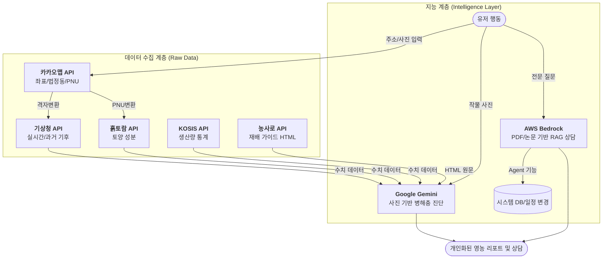

# 🌐 외부 API 통합 연동 명세서 (Total Specification)

> **작성일:** 2026-04-23  
> **버전:** v1.1 (AI 서비스 2종 추가 통합)  
> **관리 범위:** 기상청, 흙토람, 카카오맵, 농사로, KOSIS, Google Gemini, AWS Bedrock

---

## 1. 개요 (Overview)

FarmBalance 시스템은 5종의 데이터 수집 API와 **2종의 클라우드 AI 서비스(Gemini, Bedrock)**를 유기적으로 결합하여 농민에게 **지능형 수급 분석**과 **전문 영농 상담**을 제공한다. 본 문서는 시스템 전체의 데이터 파이프라인과 기술 표준을 정의한다.

### 1.1 개별 명세서 바로가기 (API Specs)

| 분류 | 명세서 명 | 핵심 역할 |
| :--- | :--- | :--- |
| **위치/기반** | [🗺️ 카카오맵 위치 명세서](file:///docs/api/API_카카오맵_위치서비스_명세서.md) | 주소 기반 좌표 및 법정동 코드 획득 |
| **환경/날씨** | [🌦️ 기상청 통합 명세서](file:///docs/api/API_기상청_통합_연동_명세서.md) | 실시간 예보 및 10년 과거 기후 기록 |
| **토양/분석** | [🧪 흙토람 토양 명세서](file:///docs/api/API_흙토람_토양정보_명세서.md) | 필지별 토양 7종 화학 성분 분석 |
| **재배/통계** | [📖 농사로 재배기술 명세서](file:///docs/api/API_농사로_재배기술_명세서.md) | HTML 재배 가이드 및 병해충 정보 |
| **수급/통계** | [📊 KOSIS 생산량통계 명세서](file:///docs/api/API_KOSIS_생산량통계_명세서.md) | 연도별 생산량 추이 및 주산지 분석 |
| **지능/AI (눈)** | [🤖 Google Gemini AI 명세서](file:///docs/api/API_Google_Gemini_AI_명세서.md) | 이미지 기반 병해충 진단 및 일반 상담 |
| **지능/AI (머리)** | [🔗 AWS Bedrock AI 명세서](file:///docs/api/API_AWS_Bedrock_AI_명세서.md) | 내부 문서 기반 RAG 상담 및 자동화 에이전트 |

---

## 2. 통합 데이터 파이프라인 (Data Pipeline)

유저의 행동 하나가 여러 API의 연쇄 반응을 일으키며 최종 지능형 서비스를 완성한다.

---

## 3. 외부 API 연동 매트릭스 (API Matrix)

| 서비스명 | 데이터 성격 | 호출 방식 | 캐싱 (Redis) | 보안 방식 | 핵심 활용처 |
| :--- | :--- | :--- | :---: | :---: | :--- |
| **카카오맵** | 위치 정보 | SDK/REST | 7일 | 도메인 제한 | 모든 기반 좌표계 |
| **기상청** | 수치 (날씨) | REST | 3시간 | API Key | 실시간 영농 알림 |
| **흙토람** | 수치 (토종) | REST | 24시간 | API Key | 토양 적합도 산출 |
| **농사로** | 텍스트 (재배) | REST | 7일 | API Key | 재배 기술 가이드 |
| **KOSIS** | 수치 (통계) | Batch | DB 저장 | API Key | 수강 밸런스 엔진 |
| **Google Gemini**| 지능 (AI) | REST | 1시간 | API Key | 사진 진단/요약/추천 |
| **AWS Bedrock** | 지능 (RAG) | SDK (IAM) | 24시간 | **IAM Role** | 내부 문서 상담/자동화|

---

## 4. 통합 기술 및 보안 표준

### 4.1 에러 처리 및 Fallback 전략
*   **AI 다운 시:** Gemini/Bedrock 장애 시 미리 정의된 **템플릿 기반 문장 자동 조합**으로 Fallback 한다.
*   **수치 API 다운 시:** 기상/토양 데이터 수집 실패 시 **AI가 '평년값'을 기준으로 답변**하도록 프롬프트를 조정한다.

### 4.2 보안 및 API 인증 체계
*   **이원화 체계:** 
    - **REST 방식:** Gemini, 기상청 등은 `.env`의 API Key를 Spring Boot Infra 계층에서 사용.
    - **인프라 방식:** Bedrock은 API Key 없이 **IAM Role(권한)**을 서버에 부여하여 인증 (가장 안전).
*   **BFF(Backend For Frontend):** 모든 외부 API 호출은 Next.js BFF를 거쳐 서버에서 수행하여 클라이언트 측 Key 노출을 원천 차단한다.

### 4.3 AI 할루시네이션(환각) 방지 공통 수칙
*   모든 AI 답변 화면에 **"AI 답변은 참고용이며 전문가 상담이 필요합니다"**라는 면책 문구를 필수 노출한다 (EXT-AI-001/002 준수).
*   출처가 명확한 RAG 답변(Bedrock)은 **참조 문서명과 페이지**를 반드시 표기한다.

---

## 5. 단계별 구현 로드맵 (Roadmap)

| 단계 | 구현 대상 | 핵심 과제 | 가시적 효과 |
| :---: | :--- | :--- | :--- |
| **1단계** | 카카오 + 기상청 | 주소 기반 좌표 획득 및 실시간 날씨 연동 | 우리 동네 날씨 알림 가능 |
| **2단계** | 흙토람 + KOSIS | 토양 적합도 및 생산량 데이터 DB 적재 | 수급 밸런스 차트 구현 |
| **3단계** | **Gemini AI** | 수치 데이터 → 자연어 추천 사유 생성 및 사진 진단 | 지능형 작물 추천 서비스 |
| **4단계** | **Bedrock AI** | 농업 매뉴얼 PDF 기반 RAG 및 업무자동화 에이전트 | 전문 지식 상담사 도입 |
| **5단계** | 고도화 | API 간 Fallback 로직 및 전사 알림 파이프라인 결합 | 시스템 안정성 확보 |

---

## 6. 결론 및 주의사항

1.  **AI 비용 관리:** Gemini는 Free Tier 내에서, Bedrock은 호출 최적화를 통해 비용 발생을 최소화한다.
2.  **데이터 소스 표기:** 각 API 데이터가 노출되는 화면하단에는 법정 출처(기상청, 흙토람, 농진청, 통계청, Google, Amazon)를 반드시 명시한다.
3.  **개인정보보호:** AI에 데이터를 전달하기 전 반드시 유저의 이름, 전화번호 등 민감 정보는 마스킹 처리한다.
