# 🌱 FarmBalance — ERD (Entity-Relationship Diagram)

> **기반 문서**: 전체_통합.md + ERD 최종 수정 계획서
> **DB**: PostgreSQL 16
> **ORM**: Spring Data JPA (Hibernate)
> **네이밍**: snake_case (DB) ↔ camelCase (Java Entity)

---

## 1. ER 다이어그램

```mermaid
erDiagram
    %% ===== 유저(User) 도메인 =====
    regions {
        bigint id PK
        varchar code UK "지역 코드 (41, 4183, 4183010 등)"
        varchar name "지역명"
        varchar type "PROVINCE | CITY | TOWN"
        bigint parent_id FK "상위 지역 (자기참조)"
        boolean is_active
        timestamp created_at
    }

    regions ||--o{ regions : "상위-하위"

    users {
        bigint id PK
        varchar email UK
        varchar password
        varchar name
        varchar phone
        varchar role "USER | FARMER | ADMIN | GOV"
        varchar region "지역명 문자열 (하위호환)"
        varchar region_code "FK → regions.code (시군구 코드)"
        varchar status "ACTIVE | SUSPENDED"
        varchar seller_status "판매자 승인 상태 (PENDING | APPROVED | REJECTED)"
        varchar business_number "사업자 등록번호"
        timestamp created_at
        timestamp updated_at
        timestamp deleted_at
    }

    regions ||--o{ users : "관할지역"

    %% ===== Farm(농장) 도메인 =====
    farms {
        bigint id PK
        bigint user_id FK
        varchar name
        varchar address
        varchar bjd_code "법정동코드 10자리"
        varchar pnu_code "필지코드 19자리"
        decimal latitude
        decimal longitude
        decimal area_size "㎡"
        varchar soil_type
        varchar business_number "사업자 등록번호"
        boolean land_cert_verified
        varchar status "PENDING | APPROVED | REJECTED"
        timestamp created_at
        timestamp updated_at
        timestamp deleted_at
    }

    cultivation_registrations {
        bigint id PK
        bigint farm_id FK
        bigint crop_id FK
        varchar seed_type "SEED | SEEDLING | SAPLING"
        decimal cultivation_area "재배 면적(㎡)"
        decimal farmer_estimated_yield "농가 입력 예상 생산량"
        decimal ai_predicted_yield "AI 예측 수확량"
        varchar yield_unit "g | kg | ton"
        timestamp created_at
        timestamp updated_at
        timestamp deleted_at
    }

    harvest_records {
        bigint id PK
        bigint cultivation_registration_id FK
        date harvest_date
        decimal yield_amount
        varchar grade
        boolean to_shop
        timestamp created_at
    }

    cultivation_history {
        bigint id PK
        bigint farm_id FK
        varchar history_type "WEATHER | FERTILIZER | PESTICIDE 등"
        jsonb content "이력 내용 (JSON)"
        timestamp created_at
    }

    %% ===== Balance(수급) 도메인 =====
    balance_data {
        bigint id PK
        varchar region_code
        bigint crop_id FK
        int year
        varchar season "SPRING | SUMMER | AUTUMN | WINTER"
        decimal supply_forecast
        decimal demand_forecast
        decimal supply_ratio "공급/수요 비율(%)"
        varchar balance_status "EXCESS_WARN | EXCESS_CAUTION | BALANCED | SHORT_CAUTION | SHORT_WARN"
        timestamp calculated_at
        timestamp created_at
        timestamp updated_at
        timestamp deleted_at
    }

    crop_production_stats {
        bigint id PK
        varchar itm_nm "KOSIS 작물명"
        varchar region_code
        varchar region_name "시도명"
        int year
        decimal cultivated_area
        decimal yield_per_10a
        decimal total_production
        varchar unit_nm "단위"
        timestamp created_at
        timestamp updated_at
        timestamp deleted_at
    }

    %% ===== Recommend(AI/외부데이터) 도메인 =====
    soil_exam_data {
        bigint id PK
        varchar pnu_code
        varchar addr_name "주소명"
        int exam_year
        date exam_date "검정일자"
        decimal ph
        decimal organic_matter
        decimal avail_phosphate
        decimal avail_silica
        decimal potassium
        decimal calcium
        decimal magnesium
        decimal ec
        varchar data_source
        timestamp created_at
        timestamp updated_at
        timestamp deleted_at
    }

    soil_fitness_data {
        bigint id PK
        varchar soil_crop_cd "흙토람 작물코드"
        varchar soil_crop_nm "작물명"
        varchar bjd_code
        varchar bjd_name "법정동명"
        int data_year
        decimal high_suit_area "최적지"
        decimal suit_area "적지"
        decimal poss_area "가능지"
        decimal low_suit_area "저위생산지"
        decimal etc_area "기타"
        timestamp created_at
        timestamp updated_at
        timestamp deleted_at
    }

    policy_data {
        bigint id PK
        varchar external_id "외부 API 제공 정책 고유번호"
        jsonb data "정책 API 응답 원본 JSON"
        timestamp fetched_at "수집 시각"
        timestamp created_at
        timestamp updated_at
        timestamp deleted_at
    }

    crop_guides {
        bigint id PK
        varchar sub_category_code "농사로 작물코드"
        varchar sub_category_nm "작물명"
        varchar ebook_code
        varchar ebook_name
        varchar ebook_pdf_url
        varchar ebook_img_url
        jsonb index_data
        int variety_count
        jsonb variety_data
        timestamp created_at
        timestamp updated_at
        timestamp deleted_at
    }

    pest_occurrence_reports {
        bigint id PK
        varchar cntnts_no UK "콘텐츠 번호"
        varchar title "보고서 제목"
        int report_year "연도"
        varchar pdf_url "다운로드 URL"
        varchar file_name "원본 파일명"
        date published_at "등록일"
        timestamp created_at
        timestamp updated_at
        timestamp deleted_at
    }

    %% ===== Shop(상점) 도메인 =====
    product_categories {
        bigint id PK
        varchar name UK "채소 | 과일 | 곡물 | 가공식품 등"
        varchar description
        int display_order
        boolean is_active
        timestamp created_at
        timestamp updated_at
        timestamp deleted_at
    }

    products {
        bigint id PK
        bigint seller_id FK
        bigint category_id FK
        bigint harvest_record_id FK "생산 이력 연계 (Nullable)"
        varchar name
        decimal price
        int stock
        text description
        int sales_count "누적 판매 수량"
        varchar status "PENDING | ACTIVE | INACTIVE | REJECTED"
        timestamp created_at
        timestamp updated_at
        timestamp deleted_at
    }

    orders {
        bigint id PK
        bigint buyer_id FK
        varchar order_number UK
        decimal total_amount
        varchar status "ORDERED | ACCEPTED | SHIPPED | COMPLETED | CANCELLED"
        varchar receiver_name
        varchar receiver_phone
        varchar shipping_address
        varchar shipping_memo
        varchar payment_method "결제 수단"
        varchar payment_id "결제 트랜잭션 ID"
        timestamp created_at
        timestamp updated_at
        timestamp deleted_at
    }

    order_items {
        bigint id PK
        bigint order_id FK
        bigint product_id FK
        int quantity
        decimal unit_price
        decimal subtotal
        timestamp created_at
        timestamp updated_at
        timestamp deleted_at
    }

    cart_items {
        bigint id PK
        bigint user_id FK
        bigint product_id FK
        int quantity
        timestamp created_at
        timestamp updated_at
        timestamp deleted_at
    }

    %% ===== 작물 마스터(Crop) 도메인 =====
    crop_categories {
        bigint id PK
        varchar name UK "곡류 | 채소 | 과일 | 특용 등"
        varchar description
        int display_order
        boolean is_active
        timestamp created_at
        timestamp updated_at
        timestamp deleted_at
    }

    crops {
        bigint id PK
        bigint category_id FK
        varchar code UK "ex: RICE_001"
        varchar name
        int growth_days
        decimal yield_per_sqm "㎡당 수확량(kg)"
        decimal avg_cost_per_sqm "㎡당 평균 비용(원)"
        jsonb climate_conditions "작물별 적정 재배 환경 조건"
        boolean is_active
        timestamp created_at
        timestamp updated_at
        timestamp deleted_at
    }

    %% ===== 커뮤니티(Community) 도메인 =====
    post_categories {
        bigint id PK
        varchar name UK "자유게시판 | 정보공유 | Q&A 등"
        varchar description
        int display_order
        boolean is_active
        timestamp created_at
        timestamp updated_at
        timestamp deleted_at
    }

    posts {
        bigint id PK
        bigint author_id FK
        bigint category_id FK
        varchar title
        text content
        int view_count
        boolean is_notice
        timestamp deleted_at
        timestamp created_at
        timestamp updated_at
    }

    comments {
        bigint id PK
        bigint post_id FK
        bigint author_id FK
        text content
        boolean accepted "답변 채택 여부"
        timestamp deleted_at
        timestamp created_at
        timestamp updated_at
    }

    %% ===== 공통/알림/관리자 도메인 =====
    uploads {
        bigint id PK
        varchar entity_type "PRODUCT | FARM_CERT | POST 등"
        bigint entity_id "대상 엔티티 PK"
        varchar file_type "IMAGE | DOCUMENT"
        varchar file_url
        varchar original_name "원본 파일명"
        int display_order "0 = 대표"
        timestamp created_at
        timestamp deleted_at
    }

    guide_messages {
        bigint id PK
        bigint sender_id FK "관리자/지자체"
        varchar target_type "ALL | REGION | CROP | USER"
        varchar target_value "지역코드 or 작물코드 등"
        varchar title
        text content
        varchar channel "IN_APP | SMS | EMAIL"
        timestamp sent_at
        timestamp created_at
        timestamp updated_at
        timestamp deleted_at
    }

    notifications {
        bigint id PK
        bigint user_id FK
        varchar type "BALANCE_WARN | GUIDE | ORDER | POLICY | SYSTEM"
        varchar title
        text message
        varchar link
        boolean is_read
        timestamp created_at
        timestamp updated_at
        timestamp deleted_at
    }

    download_history {
        bigint id PK
        bigint user_id FK
        varchar type "CULTIVATION | FARM 등"
        varchar format "CSV | XLSX"
        date start_date
        date end_date
        varchar town
        timestamp created_at
    }

    rag_categories {
        bigint id PK
        varchar name UK "정책 | 병해충 | 재배기술 | 매뉴얼 등"
        varchar description
        int display_order
        boolean is_active
        timestamp created_at
        timestamp updated_at
        timestamp deleted_at
    }

    rag_documents {
        bigint id PK
        bigint user_id FK "등록자 (users.id)"
        bigint category_id FK
        varchar title "문서 제목"
        varchar content_type "FILE | TEXT"
        text text_content "텍스트 내용 (content_type=TEXT)"
        varchar file_url "파일 경로/URL (content_type=FILE)"
        varchar file_name "원본 파일명"
        varchar file_type "PDF | TXT | MD | DOCX"
        varchar status "ACTIVE | DELETED"
        timestamp created_at
        timestamp updated_at
        timestamp deleted_at
    }

    %% ===== 관계 정의 =====
    users ||--o{ farms : "소유"
    users ||--o{ products : "판매"
    users ||--o{ orders : "주문"
    users ||--o{ cart_items : "장바구니"
    users ||--o{ posts : "작성"
    users ||--o{ comments : "작성"
    users ||--o{ notifications : "수신"
    users ||--o{ download_history : "다운로드이력"
    users ||--o{ guide_messages : "발송"
    users ||--o{ rag_documents : "등록"

    farms ||--o{ cultivation_registrations : "재배 등록"
    farms ||--o{ cultivation_history : "재배이력"

    cultivation_registrations ||--o{ harvest_records : "수확기록"
    harvest_records ||--o{ products : "상품화"

    crops ||--o{ cultivation_registrations : "작물참조"
    crops ||--o{ balance_data : "수급데이터"
    crop_categories ||--o{ crops : "분류"

    product_categories ||--o{ products : "분류"
    orders ||--|{ order_items : "주문항목"
    products ||--o{ order_items : "상품참조"
    products ||--o{ cart_items : "상품참조"

    post_categories ||--o{ posts : "분류"
    posts ||--o{ comments : "댓글"

    rag_categories ||--o{ rag_documents : "분류"
```



---

## 2. 테이블 상세 명세

### 2.1 Farm(농장) 도메인

#### farms (농장)
| 컬럼 | 타입 | 제약 | 설명 |
|------|------|------|------|
| id | BIGINT | PK, AUTO | 농장 고유 ID |
| user_id | BIGINT | FK → users(id), NOT NULL | 소유자 |
| name | VARCHAR(100) | NOT NULL | 농장명 |
| address | VARCHAR(255) | NOT NULL | 농장 주소 |
| bjd_code | VARCHAR(10) | | 법정동코드 (카카오 address.b_code) |
| pnu_code | VARCHAR(19) | | 필지코드 (bjd_code + 본번부번 조합) |
| latitude | DECIMAL(10,7) | | 위도 |
| longitude | DECIMAL(10,7) | | 경도 |
| area_size | DECIMAL(10,2) | NOT NULL | 면적 (㎡) |
| soil_type | VARCHAR(50) | | 토양 유형 |
| business_number | VARCHAR(12) | | 사업자 등록번호 |
| land_cert_verified | BOOLEAN | DEFAULT false | 관리자 토지증명서 검증 완료 여부 |
| status | VARCHAR(20) | NOT NULL, DEFAULT 'PENDING' | PENDING / APPROVED / REJECTED |
| created_at | TIMESTAMP | NOT NULL | 등록일 |
| updated_at | TIMESTAMP | | 수정일 |
| deleted_at | TIMESTAMP | | 삭제 시각 |

#### cultivation_registrations (재배 등록)
| 컬럼 | 타입 | 제약 | 설명 |
|------|------|------|------|
| id | BIGINT | PK, AUTO | 재배 등록 고유 ID |
| farm_id | BIGINT | FK → farms(id), NOT NULL | 농장 |
| crop_id | BIGINT | FK → crops(id), NOT NULL | 작물 |
| seed_type | VARCHAR(20) | NOT NULL | SEED(씨앗) / SEEDLING(종자) / SAPLING(모종) |
| cultivation_area | DECIMAL(10,2) | NOT NULL | 해당 작물의 재배 면적 (㎡) |
| farmer_estimated_yield | DECIMAL(12,2) | NOT NULL | 농가가 입력한 예상 총 생산량 |
| ai_predicted_yield | DECIMAL(12,2) | | AI 에이전트가 분석/예측한 예상 수확량 |
| yield_unit | VARCHAR(10) | | 수확량 단위 (kg, ton 등) |
| created_at | TIMESTAMP | NOT NULL | 등록일 |
| updated_at | TIMESTAMP | | 수정일 |
| deleted_at | TIMESTAMP | | 삭제 시각 |

#### harvest_records (수확 이력 - 신규)
생산량 트래킹 및 커머스와의 연계를 위한 수확 기록 테이블입니다.
| 컬럼 | 타입 | 제약 | 설명 |
|------|------|------|------|
| id | BIGINT | PK, AUTO | 고유 ID |
| cultivation_registration_id | BIGINT | FK → cultivation_registrations(id), NOT NULL | 대상 재배 등록 건 |
| harvest_date | DATE | NOT NULL | 실제 수확일 |
| yield_amount | DECIMAL(12,2) | NOT NULL | 실제 수확량 |
| grade | VARCHAR(20) | | 품질 등급 (특, 상, 보통 등) |
| to_commerce | BOOLEAN | DEFAULT false | 커머스 상품화 여부 |
| created_at | TIMESTAMP | NOT NULL | 등록일 |

#### cultivation_history (농장 재배 이력 및 기상 정보)
| 컬럼 | 타입 | 제약 | 설명 |
|------|------|------|------|
| id | BIGINT | PK, AUTO | 고유 ID |
| farm_id | BIGINT | FK → farms(id), NOT NULL | 대상 농장 |
| history_type | VARCHAR(20) | NOT NULL | 이력 유형 (WEATHER / FERTILIZER / PESTICIDE 등) |
| content | JSONB | NOT NULL | 이력 내용 (JSON) |
| created_at | TIMESTAMP | NOT NULL, DEFAULT NOW() | 생성 시각 |

### 2.2 Balance(수급) 도메인

#### balance_data (수급 예측 데이터)
| 컬럼 | 타입 | 제약 | 설명 |
|------|------|------|------|
| id | BIGINT | PK, AUTO | 수급 데이터 고유 ID |
| region_code | VARCHAR(20) | NOT NULL | 지역 코드 |
| crop_id | BIGINT | FK → crops(id), NOT NULL | 작물 |
| year | INT | NOT NULL | 연도 |
| season | VARCHAR(10) | NOT NULL | SPRING / SUMMER / AUTUMN / WINTER |
| supply_forecast | DECIMAL(12,2) | | 공급 예측량 |
| demand_forecast | DECIMAL(12,2) | | 수요 예측량 |
| supply_ratio | DECIMAL(5,2) | | 수급 비율 (%) |
| balance_status | VARCHAR(20) | | EXCESS_WARN / EXCESS_CAUTION / BALANCED / SHORT_CAUTION / SHORT_WARN |
| calculated_at | TIMESTAMP | | 최종 계산 시각 |
| created_at | TIMESTAMP | NOT NULL | 생성일 |
| updated_at | TIMESTAMP | | 수정일 |
| deleted_at | TIMESTAMP | | 삭제 시각 |

#### crop_production_stats (KOSIS 작물별 생산량)
| 컬럼 | 타입 | 제약 | 설명 |
|------|------|------|------|
| id | BIGINT | PK, AUTO | 고유 ID |
| itm_nm | VARCHAR(50) | NOT NULL | 작물명 (KOSIS ITM_NM 파싱, 예: "양파") |
| region_code | VARCHAR(10) | NOT NULL | 시도코드 |
| region_name | VARCHAR(20) | | 시도명 |
| year | INT | NOT NULL | 통계 연도 |
| cultivated_area | DECIMAL(12,2) | | 재배면적(ha) |
| yield_per_10a | DECIMAL(10,2) | | 10a당 생산량(kg) |
| total_production | DECIMAL(14,2) | | 총 생산량(톤) |
| unit_nm | VARCHAR(10) | | 단위 |
| created_at | TIMESTAMP | NOT NULL | 적재일 |
| updated_at | TIMESTAMP | | 갱신일 |
| deleted_at | TIMESTAMP | | 삭제 시각 |

### 2.3 Recommend(AI/외부데이터) 도메인

이 도메인의 테이블들은 내부 엔티티(crops, farms 등)와 DB 레벨의 FK 제약 조건 없이 비즈니스 로직(조인 또는 어플리케이션 코드)으로 느슨하게 연결됩니다.

#### soil_exam_data (흙토람 필지별 토양 화학성)
| 컬럼 | 타입 | 제약 | 설명 |
|------|------|------|------|
| id | BIGINT | PK, AUTO | 고유 ID |
| pnu_code | VARCHAR(19) | NOT NULL | 필지코드 (논리적 farms.pnu_code 참조) |
| addr_name | VARCHAR(100) | | 주소명 |
| exam_year | INT | NOT NULL | 검정연도 |
| exam_date | DATE | | 검정일자 |
| ph | DECIMAL(4,2) | | 산도 |
| organic_matter | DECIMAL(6,2) | | 유기물(g/kg) |
| avail_phosphate | DECIMAL(8,2) | | 유효인산(mg/kg) |
| avail_silica | DECIMAL(8,2) | | 유효규산(mg/kg) |
| potassium | DECIMAL(6,3) | | 치환성 칼륨(cmolc/kg) |
| calcium | DECIMAL(6,3) | | 치환성 칼슘 |
| magnesium | DECIMAL(6,3) | | 치환성 마그네슘 |
| ec | DECIMAL(6,3) | | 전기전도도(dS/m) |
| data_source | VARCHAR(20) | NOT NULL | PARCEL / STAT_FALLBACK / DEFAULT |
| created_at | TIMESTAMP | NOT NULL | 적재일 |
| updated_at | TIMESTAMP | | 갱신일 |
| deleted_at | TIMESTAMP | | 삭제 시각 |

#### soil_fitness_data (흙토람 작물별 토양적성)
| 컬럼 | 타입 | 제약 | 설명 |
|------|------|------|------|
| id | BIGINT | PK, AUTO | 고유 ID |
| soil_crop_cd | VARCHAR(10) | NOT NULL | 작물코드 (논리적 crops 매핑 대상) |
| soil_crop_nm | VARCHAR(50) | NOT NULL | 작물명 |
| bjd_code | VARCHAR(10) | NOT NULL | 법정동코드 |
| bjd_name | VARCHAR(50) | | 법정동명 |
| data_year | INT | | 데이터 기준연도 |
| high_suit_area | DECIMAL(10,2) | | 최적지 면적 |
| suit_area | DECIMAL(10,2) | | 적지 면적 |
| poss_area | DECIMAL(10,2) | | 가능지 면적 |
| low_suit_area | DECIMAL(10,2) | | 저위생산지 면적 |
| etc_area | DECIMAL(10,2) | | 기타 면적 |
| created_at | TIMESTAMP | NOT NULL | 적재일 |
| updated_at | TIMESTAMP | | 갱신일 |
| deleted_at | TIMESTAMP | | 삭제 시각 |

#### policy_data (정책 API 데이터 저장소)
| 컬럼 | 타입 | 제약 | 설명 |
|------|------|------|------|
| id | BIGINT | PK, AUTO | 내부 고유 ID |
| external_id | VARCHAR(200) | UNIQUE, NOT NULL | 외부 API 제공 정책 고유번호 |
| data | JSONB | NOT NULL | 정책 API 응답 원본 |
| fetched_at | TIMESTAMP | NOT NULL | 수집 시각 |
| created_at | TIMESTAMP | NOT NULL | 등록일 |
| updated_at | TIMESTAMP | | 수정일 |
| deleted_at | TIMESTAMP | | 삭제 시각 |

#### crop_guides (농사로 재배 길잡이)
| 컬럼 | 타입 | 제약 | 설명 |
|------|------|------|------|
| id | BIGINT | PK, AUTO | 고유 ID |
| sub_category_code | VARCHAR(20) | NOT NULL | 작물코드 |
| sub_category_nm | VARCHAR(50) | NOT NULL | 작물명 |
| ebook_code | VARCHAR(10) | | 길잡이 코드 |
| ebook_name | VARCHAR(100) | | 길잡이명 |
| ebook_pdf_url | VARCHAR(500) | | PDF URL |
| ebook_img_url | VARCHAR(500) | | 표지 이미지 URL |
| index_data | JSONB | | 목차 (장/절 구조) |
| variety_count | INT | | 등록 품종 수 |
| variety_data | JSONB | | 주요 품종 정보 |
| created_at | TIMESTAMP | NOT NULL | 수집일 |
| updated_at | TIMESTAMP | | 갱신일 |
| deleted_at | TIMESTAMP | | 삭제 시각 |

#### pest_occurrence_reports (병해충 발생정보 보고서)
| 컬럼 | 타입 | 제약 | 설명 |
|------|------|------|------|
| id | BIGINT | PK, AUTO | 고유 ID |
| cntnts_no | VARCHAR(20) | UNIQUE, NOT NULL | 콘텐츠 번호 (API 응답) |
| title | VARCHAR(200) | NOT NULL | 보고서 제목 |
| report_year | INT | NOT NULL | 연도 |
| pdf_url | VARCHAR(500) | | PDF 다운로드 URL |
| file_name | VARCHAR(200) | | 원본 파일명 |
| published_at | DATE | | 등록일 |
| created_at | TIMESTAMP | NOT NULL | 적재일 |
| updated_at | TIMESTAMP | | 갱신일 |
| deleted_at | TIMESTAMP | | 삭제 시각 |

### 2.4 Shop(상점) 도메인

#### product_categories (상품 카테고리)
| 컬럼 | 타입 | 제약 | 설명 |
|------|------|------|------|
| id | BIGINT | PK, AUTO | 고유 ID |
| name | VARCHAR(50) | UNIQUE, NOT NULL | 카테고리명 (채소, 과일, 곡물 등) |
| description | VARCHAR(200) | | 설명 |
| display_order | INT | DEFAULT 0 | 표시 순서 |
| is_active | BOOLEAN | DEFAULT true | 활성 여부 |
| created_at | TIMESTAMP | NOT NULL | 등록일 |
| updated_at | TIMESTAMP | | 수정일 |
| deleted_at | TIMESTAMP | | 삭제 시각 |

#### products (상품)
| 컬럼 | 타입 | 제약 | 설명 |
|------|------|------|------|
| id | BIGINT | PK, AUTO | 상품 고유 ID |
| seller_id | BIGINT | FK → users(id), NOT NULL | 판매자 |
| category_id | BIGINT | FK → product_categories(id) | 상품 카테고리 |
| harvest_record_id | BIGINT | FK → harvest_records(id) | 생산 이력 연계 (Nullable) |
| name | VARCHAR(200) | NOT NULL | 상품명 |
| price | DECIMAL(10,2) | NOT NULL | 가격 (원) |
| stock | INT | NOT NULL, DEFAULT 0 | 재고 |
| description | TEXT | | 상품 설명 |
| sales_count | INT | NOT NULL, DEFAULT 0 | 누적 판매 수량 |
| status | VARCHAR(20) | DEFAULT 'PENDING' | PENDING / ACTIVE / INACTIVE / REJECTED |
| created_at | TIMESTAMP | NOT NULL | 등록일 |
| updated_at | TIMESTAMP | | 수정일 |
| deleted_at | TIMESTAMP | | 삭제 시각 |

#### orders (주문)
| 컬럼 | 타입 | 제약 | 설명 |
|------|------|------|------|
| id | BIGINT | PK, AUTO | 주문 고유 ID |
| buyer_id | BIGINT | FK → users(id), NOT NULL | 구매자 |
| order_number | VARCHAR(30) | UNIQUE, NOT NULL | 주문 번호 |
| total_amount | DECIMAL(12,2) | NOT NULL | 총 금액 |
| status | VARCHAR(20) | DEFAULT 'ORDERED' | ORDERED / ACCEPTED / SHIPPED / COMPLETED / CANCELLED |
| receiver_name | VARCHAR(50) | | 받는 분 |
| receiver_phone | VARCHAR(20) | | 받는 분 연락처 |
| shipping_address | VARCHAR(255) | | 배송 주소 |
| shipping_memo | VARCHAR(200) | | 배송 메모 |
| payment_method | VARCHAR(50) | | 결제 수단 (CARD, TRANSFER 등) |
| payment_id | VARCHAR(100) | | 결제 트랜잭션 ID |
| created_at | TIMESTAMP | NOT NULL | 주문일 |
| updated_at | TIMESTAMP | | 수정일 |
| deleted_at | TIMESTAMP | | 삭제 시각 |

#### order_items (주문 항목)
| 컬럼 | 타입 | 제약 | 설명 |
|------|------|------|------|
| id | BIGINT | PK, AUTO | 주문 항목 고유 ID |
| order_id | BIGINT | FK → orders(id), NOT NULL | 주문 |
| product_id | BIGINT | FK → products(id), NOT NULL | 상품 |
| quantity | INT | NOT NULL | 수량 |
| unit_price | DECIMAL(10,2) | NOT NULL | 단가 |
| subtotal | DECIMAL(10,2) | NOT NULL | 소계 |
| created_at | TIMESTAMP | NOT NULL | 생성일 |
| updated_at | TIMESTAMP | | 수정일 |
| deleted_at | TIMESTAMP | | 삭제 시각 |

#### cart_items (장바구니)
| 컬럼 | 타입 | 제약 | 설명 |
|------|------|------|------|
| id | BIGINT | PK, AUTO | 장바구니 고유 ID |
| user_id | BIGINT | FK → users(id), NOT NULL | 유저 |
| product_id | BIGINT | FK → products(id), NOT NULL | 상품 |
| quantity | INT | NOT NULL, DEFAULT 1 | 수량 |
| created_at | TIMESTAMP | NOT NULL | 담은 시각 |
| updated_at | TIMESTAMP | | 수정일 |
| deleted_at | TIMESTAMP | | 삭제 시각 |

---

### 2.5 Common(공통) 도메인

#### uploads (공통 업로드)
모든 도메인의 파일 첨부 및 이미지 업로드를 통합 관리하는 다형성(polymorphic) 테이블입니다.
| 컬럼 | 타입 | 제약 | 설명 |
|------|------|------|------|
| id | BIGINT | PK, AUTO | 고유 ID |
| entity_type | VARCHAR(30) | NOT NULL | 용도 구분 (PRODUCT / FARM_CERT / POST 등) |
| entity_id | BIGINT | NOT NULL | 대상 엔티티의 PK |
| file_type | VARCHAR(20) | NOT NULL | 파일 종류 (IMAGE / DOCUMENT) |
| file_url | VARCHAR(500) | NOT NULL | 파일 URL |
| original_name | VARCHAR(255) | | 원본 파일명 |
| display_order | INT | DEFAULT 0 | 표시 순서 (0 = 대표) |
| created_at | TIMESTAMP | NOT NULL | 등록일 |
| deleted_at | TIMESTAMP | | 삭제 시각 |

> **인덱스**: (entity_type, entity_id) 복합 인덱스 권장
> **용도**: 상품 이미지, 토지증명서, 커뮤니티 게시글 첨부파일 등을 이 단일 테이블에서 관리합니다.

---

### 2.6 정책 관리 및 RAG 도메인 (AI용)

#### rag_categories (RAG 문서 카테고리)
| 컬럼 | 타입 | 제약 | 설명 |
|------|------|------|------|
| id | BIGINT | PK, AUTO | 고유 ID |
| name | VARCHAR(50) | UNIQUE, NOT NULL | 카테고리명 (정책, 병해충, 재배기술, 매뉴얼 등) |
| description | VARCHAR(200) | | 설명 |
| display_order | INT | DEFAULT 0 | 표시 순서 |
| is_active | BOOLEAN | DEFAULT true | 활성 여부 |
| created_at | TIMESTAMP | NOT NULL | 등록일 |
| updated_at | TIMESTAMP | | 수정일 |
| deleted_at | TIMESTAMP | | 삭제 시각 |

#### rag_documents (RAG 문서 관리)
AI 챗봇(Bedrock RAG)에 인제스트할 소스 문서(주로 농업 정책 및 매뉴얼)를 관리합니다.
| 컬럼 | 타입 | 제약 | 설명 |
|------|------|------|------|
| id | BIGINT | PK, AUTO | 고유 ID |
| user_id | BIGINT | FK → users(id), NOT NULL | 등록자 |
| category_id | BIGINT | FK → rag_categories(id), NOT NULL | 문서 카테고리 |
| title | VARCHAR(200) | NOT NULL | 문서 제목 |
| content_type | VARCHAR(10) | NOT NULL | 저장 형태: FILE / TEXT |
| text_content | TEXT | | 텍스트 내용 (content_type=TEXT) |
| file_url | VARCHAR(500) | | 파일 경로/URL (content_type=FILE) |
| file_name | VARCHAR(200) | | 원본 파일명 |
| file_type | VARCHAR(10) | | 파일 형식: PDF / TXT / MD / DOCX |
| status | VARCHAR(20) | NOT NULL, DEFAULT 'ACTIVE' | ACTIVE / DELETED |
| created_at | TIMESTAMP | NOT NULL | 등록일 |
| updated_at | TIMESTAMP | | 수정일 |
| deleted_at | TIMESTAMP | | 삭제 시각 |

---

### 2.7 User(유저) 및 지역 도메인

#### regions (지역 마스터)
| 컬럼 | 타입 | 제약 | 설명 |
|------|------|------|------|
| id | BIGINT | PK, AUTO | 고유 ID |
| code | VARCHAR(10) | UNIQUE, NOT NULL | 지역 코드 ("41", "4183", "4183010" 등) |
| name | VARCHAR(30) | NOT NULL | 지역명 (경기도, 양평군, 양평읍 등) |
| type | VARCHAR(10) | NOT NULL | PROVINCE / CITY / TOWN |
| parent_id | BIGINT | FK → regions(id) | 상위 지역 |
| is_active | BOOLEAN | DEFAULT true | 활성 여부 |
| created_at | TIMESTAMP | DEFAULT NOW() | 등록일 |

#### users (유저)
| 컬럼 | 타입 | 제약 | 설명 |
|------|------|------|------|
| id | BIGINT | PK, AUTO | 유저 고유 ID |
| email | VARCHAR(255) | UNIQUE, NOT NULL | 이메일 (로그인 ID) |
| password | VARCHAR(255) | NOT NULL | BCrypt 해싱 |
| name | VARCHAR(50) | NOT NULL | 이름 |
| phone | VARCHAR(20) | | 전화번호 |
| role | VARCHAR(20) | NOT NULL, DEFAULT 'GENERAL' | GENERAL / FARMER / ADMIN / GOV |
| region | VARCHAR(50) | | 지역 (하위호환용 유지) |
| region_code | VARCHAR(10) | | 시군구 코드 (regions.code 참조) |
| status | VARCHAR(20) | NOT NULL, DEFAULT 'ACTIVE' | ACTIVE / SUSPENDED |
| created_at | TIMESTAMP | NOT NULL | 가입일 |
| updated_at | TIMESTAMP | | 수정일 |
| deleted_at | TIMESTAMP | | 삭제 시각 |

---

### 2.8 Crop(작물) 마스터 도메인

#### crop_categories (작물 카테고리)
| 컬럼 | 타입 | 제약 | 설명 |
|------|------|------|------|
| id | BIGINT | PK, AUTO | 고유 ID |
| name | VARCHAR(50) | UNIQUE, NOT NULL | 카테고리명 (곡류, 채소, 과일 등) |
| description | VARCHAR(200) | | 설명 |
| display_order | INT | DEFAULT 0 | 표시 순서 |
| is_active | BOOLEAN | DEFAULT true | 활성 여부 |
| created_at | TIMESTAMP | NOT NULL | 등록일 |
| updated_at | TIMESTAMP | | 수정일 |
| deleted_at | TIMESTAMP | | 삭제 시각 |

#### crops (작물 마스터)
| 컬럼 | 타입 | 제약 | 설명 |
|------|------|------|------|
| id | BIGINT | PK, AUTO | 작물 고유 ID |
| category_id | BIGINT | FK -> crop_categories(id), NOT NULL | 작물 카테고리 |
| code | VARCHAR(30) | UNIQUE, NOT NULL | 작물 코드 (ex: RICE_001) |
| name | VARCHAR(50) | NOT NULL | 작물명 |
| growth_days | INT | | 재배 기간 (일) |
| yield_per_sqm | DECIMAL(10,2) | | ㎡당 수확량 (kg) |
| avg_cost_per_sqm | DECIMAL(10,2) | | ㎡당 평균 비용 (원) |
| climate_conditions | JSONB | | 작물별 적정 재배 환경 조건 |
| is_active | BOOLEAN | DEFAULT true | 활성 여부 |
| created_at | TIMESTAMP | NOT NULL | 등록일 |
| updated_at | TIMESTAMP | | 수정일 |
| deleted_at | TIMESTAMP | | 삭제 시각 |

---

### 2.9 Community(커뮤니티) 도메인

#### post_categories (게시판 카테고리)
| 컬럼 | 타입 | 제약 | 설명 |
|------|------|------|------|
| id | BIGINT | PK, AUTO | 고유 ID |
| name | VARCHAR(50) | UNIQUE, NOT NULL | 카테고리명 |
| description | VARCHAR(200) | | 설명 |
| display_order | INT | DEFAULT 0 | 표시 순서 |
| is_active | BOOLEAN | DEFAULT true | 활성 여부 |
| created_at | TIMESTAMP | NOT NULL | 등록일 |
| updated_at | TIMESTAMP | | 수정일 |
| deleted_at | TIMESTAMP | | 삭제 시각 |

#### posts (게시글)
| 컬럼 | 타입 | 제약 | 설명 |
|------|------|------|------|
| id | BIGINT | PK, AUTO | 게시글 고유 ID |
| author_id | BIGINT | FK → users(id), NOT NULL | 작성자 |
| category_id | BIGINT | FK → post_categories(id), NOT NULL | 게시판 카테고리 |
| title | VARCHAR(200) | NOT NULL | 제목 |
| content | TEXT | NOT NULL | 본문 |
| view_count | INT | DEFAULT 0 | 조회수 |
| is_notice | BOOLEAN | DEFAULT false | 공지 여부 |
| deleted_at | TIMESTAMP | | 삭제 시각 |
| created_at | TIMESTAMP | NOT NULL | 작성일 |
| updated_at | TIMESTAMP | | 수정일 |

#### comments (댓글)
| 컬럼 | 타입 | 제약 | 설명 |
|------|------|------|------|
| id | BIGINT | PK, AUTO | 댓글 고유 ID |
| post_id | BIGINT | FK → posts(id), NOT NULL | 게시글 |
| author_id | BIGINT | FK → users(id), NOT NULL | 작성자 |
| content | TEXT | NOT NULL | 댓글 내용 |
| accepted | BOOLEAN | DEFAULT false | 답변 채택 여부 |
| deleted_at | TIMESTAMP | | 삭제 시각 |
| created_at | TIMESTAMP | NOT NULL | 작성일 |
| updated_at | TIMESTAMP | | 수정일 |

---

### 2.10 Admin/Gov(알림 및 관리) 도메인

#### guide_messages (권고 메시지)
| 컬럼 | 타입 | 제약 | 설명 |
|------|------|------|------|
| id | BIGINT | PK, AUTO | 메시지 고유 ID |
| sender_id | BIGINT | FK → users(id), NOT NULL | 발송자 (관리자/지자체) |
| target_type | VARCHAR(10) | NOT NULL | ALL / REGION / CROP / USER |
| target_value | VARCHAR(50) | | 대상 값 |
| title | VARCHAR(200) | NOT NULL | 제목 |
| content | TEXT | NOT NULL | 내용 |
| channel | VARCHAR(10) | NOT NULL | IN_APP / SMS / EMAIL |
| sent_at | TIMESTAMP | | 발송 시각 |
| created_at | TIMESTAMP | NOT NULL | 생성일 |
| updated_at | TIMESTAMP | | 수정일 |
| deleted_at | TIMESTAMP | | 삭제 시각 |

#### notifications (알림)
| 컬럼 | 타입 | 제약 | 설명 |
|------|------|------|------|
| id | BIGINT | PK, AUTO | 알림 고유 ID |
| user_id | BIGINT | FK → users(id), NOT NULL | 수신자 |
| type | VARCHAR(20) | NOT NULL | BALANCE_WARN / GUIDE / ORDER / POLICY / SYSTEM |
| title | VARCHAR(200) | NOT NULL | 알림 제목 |
| message | TEXT | | 알림 내용 |
| link | VARCHAR(500) | | 이동 링크 |
| is_read | BOOLEAN | DEFAULT false | 읽음 여부 |
| created_at | TIMESTAMP | NOT NULL | 생성일 |
| updated_at | TIMESTAMP | | 수정일 |
| deleted_at | TIMESTAMP | | 삭제 시각 |

#### download_history (데이터 다운로드 이력)
| 컬럼 | 타입 | 제약 | 설명 |
|------|------|------|------|
| id | BIGINT | PK, AUTO | 다운로드 이력 고유 ID |
| user_id | BIGINT | FK → users(id), NOT NULL | 다운로드 요청자 |
| type | VARCHAR(20) | NOT NULL | 데이터 유형 |
| format | VARCHAR(10) | NOT NULL | 파일 형식 (CSV, XLSX) |
| start_date | DATE | | 필터: 시작일 |
| end_date | DATE | | 필터: 종료일 |
| town | VARCHAR(50) | | 필터: 읍면 |
| created_at | TIMESTAMP | NOT NULL | 다운로드 일시 || 타입 | 제약 | 설명 |
|------|------|------|------|
| id | BIGINT | PK, AUTO | 장바구니 고유 ID |
| user_id | BIGINT | FK → users(id), NOT NULL | 유저 |
| product_id | BIGINT | FK → products(id), NOT NULL | 상품 |
| quantity | INT | NOT NULL, DEFAULT 1 | 수량 |
| created_at | TIMESTAMP | NOT NULL | 담은 시각 |
| updated_at | TIMESTAMP | | 수정일 |
| deleted_at | TIMESTAMP | | 삭제 시각 |

---

### 2.5 Common(공통) 도메인

#### uploads (공통 업로드)
모든 도메인의 파일 첨부 및 이미지 업로드를 통합 관리하는 다형성(polymorphic) 테이블입니다.
| 컬럼 | 타입 | 제약 | 설명 |
|------|------|------|------|
| id | BIGINT | PK, AUTO | 고유 ID |
| entity_type | VARCHAR(30) | NOT NULL | 용도 구분 (PRODUCT / FARM_CERT / POST 등) |
| entity_id | BIGINT | NOT NULL | 대상 엔티티의 PK |
| file_type | VARCHAR(20) | NOT NULL | 파일 종류 (IMAGE / DOCUMENT) |
| file_url | VARCHAR(500) | NOT NULL | 파일 URL |
| original_name | VARCHAR(255) | | 원본 파일명 |
| display_order | INT | DEFAULT 0 | 표시 순서 (0 = 대표) |
| created_at | TIMESTAMP | NOT NULL | 등록일 |
| deleted_at | TIMESTAMP | | 삭제 시각 |

> **인덱스**: (entity_type, entity_id) 복합 인덱스 권장
> **용도**: 상품 이미지, 토지증명서, 종자 영수증, 커뮤니티 게시글 첨부파일 등을 이 단일 테이블에서 관리합니다.

---

### 2.6 User, Crop, Community, Admin 도메인 (요약)
(유저, 공통 작물 마스터, 게시판, 알림 등은 기존 명세와 동일하게 관리되며 1절 다이어그램 참조)

---

## 3. 핵심 관계 요약

| 관계 | 카디널리티 | FK | 설명 |
|------|:---------:|:---:|------|
| farms → cultivation_registrations | 1:N | ✅ | 농장별 여러 재배 등록 |
| farms → cultivation_history | 1:N | ✅ | 농장별 재배/기상 이력 적재 |
| cultivation_registrations → harvest_records | 1:N | ✅ | 파종 건별 수확 기록 트래킹 |
| harvest_records → products | 1:N | ✅ | 수확물 데이터를 커머스 상품에 매핑 |
| users → products | 1:N | ✅ | 농가 유저가 여러 상품 등록 |
| users → orders | 1:N | ✅ | 구매자가 여러 주문 |
| orders → order_items | 1:N | ✅ | 주문 1건에 여러 상품 항목 |

---

## 4. 인덱스 권장

```sql
-- Farm 도메인
CREATE INDEX idx_farms_user_id ON farms(user_id);
CREATE INDEX idx_farms_pnu_code ON farms(pnu_code);
CREATE INDEX idx_history_farm_id ON cultivation_history(farm_id);
CREATE INDEX idx_harvest_seed_reg ON harvest_records(cultivation_registration_id);

-- Balance 도메인
CREATE UNIQUE INDEX idx_balance_data_unique ON balance_data(region_code, crop_id, year, season);

-- Recommend 도메인 (외부 API)
CREATE UNIQUE INDEX idx_soil_pnu_year ON soil_exam_data(pnu_code, exam_year);
CREATE UNIQUE INDEX idx_prod_stats_unique ON crop_production_stats(itm_nm, region_code, year);
CREATE UNIQUE INDEX idx_pest_reports_cntnts ON pest_occurrence_reports(cntnts_no);

-- Shop 도메인
CREATE INDEX idx_products_seller_id ON products(seller_id);
CREATE INDEX idx_products_harvest_id ON products(harvest_record_id);
CREATE INDEX idx_orders_buyer_id ON orders(buyer_id);

-- ✅ PostgreSQL 최적화: Soft Delete + Unique 조건 처리를 위한 Partial Index 적용
-- deleted_at 컬럼을 사용하는 테이블에서 유니크 제약 조건을 논리삭제 데이터에는 제외
CREATE UNIQUE INDEX idx_users_email_unique 
    ON users(email) 
    WHERE deleted_at IS NULL;

CREATE UNIQUE INDEX idx_crop_categories_name_unique 
    ON crop_categories(name) 
    WHERE deleted_at IS NULL;

CREATE UNIQUE INDEX idx_product_categories_name_unique 
    ON product_categories(name) 
    WHERE deleted_at IS NULL;
```
---

## 3. 핵심 관계 요약

| 관계 | 카디널리티 | FK | 설명 |
|------|:---------:|:---:|------|
| regions → regions | 1:N | ✅ | 시도 → 시군구 → 읍면동 계층 (자기참조) |
| users → farms | 1:N | ✅ | 유저 한 명이 여러 농장 소유 가능 |
| farms → cultivation_registrations | 1:N | ✅ | 농장별 여러 재배 등록 |
| farms → cultivation_history | 1:N | ✅ | 농장별 재배/기상 이력 적재 |
| cultivation_registrations → harvest_records | 1:N | ✅ | 파종 건별 수확 기록 트래킹 |
| harvest_records → products | 1:N | ✅ | 수확물 데이터를 커머스 상품에 매핑 |
| users → products | 1:N | ✅ | 농가 유저가 여러 상품 등록 |
| users → orders | 1:N | ✅ | 구매자가 여러 주문 |
| orders → order_items | 1:N | ✅ | 주문 1건에 여러 상품 항목 |
| users → posts | 1:N | ✅ | 유저가 여러 게시글 작성 |
| posts → comments | 1:N | ✅ | 게시글에 여러 댓글 |
| users → notifications | 1:N | ✅ | 유저에게 여러 알림 발송 |
| users → rag_documents | 1:N | ✅ | 관리자가 여러 정책 문서(RAG) 등록 |

---

## 4. 인덱스 권장

```sql
-- Farm 도메인
CREATE INDEX idx_farms_user_id ON farms(user_id);
CREATE INDEX idx_farms_pnu_code ON farms(pnu_code);
CREATE INDEX idx_history_farm_id ON cultivation_history(farm_id);
CREATE INDEX idx_harvest_seed_reg ON harvest_records(cultivation_registration_id);

-- Balance 도메인
CREATE UNIQUE INDEX idx_balance_data_unique ON balance_data(region_code, crop_id, year, season);

-- Recommend 도메인 (외부 API)
CREATE UNIQUE INDEX idx_soil_pnu_year ON soil_exam_data(pnu_code, exam_year);
CREATE UNIQUE INDEX idx_prod_stats_unique ON crop_production_stats(itm_nm, region_code, year);
CREATE UNIQUE INDEX idx_pest_reports_cntnts ON pest_occurrence_reports(cntnts_no);

-- Shop 도메인
CREATE INDEX idx_products_seller_id ON products(seller_id);
CREATE INDEX idx_products_harvest_id ON products(harvest_record_id);
CREATE INDEX idx_orders_buyer_id ON orders(buyer_id);

-- User/Admin 도메인
CREATE INDEX idx_notifications_user_id_read ON notifications(user_id, is_read);
CREATE INDEX idx_rag_docs_category ON rag_documents(category_id);

-- ✅ PostgreSQL 최적화: Soft Delete + Unique 조건 처리를 위한 Partial Index 적용
-- deleted_at 컬럼을 사용하는 테이블에서 유니크 제약 조건을 논리삭제 데이터에는 제외
CREATE UNIQUE INDEX idx_users_email_unique 
    ON users(email) 
    WHERE deleted_at IS NULL;

CREATE UNIQUE INDEX idx_crop_categories_name_unique 
    ON crop_categories(name) 
    WHERE deleted_at IS NULL;

CREATE UNIQUE INDEX idx_product_categories_name_unique 
    ON product_categories(name) 
    WHERE deleted_at IS NULL;
```
