# 🌱 FarmBalance — ERD (Entity-Relationship Diagram)

> **기반 문서**: 전체_통합.md + ERD 최종 수정 계획서
> **DB**: PostgreSQL 16
> **ORM**: Spring Data JPA (Hibernate)
> **네이밍**: snake_case (DB) ↔ camelCase (Java Entity)
> **테이블 수**: 32개

---

## 1. ER 다이어그램

```mermaid
erDiagram
    %% ===== 지역 마스터 =====
    regions {
        bigint id PK
        varchar code UK "지역 코드 (41, 4183, 4183010 등)"
        varchar name "지역명"
        varchar type "PROVINCE | CITY | TOWN"
        bigint parent_id FK "상위 지역 (자기참조)"
        boolean is_active
        timestamp created_at
    }

    regions ||--o{ regions : "상위-하위"

    %% ===== 유저 도메인 =====
    users {
        bigint id PK
        varchar email UK
        varchar password
        varchar name
        varchar phone
        varchar role "USER | FARMER | ADMIN | GOV"
        varchar region_code "FK → regions.code (시군구 코드)"
        varchar address "상세 주소"
        text bio "자기소개"
        varchar status "ACTIVE | SUSPENDED"
        timestamp created_at
        timestamp updated_at
        timestamp deleted_at
        varchar provider "LOCAL | GOOGLE | KAKAO"
        varchar provider_id
        varchar profile_image_url
    }

    regions ||--o{ users : "관할지역"

    farms {
        bigint id PK
        bigint user_id FK
        varchar name
        varchar address
        varchar bjd_code "법정동코드 10자리"
        varchar pnu_code "필지코드 19자리"
        decimal latitude
        decimal longitude
        decimal area_size "㎡"
        varchar soil_type
        double soil_ph "토양 산도"
        double soil_organic_matter "토양 유기물"
        varchar business_number "사업자 등록번호"
        varchar land_cert_image_url "토지증명서 이미지"
        boolean land_cert_verified
        varchar certification_status "관리자 승인: PENDING | APPROVED | REJECTED"
        varchar reject_reason "반려 사유"
        varchar status "운영 상태: OPERATING | FALLOW | CLOSED"
        timestamp created_at
        timestamp updated_at
        timestamp deleted_at
    }

    %% ===== 작물 도메인 =====
    crop_categories {
        bigint id PK
        varchar name UK "곡류 | 채소 | 과일 | 특용 등"
        varchar description
        int display_order
        boolean is_active
        timestamp created_at
        timestamp updated_at
        timestamp deleted_at
    }

    crops {
        bigint id PK
        bigint category_id FK
        varchar name
        timestamp created_at
        timestamp updated_at
        timestamp deleted_at
    }

    crop_categories ||--o{ crops : "분류"

    cultivation_registrations {
        bigint id PK
        bigint farm_id FK
        bigint crop_id FK
        varchar cultivation_type "SEED | SEEDLING | SAPLING"
        decimal cultivation_area "재배 면적(㎡)"
        decimal farmer_estimated_yield "농가 입력 예상 생산량"
        decimal ai_predicted_yield "AI 예측 수확량"
        varchar yield_unit "g | kg | ton"
        varchar status "재배 상태: ACTIVE | COMPLETED"
        boolean verified
        timestamp created_at
        timestamp updated_at
        timestamp deleted_at
    }

    harvest_records {
        bigint id PK
        bigint cultivation_registration_id FK
        date harvest_date
        decimal yield_amount
        varchar yield_unit
        varchar grade "A | B | C"
        boolean to_shop "상점 노출 여부"
        timestamp created_at
    }

    cultivation_history {
        bigint id PK
        bigint farm_id FK
        bigint cultivation_registration_id FK
        date record_date
        varchar activity_type "WATER | FERTILIZER | PESTICIDE | ETC"
        text activity_content
        decimal avg_temp "해당일 평균 기온"
        decimal total_rain "해당일 강수량"
        timestamp created_at
    }



    %% ===== 수급 도메인 =====
    balance_data {
        bigint id PK
        varchar region_code
        bigint crop_id FK
        int year
        varchar season "SPRING | SUMMER | AUTUMN | WINTER"
        decimal supply_forecast
        decimal demand_forecast
        decimal supply_ratio "공급/수요 비율(%)"
        varchar balance_status "EXCESS_WARN | EXCESS_CAUTION | BALANCED | SHORT_CAUTION | SHORT_WARN"
        timestamp calculated_at
        timestamp created_at
        timestamp updated_at
        timestamp deleted_at
    }

    %% ===== 상점 도메인 =====
    product_categories {
        bigint id PK
        varchar name UK "채소 | 과일 | 곡물 | 가공식품 등"
        varchar description
        int display_order
        boolean is_active
        timestamp created_at
        timestamp updated_at
        timestamp deleted_at
    }

    products {
        bigint id PK
        bigint seller_id FK
        bigint category_id FK
        bigint harvest_record_id FK "논리적 참조 (농가 직거래 시)"
        varchar name
        decimal price
        int stock
        text description
        int sales_count "누적 판매 수량"
        varchar status "PENDING | ACTIVE | INACTIVE | REJECTED"
        timestamp created_at
        timestamp updated_at
        timestamp deleted_at
    }

    %% ===== 공통 업로드 =====
    uploads {
        bigint id PK
        varchar entity_type "PRODUCT | FARM_CERT | POST 등"
        bigint entity_id "대상 엔티티 PK"
        varchar file_type "IMAGE | DOCUMENT"
        varchar file_url
        varchar original_name "원본 파일명"
        int display_order "0 = 대표"
        timestamp created_at
        timestamp deleted_at
    }

    product_categories ||--o{ products : "분류"

    orders {
        bigint id PK
        bigint buyer_id FK
        varchar order_number UK
        decimal total_amount
        varchar status "ORDERED | ACCEPTED | SHIPPED | COMPLETED | CANCELLED"
        varchar receiver_name "받는 분"
        varchar receiver_phone "연락처"
        varchar shipping_address
        varchar shipping_memo "배송 메모"
        timestamp created_at
        timestamp updated_at
        timestamp deleted_at
    }

    order_items {
        bigint id PK
        bigint order_id FK
        bigint product_id FK
        int quantity
        decimal unit_price
        decimal subtotal
        timestamp created_at
        timestamp updated_at
        timestamp deleted_at
    }

    cart_items {
        bigint id PK
        bigint user_id FK
        bigint product_id FK
        int quantity
        timestamp created_at
        timestamp updated_at
        timestamp deleted_at
    }

    %% ===== 커뮤니티 도메인 =====
    post_categories {
        bigint id PK
        varchar name UK "자유게시판 | 정보공유 | Q&A 등"
        varchar description
        int display_order
        boolean is_active
        timestamp created_at
        timestamp updated_at
        timestamp deleted_at
    }

    posts {
        bigint id PK
        bigint author_id FK
        bigint category_id FK
        varchar title
        text content
        int view_count
        boolean is_notice
        timestamp deleted_at
        timestamp created_at
        timestamp updated_at
    }

    post_categories ||--o{ posts : "분류"

    comments {
        bigint id PK
        bigint post_id FK
        bigint author_id FK
        text content
        boolean accepted "답변 채택 여부"
        timestamp deleted_at
        timestamp created_at
        timestamp updated_at
    }
    
    reports {
        bigint id PK
        bigint reporter_id FK "신고자"
        varchar target_type "POST | COMMENT | SHOP | USER"
        bigint target_id "대상 엔티티 PK"
        text reason "신고 사유"
        varchar status "PENDING | REVIEWING | COMPLETED"
        timestamp created_at
    }

    %% ===== 정책 도메인 =====

    policy_data {
        bigint id PK
        varchar external_id "외부 API 제공 정책 고유번호"
        varchar source "수집 소스 (GOV24 운영 / SEED 테스트 / MAFRA TODO)"
        varchar title "정책명"
        varchar organization "지원기관"
        varchar region_code "지역코드 (regions.code 참조)"
        varchar category "AI 분류 (보조금/교육/임대/검정/세금/융자/기타)"
        varchar target "지원대상"
        text content "지원내용 상세"
        varchar support_amount "지원금/규모"
        date apply_start "신청 시작일"
        date apply_end "신청 마감일"
        varchar source_url "원문 링크 (gov.kr URL)"
        jsonb data "하위호환용 원본 JSONB (레거시)"
        jsonb raw_data "정책 API 응답 원본 JSON"
        jsonb normalized_data "AI Analyzer 정규화 결과 JSON"
        decimal confidence "AI 분석 신뢰도 (0.00~1.00)"
        timestamp fetched_at "수집 시각"
        timestamp created_at
        timestamp updated_at
        timestamp deleted_at
    }


    %% ===== 알림 도메인 =====
    guide_messages {
        bigint id PK
        bigint sender_id FK "관리자/지자체"
        varchar target_type "ALL | REGION | CROP | USER"
        varchar target_value "지역코드 or 작물코드 등"
        varchar title
        text content
        varchar channel "IN_APP | SMS | EMAIL"
        timestamp sent_at
        timestamp created_at
        timestamp updated_at
        timestamp deleted_at
    }

    notifications {
        bigint id PK
        bigint user_id FK
        varchar type "BALANCE_WARN | GUIDE | ORDER | POLICY | SYSTEM"
        varchar title
        text message
        varchar link
        boolean is_read
        timestamp created_at
        timestamp updated_at
        timestamp deleted_at
    }

    %% ===== 지자체/관리자 도메인 =====
    download_history {
        bigint id PK
        bigint user_id FK
        varchar type "CULTIVATION | FARM 등"
        varchar format "CSV | XLSX"
        date start_date
        date end_date
        varchar town
        timestamp created_at
    }

    %% ===== 관계 정의 =====
    users ||--o{ farms : "소유"
    users ||--o{ products : "판매"
    users ||--o{ orders : "주문"
    users ||--o{ cart_items : "장바구니"
    users ||--o{ posts : "작성"
    users ||--o{ comments : "작성"
    users ||--o{ notifications : "수신"
    users ||--o{ download_history : "다운로드이력"
    users ||--o{ reports : "신고"

    farms ||--o{ cultivation_registrations : "재배등록"
    farms ||--o{ cultivation_history : "이력관리"

    crops ||--o{ cultivation_registrations : "작물참조"
    crops ||--o{ balance_data : "수급데이터"

    cultivation_registrations ||--o{ harvest_records : "수확기록"
    cultivation_registrations ||--o{ cultivation_history : "활동기록"

    harvest_records ||--o{ products : "상품매핑"

    orders ||--|{ order_items : "주문항목"
    products ||--o{ order_items : "상품참조"
    products ||--o{ cart_items : "상품참조"

    posts ||--o{ comments : "댓글"

    users ||--o{ guide_messages : "발송"
    users ||--o{ rag_documents : "등록"

    %% ===== 농사로 Open API 데이터 (신규 V9) =====

    nongsaro_varieties {
        bigint id PK
        varchar cntnts_no UK "콘텐츠 번호"
        text variety_name "품종명"
        varchar crop_name "작물명"
        varchar category_code "분류코드"
        text characteristics "주요 특성"
        text breeding_inst "육성기관"
        varchar breeding_year "육성년도"
        text image_url "이미지 URL"
        text attachment_url "첨부파일 URL"
        varchar file_name "파일명"
        jsonb raw_data "API 원본 JSON"
        timestamp created_at
        timestamp updated_at
        timestamp deleted_at
    }

    nongsaro_farm_schedules {
        bigint id PK
        varchar cntnts_no "콘텐츠 번호"
        varchar crop_code "품목코드"
        varchar crop_name "품목명"
        text farm_work_type "농작업 유형"
        varchar info_type_code "정보구분코드"
        text info_type_name "정보구분명"
        text operation_name "작업명"
        int start_month "시작월"
        varchar start_period "시작시기"
        int end_month "종료월"
        varchar end_period "종료시기"
        int duration_months "소요기간(월)"
        text video_url "동영상 URL"
        jsonb raw_data "API 원본 JSON"
        timestamp created_at
        timestamp updated_at
        timestamp deleted_at
    }

    nongsaro_disaster_prevention {
        bigint id PK
        varchar cntnts_no UK "콘텐츠 번호"
        text title "제목"
        varchar crop_name "작물명"
        varchar disaster_type "재해유형"
        text content "본문"
        text image_url "첨부파일 URL"
        jsonb raw_data "API 원본 JSON"
        timestamp created_at
        timestamp updated_at
        timestamp deleted_at
    }

    nongsaro_eco_farming {
        bigint id PK
        varchar cntnts_no UK "콘텐츠 번호"
        text title "제목"
        varchar region_name "지역명"
        text link_url "링크 URL"
        varchar file_name "파일명"
        jsonb raw_data "API 원본 JSON"
        timestamp created_at
        timestamp updated_at
        timestamp deleted_at
    }

    nongsaro_advanced_tech {
        bigint id PK
        varchar cntnts_no UK "콘텐츠 번호"
        text title "제목"
        text content "본문"
        text image_url "이미지 URL"
        text video_url "동영상 URL"
        jsonb raw_data "API 원본 JSON"
        timestamp created_at
        timestamp updated_at
        timestamp deleted_at
    }

    %% ===== 외부 API 데이터 (신규) =====

    weather_data {
        bigint id PK
        varchar stn_id
        varchar stn_name "관측소명"
        date obs_date
        decimal avg_temp
        decimal min_temp
        decimal max_temp
        decimal total_rain
        decimal avg_humidity
        decimal sunshine_hours
        decimal avg_wind_speed
        timestamp created_at
        timestamp updated_at
        timestamp deleted_at
    }

    soil_exam_data {
        bigint id PK
        varchar pnu_code
        varchar addr_name "주소명"
        int exam_year
        date exam_date "검정일자"
        decimal ph
        decimal organic_matter
        decimal avail_phosphate
        decimal avail_silica
        decimal potassium
        decimal calcium
        decimal magnesium
        decimal ec
        varchar data_source
        timestamp created_at
        timestamp updated_at
        timestamp deleted_at
    }

    crop_production_stats {
        bigint id PK
        varchar itm_nm "KOSIS 작물명"
        varchar region_code
        varchar region_name "시도명"
        int year
        decimal cultivated_area
        decimal yield_per_10a
        decimal total_production
        varchar unit_nm "단위"
        timestamp created_at
        timestamp updated_at
        timestamp deleted_at
    }

    soil_fitness_data {
        bigint id PK
        varchar soil_crop_cd "흙토람 작물코드"
        varchar soil_crop_nm "작물명"
        varchar bjd_code
        varchar bjd_name "법정동명"
        int data_year
        decimal high_suit_area "최적지"
        decimal suit_area "적지"
        decimal poss_area "가능지"
        decimal low_suit_area "저위생산지"
        decimal etc_area "기타"
        timestamp created_at
        timestamp updated_at
        timestamp deleted_at
    }

    crop_guides {
        bigint id PK
        varchar sub_category_code "농사로 작물코드"
        varchar sub_category_nm "작물명"
        varchar ebook_code
        varchar ebook_name
        varchar ebook_pdf_url
        varchar ebook_img_url
        jsonb index_data
        int variety_count
        jsonb variety_data
        timestamp created_at
        timestamp updated_at
        timestamp deleted_at
    }

    pest_occurrence_reports {
        bigint id PK
        varchar cntnts_no UK "콘텐츠 번호"
        varchar title "보고서 제목"
        int report_year "연도"
        varchar pdf_url "다운로드 URL"
        varchar file_name "원본 파일명"
        date published_at "등록일"
        timestamp created_at
        timestamp updated_at
        timestamp deleted_at
    }

    rag_categories {
        bigint id PK
        varchar name UK "정책 | 병해충 | 재배기술 | 매뉴얼 등"
        varchar description
        int display_order
        boolean is_active
        timestamp created_at
        timestamp updated_at
        timestamp deleted_at
    }

    rag_documents {
        bigint id PK
        bigint user_id FK "등록자 (users.id)"
        bigint category_id FK
        varchar title "문서 제목"
        varchar content_type "FILE | TEXT"
        text text_content "텍스트 내용 (content_type=TEXT)"
        varchar file_url "파일 경로/URL (content_type=FILE)"
        varchar file_name "원본 파일명"
        varchar file_type "PDF | TXT | MD | DOCX"
        varchar status "ACTIVE | DELETED"
        timestamp created_at
        timestamp updated_at
        timestamp deleted_at
    }

    api_sync_status {
        bigint id PK
        varchar api_name UK
        varchar display_name
        timestamp last_synced
        varchar sync_status "PENDING | RUNNING | SUCCESS | FAILED"
        int last_record_count
        text error_message
        boolean is_active
        timestamp created_at
        timestamp updated_at
        timestamp deleted_at
    }

    rag_categories ||--o{ rag_documents : "분류"
```



---

## 2. 테이블 상세 명세

### 2.0 regions (지역 마스터) — 신규

시도 → 시군구 → 읍면동 계층 구조의 지역 기준정보 테이블입니다.

| 컬럼 | 타입 | 제약 | 설명 |
|------|------|------|------|
| id | BIGINT | PK, AUTO | 고유 ID |
| code | VARCHAR(10) | UNIQUE, NOT NULL | 지역 코드 ("41", "4183", "4183010" 등) |
| name | VARCHAR(30) | NOT NULL | 지역명 (경기도, 양평군, 양평읍 등) |
| type | VARCHAR(10) | NOT NULL, CHECK | PROVINCE / CITY / TOWN |
| parent_id | BIGINT | FK → regions(id) | 상위 지역 (자기참조, 시도=NULL) |
| is_active | BOOLEAN | DEFAULT true | 활성 여부 |
| created_at | TIMESTAMP | DEFAULT NOW() | 등록일 |

> **계층 예시**: 경기도(PROVINCE) → 양평군(CITY) → 양평읍(TOWN)
> **용도**: GOV 사용자의 관할지역 결정, 읍면 필터 동적 조회, 하드코딩 제거

### 2.1 users (유저)

| 컬럼 | 타입 | 제약 | 설명 |
|------|------|------|------|
| id | BIGINT | PK, AUTO | 유저 고유 ID |
| email | VARCHAR(255) | UNIQUE, NOT NULL | 이메일 (로그인 ID) |
| password | VARCHAR(255) | NOT NULL | BCrypt 해싱 |
| name | VARCHAR(50) | NOT NULL | 이름 |
| phone | VARCHAR(20) | | 전화번호 |
| role | VARCHAR(20) | NOT NULL, DEFAULT 'USER' | USER / FARMER / ADMIN / GOV |
| region_code | VARCHAR(10) | | 시군구 코드 (regions.code 참조, 예: "4183") |
| address | VARCHAR(255) | | 상세 주소 |
| bio | TEXT | | 자기소개 |
| status | VARCHAR(20) | NOT NULL, DEFAULT 'ACTIVE' | ACTIVE / SUSPENDED |
| provider | VARCHAR(20) | NOT NULL, DEFAULT 'LOCAL' | LOCAL / KAKAO / GOOGLE |
| provider_id | VARCHAR(100) | | 소셜 로그인 고유 ID |
| profile_image_url | VARCHAR(200) | | 프로필 이미지 URL |
| created_at | TIMESTAMP | NOT NULL | 가입일 |
| updated_at | TIMESTAMP | | 수정일 |
| deleted_at | TIMESTAMP | | 삭제 시각 |

> **region_code**: GOV 사용자의 관할 시군구를 `regions` 테이블과 연결하여 하위 읍면동 목록을 동적으로 조회하기 위함.  
> ~~기존 `region` 문자열 컬럼~~은 V23 마이그레이션(`V23__drop_users_region_column.sql`)으로 삭제되었습니다.

### 2.2 farms (농장)

| 컬럼 | 타입 | 제약 | 설명 |
|------|------|------|------|
| id | BIGINT | PK, AUTO | 농장 고유 ID |
| user_id | BIGINT | FK → users(id), NOT NULL | 소유자 |
| name | VARCHAR(100) | NOT NULL | 농장명 |
| address | VARCHAR(255) | NOT NULL | 농장 주소 |
| bjd_code | VARCHAR(10) | | 법정동코드 (카카오 address.b_code) |
| pnu_code | VARCHAR(19) | | 필지코드 (bjd_code + 본번부번 조합) |
| latitude | DECIMAL(10,7) | | 위도 (카카오 address.y) |
| longitude | DECIMAL(10,7) | | 경도 (카카오 address.x) |
| area_size | DECIMAL(10,2) | NOT NULL | 면적 (㎡) |
| soil_type | VARCHAR(50) | | 토양 유형 |
| soil_ph | DOUBLE PRECISION | | 토양 산도 (pH) |
| soil_organic_matter | DOUBLE PRECISION | | 토양 유기물 함량 |
| business_number | VARCHAR(12) | | 사업자 등록번호 |
| land_cert_image_url | VARCHAR(500) | | 토지증명서 이미지 URL |
| land_cert_verified | BOOLEAN | DEFAULT false | 관리자 토지증명서 검증 완료 여부 |
| certification_status | VARCHAR(20) | NOT NULL, DEFAULT 'PENDING' | 관리자 승인: PENDING / APPROVED / REJECTED |
| reject_reason | VARCHAR(500) | | 반려 사유 |
| status | VARCHAR(20) | NOT NULL, DEFAULT 'OPERATING' | 운영 상태: OPERATING / FALLOW / CLOSED |
| created_at | TIMESTAMP | NOT NULL | 등록일 |
| updated_at | TIMESTAMP | | 수정일 |
| deleted_at | TIMESTAMP | | 삭제 시각 |

### 2.3 crop_categories (작물 카테고리)

| 컬럼 | 타입 | 제약 | 설명 |
|------|------|------|------|
| id | BIGINT | PK, AUTO | 고유 ID |
| name | VARCHAR(50) | UNIQUE, NOT NULL | 카테고리명 (곡류, 채소, 과일, 특용 등) |
| description | VARCHAR(200) | | 설명 |
| display_order | INT | DEFAULT 0 | 표시 순서 |
| is_active | BOOLEAN | DEFAULT true | 활성 여부 |
| created_at | TIMESTAMP | NOT NULL | 등록일 |
| updated_at | TIMESTAMP | | 수정일 |
| deleted_at | TIMESTAMP | | 삭제 시각 |

### 2.4 crops (작물 마스터)

| 컬럼 | 타입 | 제약 | 설명 |
|------|------|------|------|
| id | BIGINT | PK, AUTO | 작물 고유 ID |
| category_id | BIGINT | FK -> crop_categories(id), NOT NULL | 작물 카테고리 |
| name | VARCHAR(50) | NOT NULL | 작물명 |
| created_at | TIMESTAMP | NOT NULL | 등록일 |
| updated_at | TIMESTAMP | | 수정일 |
| deleted_at | TIMESTAMP | | 삭제 시각 |

> **V15 적용**: `code`, `growth_days`, `yield_per_sqm`, `avg_cost_per_sqm`, `climate_conditions`, `is_active` 컬럼이 삭제되었습니다. crops 테이블은 조회 전용 마스터 데이터로 전환되었습니다.

### 2.5 cultivation_registrations (재배 등록)

| 컬럼 | 타입 | 제약 | 설명 |
|------|------|------|------|
| id | BIGINT | PK, AUTO | 재배 등록 고유 ID |
| farm_id | BIGINT | FK → farms(id), NOT NULL | 농장 |
| crop_id | BIGINT | FK → crops(id), NOT NULL | 작물 |
| cultivation_type | VARCHAR(20) | NOT NULL | SEED(씨앗) / SEEDLING(종자) / SAPLING(모종) |
| cultivation_area | DECIMAL(10,2) | NOT NULL | 재배 면적 (㎡) |
| farmer_estimated_yield | DECIMAL(12,2) | | 농가 입력 예상 생산량 |
| ai_predicted_yield | DECIMAL(12,2) | | AI 예측 수확량 |
| yield_unit | VARCHAR(10) | | 수확량 단위 (g / kg / ton) |
| status | VARCHAR(20) | NOT NULL, DEFAULT 'ACTIVE' | 재배 상태: ACTIVE / COMPLETED |
| verified | BOOLEAN | DEFAULT false | 인증 여부 |
| created_at | TIMESTAMP | NOT NULL | 등록일 |
| updated_at | TIMESTAMP | | 수정일 |
| deleted_at | TIMESTAMP | | 삭제 시각 |

### 2.5.1 harvest_records (수확 이력)

| 컬럼 | 타입 | 제약 | 설명 |
|------|------|------|------|
| id | BIGINT | PK, AUTO | 수확 이력 고유 ID |
| cultivation_registration_id | BIGINT | FK → cultivation_registrations(id) | 재배 등록 참조 |
| harvest_date | DATE | NOT NULL | 수확일 |
| yield_amount | DECIMAL(12,2) | NOT NULL | 실제 수확량 |
| yield_unit | VARCHAR(10) | NOT NULL | 수확량 단위 |
| grade | VARCHAR(10) | | 등급 (A / B / C) |
| to_shop | BOOLEAN | DEFAULT false | 상점 노출 여부 |
| created_at | TIMESTAMP | NOT NULL | 등록일 |

### 2.5.2 cultivation_history (재배/기상 이력)

농가 활동 기록과 당시 기상 데이터를 결합하여 타임라인 형태로 저장합니다.

| 컬럼 | 타입 | 제약 | 설명 |
|------|------|------|------|
| id | BIGINT | PK, AUTO | 이력 고유 ID |
| farm_id | BIGINT | FK → farms(id), NOT NULL | 농장 |
| cultivation_registration_id | BIGINT | FK → cultivation_registrations(id) | 관련 재배 등록 |
| record_date | DATE | NOT NULL | 기록일 |
| activity_type | VARCHAR(20) | | WATER / FERTILIZER / PESTICIDE / ETC |
| activity_content | TEXT | | 활동 내용 |
| avg_temp | DECIMAL(5,1) | | 해당일 평균 기온 (기상 API 스냅샷) |
| total_rain | DECIMAL(7,1) | | 해당일 강수량 (기상 API 스냅샷) |
| created_at | TIMESTAMP | NOT NULL | 등록일 |

### 2.6 balance_data (수급 데이터)

| 컬럼 | 타입 | 제약 | 설명 |
|------|------|------|------|
| id | BIGINT | PK, AUTO | 수급 데이터 고유 ID |
| region_code | VARCHAR(20) | NOT NULL | 지역 코드 |
| crop_id | BIGINT | FK → crops(id), NOT NULL | 작물 |
| year | INT | NOT NULL | 연도 |
| season | VARCHAR(10) | NOT NULL | SPRING / SUMMER / AUTUMN / WINTER |
| supply_forecast | DECIMAL(12,2) | | 공급 예측량 |
| demand_forecast | DECIMAL(12,2) | | 수요 예측량 |
| supply_ratio | DECIMAL(5,2) | | 수급 비율 (%) |
| balance_status | VARCHAR(20) | | EXCESS_WARN / EXCESS_CAUTION / BALANCED / SHORT_CAUTION / SHORT_WARN |
| calculated_at | TIMESTAMP | | 최종 계산 시각 |
| created_at | TIMESTAMP | NOT NULL | 생성일 |
| updated_at | TIMESTAMP | | 수정일 |
| deleted_at | TIMESTAMP | | 삭제 시각 |

> **UNIQUE 제약**: (region_code, crop_id, year, season) 복합 유니크

### 2.7 product_categories (상품 카테고리)

| 컬럼 | 타입 | 제약 | 설명 |
|------|------|------|------|
| id | BIGINT | PK, AUTO | 고유 ID |
| name | VARCHAR(50) | UNIQUE, NOT NULL | 카테고리명 (채소, 과일, 곡물, 가공식품 등) |
| description | VARCHAR(200) | | 설명 |
| display_order | INT | DEFAULT 0 | 표시 순서 |
| is_active | BOOLEAN | DEFAULT true | 활성 여부 |
| created_at | TIMESTAMP | NOT NULL | 등록일 |
| updated_at | TIMESTAMP | | 수정일 |
| deleted_at | TIMESTAMP | | 삭제 시각 |

### 2.8 products (상품)

| 컬럼 | 타입 | 제약 | 설명 |
|------|------|------|------|
| id | BIGINT | PK, AUTO | 상품 고유 ID |
| seller_id | BIGINT | FK → users(id), NOT NULL | 판매자 |
| category_id | BIGINT | FK → product_categories(id) | 상품 카테고리 |
| harvest_record_id | BIGINT | FK → harvest_records(id) | 수확 이력 참조 (선택) |
| name | VARCHAR(200) | NOT NULL | 상품명 |
| price | DECIMAL(10,2) | NOT NULL | 가격 (원) |
| stock | INT | NOT NULL, DEFAULT 0 | 재고 |
| description | TEXT | | 상품 설명 |
| sales_count | INT | NOT NULL, DEFAULT 0 | 누적 판매 수량 |
| status | VARCHAR(20) | DEFAULT 'PENDING' | PENDING / ACTIVE / INACTIVE / REJECTED |
| created_at | TIMESTAMP | NOT NULL | 등록일 |
| updated_at | TIMESTAMP | | 수정일 |
| deleted_at | TIMESTAMP | | 삭제 시각 |

### 2.8.1 uploads (공통 업로드)

모든 도메인의 파일 첨부 및 이미지 업로드를 통합 관리하는 다형성(polymorphic) 테이블입니다.

| 컬럼 | 타입 | 제약 | 설명 |
|------|------|------|------|
| id | BIGINT | PK, AUTO | 고유 ID |
| entity_type | VARCHAR(30) | NOT NULL | 용도 구분 (PRODUCT / FARM_CERT / CULTIVATION_RECEIPT / POST 등) |
| entity_id | BIGINT | NOT NULL | 대상 엔티티의 PK |
| file_type | VARCHAR(20) | NOT NULL | 파일 종류 (IMAGE / DOCUMENT) |
| file_url | VARCHAR(500) | NOT NULL | 파일 URL |
| original_name | VARCHAR(255) | | 원본 파일명 |
| display_order | INT | DEFAULT 0 | 표시 순서 (0 = 대표) |
| created_at | TIMESTAMP | NOT NULL | 등록일 |
| deleted_at | TIMESTAMP | | 삭제 시각 |

> **인덱스**: (entity_type, entity_id) 복합 인덱스 권장  
> **entity_type 값**: `PRODUCT` (상품), `FARM_CERT` (토지증명서), `CULTIVATION_RECEIPT` (재배 영수증), `POST` (게시글)  
> **file_type 값**: `IMAGE` (이미지 파일), `DOCUMENT` (문서 파일)

### 2.9 orders (주문)

| 컬럼 | 타입 | 제약 | 설명 |
|------|------|------|------|
| id | BIGINT | PK, AUTO | 주문 고유 ID |
| buyer_id | BIGINT | FK → users(id), NOT NULL | 구매자 |
| order_number | VARCHAR(30) | UNIQUE, NOT NULL | 주문 번호 |
| total_amount | DECIMAL(12,2) | NOT NULL | 총 금액 |
| status | VARCHAR(20) | DEFAULT 'ORDERED' | ORDERED / ACCEPTED / SHIPPED / COMPLETED / CANCELLED |
| receiver_name | VARCHAR(50) | | 받는 분 |
| receiver_phone | VARCHAR(20) | | 받는 분 연락처 |
| shipping_address | VARCHAR(255) | | 배송 주소 |
| shipping_memo | VARCHAR(200) | | 배송 메모 |
| created_at | TIMESTAMP | NOT NULL | 주문일 |
| updated_at | TIMESTAMP | | 수정일 |
| deleted_at | TIMESTAMP | | 삭제 시각 |

### 2.10 order_items (주문 항목)

| 컬럼 | 타입 | 제약 | 설명 |
|------|------|------|------|
| id | BIGINT | PK, AUTO | 주문 항목 고유 ID |
| order_id | BIGINT | FK → orders(id), NOT NULL | 주문 |
| product_id | BIGINT | FK → products(id), NOT NULL | 상품 |
| quantity | INT | NOT NULL | 수량 |
| unit_price | DECIMAL(10,2) | NOT NULL | 단가 (주문 시점 스냅샷) |
| subtotal | DECIMAL(10,2) | NOT NULL | 소계 |
| created_at | TIMESTAMP | NOT NULL | 생성일 |
| updated_at | TIMESTAMP | | 수정일 |
| deleted_at | TIMESTAMP | | 삭제 시각 |

### 2.11 cart_items (장바구니)

| 컬럼 | 타입 | 제약 | 설명 |
|------|------|------|------|
| id | BIGINT | PK, AUTO | 장바구니 고유 ID |
| user_id | BIGINT | FK → users(id), NOT NULL | 유저 |
| product_id | BIGINT | FK → products(id), NOT NULL | 상품 |
| quantity | INT | NOT NULL, DEFAULT 1 | 수량 |
| created_at | TIMESTAMP | NOT NULL | 담은 시각 |
| updated_at | TIMESTAMP | | 수정일 |
| deleted_at | TIMESTAMP | | 삭제 시각 |

> **UNIQUE 제약**: (user_id, product_id) 복합 유니크

### 2.12 post_categories (게시판 카테고리)

| 컬럼 | 타입 | 제약 | 설명 |
|------|------|------|------|
| id | BIGINT | PK, AUTO | 고유 ID |
| name | VARCHAR(50) | UNIQUE, NOT NULL | 카테고리명 (자유게시판, 정보공유, Q&A 등) |
| description | VARCHAR(200) | | 설명 |
| display_order | INT | DEFAULT 0 | 표시 순서 |
| is_active | BOOLEAN | DEFAULT true | 활성 여부 |
| created_at | TIMESTAMP | NOT NULL | 등록일 |
| updated_at | TIMESTAMP | | 수정일 |
| deleted_at | TIMESTAMP | | 삭제 시각 |

### 2.13 posts (게시글)

| 컬럼 | 타입 | 제약 | 설명 |
|------|------|------|------|
| id | BIGINT | PK, AUTO | 게시글 고유 ID |
| author_id | BIGINT | FK → users(id), NOT NULL | 작성자 |
| category_id | BIGINT | FK → post_categories(id), NOT NULL | 게시판 카테고리 |
| title | VARCHAR(200) | NOT NULL | 제목 |
| content | TEXT | NOT NULL | 본문 |
| view_count | INT | DEFAULT 0 | 조회수 |
| is_notice | BOOLEAN | DEFAULT false | 공지 여부 |
| deleted_at | TIMESTAMP | | 삭제 시각 (null이면 미삭제) |
| created_at | TIMESTAMP | NOT NULL | 작성일 |
| updated_at | TIMESTAMP | | 수정일 |

### 2.14 comments (댓글)

| 컬럼 | 타입 | 제약 | 설명 |
|------|------|------|------|
| id | BIGINT | PK, AUTO | 댓글 고유 ID |
| post_id | BIGINT | FK → posts(id), NOT NULL | 게시글 |
| author_id | BIGINT | FK → users(id), NOT NULL | 작성자 |
| content | TEXT | NOT NULL | 댓글 내용 |
| accepted | BOOLEAN | DEFAULT false | 답변 채택 여부 (Q&A) |
| deleted_at | TIMESTAMP | | 삭제 시각 (null이면 미삭제) |
| created_at | TIMESTAMP | NOT NULL | 작성일 |
| updated_at | TIMESTAMP | | 수정일 |

### 2.15 policy_data (정책 데이터 저장소)

외부 정책 API/크롤링에서 수집한 데이터를 저장하는 테이블입니다. 목록 조회 성능과 화면 표시를 위해 주요 필드를 정규화 컬럼으로 추출하고, 원본 JSON은 `raw_data`에 보관합니다.

| 컬럼 | 타입 | 제약 | 설명 |
|------|------|------|------|
| id | BIGINT | PK, AUTO | 내부 고유 ID |
| external_id | VARCHAR(200) | NOT NULL | 외부 API 제공 정책 고유번호 |
| source | VARCHAR(30) | | 수집 소스 (GOV24 ✅운영 / SEED 테스트용 / MAFRA TODO) |
| title | VARCHAR(500) | | 정책명 |
| organization | VARCHAR(200) | | 지원기관명 |
| region_code | VARCHAR(10) | | 지역코드 (regions.code 논리적 참조) |
| category | VARCHAR(50) | | AI 분석 카테고리 (보조금/교육/임대/검정/세금/융자/기타) |
| target | VARCHAR(200) | | 지원 대상 |
| content | TEXT | | 지원 내용 상세 |
| support_amount | VARCHAR(100) | | 지원 금액/규모 |
| apply_start | DATE | | 신청 시작일 |
| apply_end | DATE | | 신청 마감일 |
| source_url | VARCHAR(1000) | | 원문 링크 (Gov24: https://www.gov.kr/portal/...) |
| data | JSONB | | 하위호환용 레거시 컬럼 (기존 데이터 유지) |
| raw_data | JSONB | | 정책 API 응답 원본 JSON |
| normalized_data | JSONB | | AI Analyzer 정규화 결과 JSON |
| confidence | DECIMAL(5,2) | | AI 분석 신뢰도 (0.00~1.00) |
| fetched_at | TIMESTAMP | NOT NULL | 수집 시각 |
| created_at | TIMESTAMP | NOT NULL | 등록일 |
| updated_at | TIMESTAMP | | 수정일 |
| deleted_at | TIMESTAMP | | 삭제 시각 |

> **UNIQUE 제약**: (external_id, source) 복합 유니크 — 동일 소스에서 같은 정책을 중복 저장하지 않습니다.
> **JSONB 컬럼 역할 분리**: `data`는 하위호환용 레거시 유지, `raw_data`는 외부 API 원본 보관, `normalized_data`는 AI Analyzer가 정규화한 결과 저장
> **설계 변경 이력**: 기존 `data` JSONB 단일 컬럼 → `raw_data`로 리네임 + 정규화 컬럼 추가 → `normalized_data` + `confidence` 추가 (AI 분석 결과) → Gov24 실 API 연동 완료 (2026-04-30)
> **데이터 현황**: GOV24 실 데이터 26건 운영 중. SEED(Mock) 데이터는 `app.policy.mock-fetcher-enabled=true` 시에만 생성됨.


### 2.16 guide_messages (권고 메시지)

| 컬럼 | 타입 | 제약 | 설명 |
|------|------|------|------|
| id | BIGINT | PK, AUTO | 메시지 고유 ID |
| sender_id | BIGINT | FK → users(id), NOT NULL | 발송자 (관리자/지자체) |
| target_type | VARCHAR(10) | NOT NULL | ALL / REGION / CROP / USER |
| target_value | VARCHAR(50) | | 대상 값 (지역코드, 작물코드 등) |
| title | VARCHAR(200) | NOT NULL | 제목 |
| content | TEXT | NOT NULL | 내용 |
| channel | VARCHAR(10) | NOT NULL | IN_APP / SMS / EMAIL |
| sent_at | TIMESTAMP | | 발송 시각 |
| created_at | TIMESTAMP | NOT NULL | 생성일 |
| updated_at | TIMESTAMP | | 수정일 |
| deleted_at | TIMESTAMP | | 삭제 시각 |

### 2.17 notifications (알림)

| 컬럼 | 타입 | 제약 | 설명 |
|------|------|------|------|
| id | BIGINT | PK, AUTO | 알림 고유 ID |
| user_id | BIGINT | FK → users(id), NOT NULL | 수신자 |
| type | VARCHAR(20) | NOT NULL | BALANCE_WARN / GUIDE / ORDER / POLICY / SYSTEM |
| title | VARCHAR(200) | NOT NULL | 알림 제목 |
| message | TEXT | | 알림 내용 |
| link | VARCHAR(500) | | 이동 링크 |
| is_read | BOOLEAN | DEFAULT false | 읽음 여부 |
| created_at | TIMESTAMP | NOT NULL | 생성일 |
| updated_at | TIMESTAMP | | 수정일 |
| deleted_at | TIMESTAMP | | 삭제 시각 |

### 2.18 weather_data (기상청 ASOS 일별 관측 — 독립)

| 컬럼 | 타입 | 제약 | 설명 |
|------|------|------|------|
| id | BIGINT | PK, AUTO | 고유 ID |
| stn_id | VARCHAR(10) | NOT NULL | 관측소 ID (ASOS stnId) |
| stn_name | VARCHAR(20) | | 관측소명 (ASOS stnNm, 예: "양평") |
| obs_date | DATE | NOT NULL | 관측일 |
| avg_temp | DECIMAL(5,1) | | 평균기온(℃) |
| min_temp | DECIMAL(5,1) | | 최저기온 |
| max_temp | DECIMAL(5,1) | | 최고기온 |
| total_rain | DECIMAL(7,1) | | 일강수량(mm) |
| avg_humidity | DECIMAL(5,1) | | 평균습도(%) |
| sunshine_hours | DECIMAL(5,1) | | 일조시간(hr) |
| avg_wind_speed | DECIMAL(5,1) | | 평균풍속(m/s) |
| created_at | TIMESTAMP | NOT NULL | 적재일 |
| updated_at | TIMESTAMP | | 갱신일 |
| deleted_at | TIMESTAMP | | 삭제 시각 |
> **UNIQUE 제약**: (stn_id, obs_date)

### 2.19 soil_exam_data (흙토람 필지별 토양 화학성 — 독립)

| 컬럼 | 타입 | 제약 | 설명 |
|------|------|------|------|
| id | BIGINT | PK, AUTO | 고유 ID |
| pnu_code | VARCHAR(19) | NOT NULL | 필지코드 (흙토람 PNU_CD, farms.pnu_code 논리적 참조) |
| addr_name | VARCHAR(100) | | 주소명 (흙토람 ADDR_NM, 예: "양평군 양서면 복포리") |
| exam_year | INT | NOT NULL | 검정연도 |
| exam_date | DATE | | 검정일자 (흙토람 EXAM_DT) |
| ph | DECIMAL(4,2) | | 산도 |
| organic_matter | DECIMAL(6,2) | | 유기물(g/kg) |
| avail_phosphate | DECIMAL(8,2) | | 유효인산(mg/kg) |
| avail_silica | DECIMAL(8,2) | | 유효규산(mg/kg) |
| potassium | DECIMAL(6,3) | | 치환성 칼륨(cmolc/kg) |
| calcium | DECIMAL(6,3) | | 치환성 칼슘 |
| magnesium | DECIMAL(6,3) | | 치환성 마그네슘 |
| ec | DECIMAL(6,3) | | 전기전도도(dS/m) |
| data_source | VARCHAR(20) | NOT NULL | PARCEL / STAT_FALLBACK / DEFAULT |
| created_at | TIMESTAMP | NOT NULL | 적재일 |
| updated_at | TIMESTAMP | | 갱신일 |
| deleted_at | TIMESTAMP | | 삭제 시각 |

> **UNIQUE 제약**: (pnu_code, exam_year)


### 2.20 crop_production_stats (KOSIS 작물별 생산량 — 독립)

| 컬럼 | 타입 | 제약 | 설명 |
|------|------|------|------|
| id | BIGINT | PK, AUTO | 고유 ID |
| itm_nm | VARCHAR(50) | NOT NULL | 작물명 (KOSIS ITM_NM 파싱, 예: "양파") |
| region_code | VARCHAR(10) | NOT NULL | 시도코드 (KOSIS C1, 예: "31") |
| region_name | VARCHAR(20) | | 시도명 (KOSIS C1_NM, 예: "경기도") |
| year | INT | NOT NULL | 통계 연도 (KOSIS PRD_DE) |
| cultivated_area | DECIMAL(12,2) | | 재배면적(ha) |
| yield_per_10a | DECIMAL(10,2) | | 10a당 생산량(kg) |
| total_production | DECIMAL(14,2) | | 총 생산량(톤) |
| unit_nm | VARCHAR(10) | | 단위 (KOSIS UNIT_NM, 예: "ha", "톤") |
| created_at | TIMESTAMP | NOT NULL | 적재일 |
| updated_at | TIMESTAMP | | 갱신일 |
| deleted_at | TIMESTAMP | | 삭제 시각 |

> **UNIQUE 제약**: (itm_nm, region_code, year)

### 2.21 soil_fitness_data (흙토람 작물별 토양적성 — 독립)

| 컬럼 | 타입 | 제약 | 설명 |
|------|------|------|------|
| id | BIGINT | PK, AUTO | 고유 ID |
| soil_crop_cd | VARCHAR(10) | NOT NULL | 작물코드 (흙토람 soil_Crop_Cd, 예: "CR048") |
| soil_crop_nm | VARCHAR(50) | NOT NULL | 작물명 (흙토람 soil_Crop_Nm, 예: "양파") |
| bjd_code | VARCHAR(10) | NOT NULL | 법정동코드 (흙토람 stdg_Cd) |
| bjd_name | VARCHAR(50) | | 법정동명 (흙토람 bjd_Nm, 예: "경기도 양평군") |
| data_year | INT | | 데이터 기준연도 |
| high_suit_area | DECIMAL(10,2) | | 최적지 면적 (흙토람 high_Suit_Area) |
| suit_area | DECIMAL(10,2) | | 적지 면적 (흙토람 suit_Area) |
| poss_area | DECIMAL(10,2) | | 가능지 면적 (흙토람 poss_Area) |
| low_suit_area | DECIMAL(10,2) | | 저위생산지 면적 (흙토람 low_Suit_Area) |
| etc_area | DECIMAL(10,2) | | 기타 면적 (흙토람 etc_Area) |
| created_at | TIMESTAMP | NOT NULL | 적재일 |
| updated_at | TIMESTAMP | | 갱신일 |
| deleted_at | TIMESTAMP | | 삭제 시각 |

> **UNIQUE 제약**: (soil_crop_cd, bjd_code, data_year)

### 2.22 crop_guides (농사로 재배 길잡이 — 독립)

| 컬럼 | 타입 | 제약 | 설명 |
|------|------|------|------|
| id | BIGINT | PK, AUTO | 고유 ID |
| sub_category_code | VARCHAR(20) | NOT NULL | 작물코드 (농사로 subCategoryCode, 예: "VC041201") |
| sub_category_nm | VARCHAR(50) | NOT NULL | 작물명 (농사로 subCategoryNm, 예: "양파") |
| ebook_code | VARCHAR(10) | | 길잡이 코드 |
| ebook_name | VARCHAR(100) | | 길잡이명 |
| ebook_pdf_url | VARCHAR(500) | | PDF 다운로드 URL |
| ebook_img_url | VARCHAR(500) | | 표지 이미지 URL |
| index_data | JSONB | | 목차 (장/절 구조) |
| variety_count | INT | | 등록 품종 수 |
| variety_data | JSONB | | 주요 품종 정보 |
| created_at | TIMESTAMP | NOT NULL | 수집일 |
| updated_at | TIMESTAMP | | 갱신일 |
| deleted_at | TIMESTAMP | | 삭제 시각 |

> **UNIQUE 제약**: (sub_category_code)

### 2.23 nongsaro_varieties (농사로 품종 정보 — 독립)

농사로 `varietyInfo` API에서 수집한 품종 마스터 데이터입니다.

| 컬럼 | 타입 | 제약 | 설명 |
|------|------|------|------|
| id | BIGINT | PK, AUTO | 고유 ID |
| cntnts_no | VARCHAR(20) | UNIQUE, NOT NULL | 콘텐츠 번호 |
| variety_name | TEXT | | 품종명 (cntntsSj) |
| crop_name | VARCHAR(100) | | 작물명 (svcCodeNm) |
| category_code | VARCHAR(20) | | 상위 분류코드 (upperSvcCode) |
| characteristics | TEXT | | 주요 특성 (mainChartrInfo) |
| breeding_inst | TEXT | | 육성기관 (unbrngInsttInfo) |
| breeding_year | VARCHAR(10) | | 육성년도 (unbrngYear) |
| image_url | TEXT | | 이미지 URL |
| attachment_url | TEXT | | 첨부파일 URL |
| file_name | VARCHAR(200) | | 원본 파일명 |
| raw_data | JSONB | | API 원본 JSON |
| created_at | TIMESTAMP | DEFAULT NOW() | 수집일 |
| updated_at | TIMESTAMP | | 갱신일 |
| deleted_at | TIMESTAMP | | 삭제 시각 |

> **데이터 소스**: 농사로 `varietyInfo/varietyList` API (~2,604건)

### 2.24 nongsaro_farm_schedules (농사로 농작업일정 — 독립)

농사로 `farmWorkingPlanNew` API에서 품목그룹→일정→시기별 3단계로 수집한 농작업 일정 데이터입니다.

| 컬럼 | 타입 | 제약 | 설명 |
|------|------|------|------|
| id | BIGINT | PK, AUTO | 고유 ID |
| cntnts_no | VARCHAR(20) | NOT NULL | 콘텐츠 번호 |
| crop_code | VARCHAR(20) | | 품목코드 (kidofcomdtySeCode) |
| crop_name | VARCHAR(50) | | 품목명 |
| farm_work_type | TEXT | | 농작업 유형 |
| info_type_code | VARCHAR(20) | | 정보구분코드 (infoSeCode) |
| info_type_name | TEXT | | 정보구분명 |
| operation_name | TEXT | | 작업명 (opertNm) |
| start_month | INT | | 시작월 |
| start_period | VARCHAR(10) | | 시작시기 (상/중/하) |
| end_month | INT | | 종료월 |
| end_period | VARCHAR(10) | | 종료시기 |
| duration_months | INT | | 소요기간 (월) |
| video_url | TEXT | | 동영상 URL |
| raw_data | JSONB | | API 원본 JSON |
| created_at | TIMESTAMP | DEFAULT NOW() | 수집일 |
| updated_at | TIMESTAMP | | 갱신일 |
| deleted_at | TIMESTAMP | | 삭제 시각 |

> **UNIQUE 제약**: (cntnts_no, operation_name, start_month)  
> **인덱스**: crop_code, start_month  
> **데이터 소스**: 농사로 `farmWorkingPlanNew` API (품목그룹→일정→시기별 3단계 수집)

### 2.25 nongsaro_disaster_prevention (농사로 재해예방정보 — 독립)

농사로 `frcDsstrPrevnt` API에서 수집한 재해예방 관리기술 정보입니다.

| 컬럼 | 타입 | 제약 | 설명 |
|------|------|------|------|
| id | BIGINT | PK, AUTO | 고유 ID |
| cntnts_no | VARCHAR(20) | UNIQUE, NOT NULL | 콘텐츠 번호 |
| title | TEXT | | 제목 |
| crop_name | VARCHAR(100) | | 작물명 (API 미제공 시 NULL) |
| disaster_type | VARCHAR(100) | | 재해유형 (제목에서 파싱: 재해예방/고온해/저온해/홍수해 등) |
| content | TEXT | | 본문 (PDF 형태라 NULL) |
| image_url | TEXT | | 첨부파일 다운로드 URL |
| raw_data | JSONB | | API 원본 JSON |
| created_at | TIMESTAMP | DEFAULT NOW() | 수집일 |
| updated_at | TIMESTAMP | | 갱신일 |
| deleted_at | TIMESTAMP | | 삭제 시각 |

> **데이터 소스**: 농사로 `frcDsstrPrevnt/frcDsstrPrevntLst` API (~320건)  
> **disaster_type 값**: 재해예방, 고온해(폭염), 저온해(동해), 홍수해, 호우, 기타

### 2.26 nongsaro_eco_farming (농사로 친환경 우수사례 — 독립)

농사로 `evrfrndFarmng` API에서 수집한 친환경 농업 우수사례입니다.

| 컬럼 | 타입 | 제약 | 설명 |
|------|------|------|------|
| id | BIGINT | PK, AUTO | 고유 ID |
| cntnts_no | VARCHAR(20) | UNIQUE, NOT NULL | 콘텐츠 번호 |
| title | TEXT | | 제목 |
| region_name | VARCHAR(50) | | 지역명 (areaNm) |
| link_url | TEXT | | 링크 URL |
| file_name | VARCHAR(200) | | 원본 파일명 |
| raw_data | JSONB | | API 원본 JSON |
| created_at | TIMESTAMP | DEFAULT NOW() | 수집일 |
| updated_at | TIMESTAMP | | 갱신일 |
| deleted_at | TIMESTAMP | | 삭제 시각 |

> **데이터 소스**: 농사로 `evrfrndFarmng/evrfrndFarmngLst` API (~66건)

### 2.27 nongsaro_advanced_tech (농사로 첨단농업기술 — 독립)

농사로 `uptodeFarmngTchnlgyInfo` API에서 수집한 첨단농업기술 콘텐츠입니다.

| 컬럼 | 타입 | 제약 | 설명 |
|------|------|------|------|
| id | BIGINT | PK, AUTO | 고유 ID |
| cntnts_no | VARCHAR(20) | UNIQUE, NOT NULL | 콘텐츠 번호 (classSubIdx) |
| title | TEXT | | 제목 (classSubTitle) |
| content | TEXT | | 본문 (classSubContents) |
| image_url | TEXT | | 이미지 URL |
| video_url | TEXT | | 동영상 URL (classSubMovieUrl) |
| raw_data | JSONB | | API 원본 JSON |
| created_at | TIMESTAMP | DEFAULT NOW() | 수집일 |
| updated_at | TIMESTAMP | | 갱신일 |
| deleted_at | TIMESTAMP | | 삭제 시각 |

> **데이터 소스**: 농사로 `uptodeFarmngTchnlgyInfo/uptodeFarmngTchnlgyInfoLst` API (~171건)

### 2.28 pest_occurrence_reports (병해충 발생정보 보고서 — 독립)

| 컬럼 | 타입 | 제약 | 설명 |
|------|------|------|------|
| id | BIGINT | PK, AUTO | 고유 ID |
| cntnts_no | VARCHAR(20) | UNIQUE, NOT NULL | 콘텐츠 번호 (API 응답) |
| title | VARCHAR(200) | NOT NULL | 보고서 제목 (예: "병해충발생정보 제15호 (2024.12.1~12.31)") |
| report_year | INT | NOT NULL | 연도 |
| pdf_url | VARCHAR(500) | | PDF 다운로드 URL (downFile) |
| file_name | VARCHAR(200) | | 원본 파일명 |
| published_at | DATE | | 등록일 |
| created_at | TIMESTAMP | NOT NULL | 적재일 |
| updated_at | TIMESTAMP | | 갱신일 |
| deleted_at | TIMESTAMP | | 삭제 시각 |

> **UNIQUE 제약**: (cntnts_no)  
> **데이터 소스**: 농사로 `dbyhsCccrrncInfo` API

### 2.29 rag_categories (RAG 문서 카테고리)

| 컬럼 | 타입 | 제약 | 설명 |
|------|------|------|------|
| id | BIGINT | PK, AUTO | 고유 ID |
| name | VARCHAR(50) | UNIQUE, NOT NULL | 카테고리명 (정책, 병해충, 재배기술, 매뉴얼 등) |
| description | VARCHAR(200) | | 설명 |
| display_order | INT | DEFAULT 0 | 표시 순서 |
| is_active | BOOLEAN | DEFAULT true | 활성 여부 |
| created_at | TIMESTAMP | NOT NULL | 등록일 |
| updated_at | TIMESTAMP | | 수정일 |
| deleted_at | TIMESTAMP | | 삭제 시각 |

### 2.30 rag_documents (RAG 문서 관리)

| 컬럼 | 타입 | 제약 | 설명 |
|------|------|------|------|
| id | BIGINT | PK, AUTO | 고유 ID |
| user_id | BIGINT | FK → users(id), NOT NULL | 등록자 |
| category_id | BIGINT | FK → rag_categories(id), NOT NULL | 문서 카테고리 |
| title | VARCHAR(200) | NOT NULL | 문서 제목 |
| content_type | VARCHAR(10) | NOT NULL | 저장 형태: FILE / TEXT |
| text_content | TEXT | | 텍스트 내용 (content_type=TEXT일 때 사용) |
| file_url | VARCHAR(500) | | 파일 경로 또는 URL (content_type=FILE일 때 사용) |
| file_name | VARCHAR(200) | | 원본 파일명 |
| file_type | VARCHAR(10) | | 파일 형식: PDF / TXT / MD / DOCX |
| status | VARCHAR(20) | NOT NULL, DEFAULT 'ACTIVE' | ACTIVE / DELETED |
| created_at | TIMESTAMP | NOT NULL | 등록일 |
| updated_at | TIMESTAMP | | 수정일 |
| deleted_at | TIMESTAMP | | 삭제 시각 |

> **설계 의도**: AI 챗봇(Bedrock RAG)에 인제스트할 소스 문서를 관리하는 테이블.  
> 관리자가 파일(PDF 등)을 업로드하거나 텍스트를 직접 입력하여 RAG 벡터 DB의 원본 데이터를 CRUD 할 수 있다.

### 2.31 download_history (데이터 다운로드 이력)

| 컬럼 | 타입 | 제약 | 설명 |
|------|------|------|------|
| id | BIGINT | PK, AUTO | 다운로드 이력 고유 ID |
| user_id | BIGINT | FK → users(id), NOT NULL | 다운로드 요청자 |
| type | VARCHAR(20) | NOT NULL | 데이터 유형 (CULTIVATION, FARM 등) |
| format | VARCHAR(10) | NOT NULL | 파일 형식 (CSV, XLSX) |
| start_date | DATE | | 필터: 시작일 |
| end_date | DATE | | 필터: 종료일 |
| town | VARCHAR(50) | | 필터: 읍면 |
| created_at | TIMESTAMP | NOT NULL | 다운로드 일시 |

> **설계 의도**: 지자체/관리자가 데이터를 엑셀/CSV로 다운로드(내보내기) 한 이력을 추적/보관합니다. 파일 원본은 시스템 내에 저장하지 않습니다.

### 2.32 api_sync_status (API별 동기화 상태 모니터링)

외부 API 데이터 수집의 최신 상태, 성공 여부, 제어 상태를 관리합니다.

| 컬럼 | 타입 | 제약 | 설명 |
|------|------|------|------|
| id | BIGINT | PK, AUTO | 상태 고유 ID |
| api_name | VARCHAR(50) | NOT NULL, UNIQUE | API 식별자 (WEATHER 등, 코드 매칭용) |
| display_name | VARCHAR(100) | NOT NULL | 관리자 UI 표시명 |
| last_synced | TIMESTAMP | | 마지막 동기화 시각 |
| sync_status | VARCHAR(20) | DEFAULT 'PENDING' | PENDING / RUNNING / SUCCESS / FAILED |
| last_record_count | INT | | 마지막 수집 건수 |
| error_message | TEXT | | 동기화 실패 시 에러 내용 |
| is_active | BOOLEAN | DEFAULT true | 관리자 수집 On/Off 제어 |
| created_at | TIMESTAMP | NOT NULL | 등록일 |
| updated_at | TIMESTAMP | | 수정일 |
| deleted_at | TIMESTAMP | | 삭제 시각 |

### 2.33 reports (신고 시스템)

커뮤니티(게시글, 댓글), 상점, 유저 등 시스템 내 부적절한 콘텐츠나 행위를 신고한 이력을 관리합니다.

| 컬럼 | 타입 | 제약 | 설명 |
|------|------|------|------|
| id | BIGINT | PK, AUTO | 신고 고유 ID |
| reporter_id | BIGINT | FK → users(id), NOT NULL | 신고자 |
| target_type | VARCHAR(20) | NOT NULL | 대상 유형 (POST / COMMENT / SHOP / USER) |
| target_id | BIGINT | NOT NULL | 대상 엔티티의 PK |
| reason | TEXT | NOT NULL | 신고 사유 |
| status | VARCHAR(20) | NOT NULL, DEFAULT 'PENDING' | 처리 상태 (PENDING / REVIEWING / COMPLETED) |
| created_at | TIMESTAMP | NOT NULL | 신고 일시 |

> **설계 의도**: 다양한 도메인의 신고를 하나의 테이블에서 통합 관리하여 관리자 페이지에서 효율적으로 처리할 수 있도록 설계하였습니다.

---

## 3. 핵심 관계 요약

| 관계 | 카디널리티 | FK | 설명 |
|------|:---------:|:---:|------|
| regions → regions | 1:N (자기참조) | ✅ | 시도 → 시군구 → 읍면동 계층 |
| regions → users | 1:N | — | region_code로 논리적 참조 (GOV 관할) |
| farms → cultivation_registrations | 1:N | ✅ | 농장별 여러 재배 등록 |
| farms → cultivation_history | 1:N | ✅ | 농장별 재배/기상 이력 적재 |
| cultivation_registrations → harvest_records | 1:N | ✅ | 파종 건별 수확 기록 트래킹 |
| harvest_records → products | 1:N | ✅ | 수확물 데이터를 커머스 상품에 매핑 |
| crops → balance_data | 1:N | ✅ | 작물별 지역·시즌 수급 데이터 |
| users → products | 1:N | ✅ | 판매자가 여러 상품 등록 |
| users → orders | 1:N | ✅ | 구매자가 여러 주문 |
| orders → order_items | 1:N | ✅ | 주문 1건에 여러 항목 |
| users → posts | 1:N | ✅ | 유저가 여러 게시글 작성 |
| posts → comments | 1:N | ✅ | 게시글에 여러 댓글 |
| users → notifications | 1:N | ✅ | 유저에게 여러 알림 |
| users → rag_documents | 1:N | ✅ | 관리자가 여러 RAG 문서 등록 |
| crop_categories → crops | 1:N | ✅ | 작물 카테고리별 여러 작물 |
| product_categories → products | 1:N | ✅ | 상품 카테고리별 여러 상품 |
| post_categories → posts | 1:N | ✅ | 게시판 카테고리별 여러 게시글 |
| rag_categories → rag_documents | 1:N | ✅ | RAG 카테고리별 여러 문서 |
| users → reports | 1:N | ✅ | 유저가 여러 건의 신고 접수 |
| posts/comments/etc → reports | 1:N | — | target_type/target_id로 논리적 참조 |

### 3.1 외부 AI 데이터 테이블 (독립 — FK 없음)

| 테이블 | 연결 키 | 연결 대상 | 설명 |
|------|---------|---------|------|
| crop_production_stats | crop_id | crops.id | KOSIS 생산량 (논리적 참조) |
| soil_fitness_data | crop_id | crops.id | 흙토람 토양적성 (논리적 참조) |
| crop_guides | crop_id | crops.id | 농사로 재배 가이드 (논리적 참조) |
| soil_exam_data | pnu_code | farms.pnu_code | 흙토람 토양 화학성 (논리적 참조) |
| weather_data | — | — | 완전 독립 (stn_id + obs_date로 조회) |
| pest_occurrence_reports | — | — | 완전 독립 (cntnts_no로 조회) |
| nongsaro_varieties | — | — | 농사로 품종 정보 (~2,604건) |
| nongsaro_farm_schedules | — | — | 농사로 농작업일정 시기별 데이터 |
| nongsaro_disaster_prevention | — | — | 농사로 재해예방정보 (~320건) |
| nongsaro_eco_farming | — | — | 농사로 친환경 우수사례 (~66건) |
| nongsaro_advanced_tech | — | — | 농사로 첨단농업기술 (~171건) |

> **설계 근거**: 외부 API에서 배치 수집하는 AI용 데이터이므로, 내부 도메인 테이블과 FK로 결합하지 않고 독립적으로 관리합니다.

---

## 4. 인덱스 권장

```sql
-- 지역 마스터
CREATE INDEX idx_regions_parent ON regions(parent_id);
CREATE INDEX idx_regions_type ON regions(type);

-- 유저 조회
CREATE INDEX idx_users_email ON users(email);
CREATE INDEX idx_users_role ON users(role);
CREATE INDEX idx_users_region ON users(region);
CREATE INDEX idx_users_region_code ON users(region_code);

-- 농장
CREATE INDEX idx_farms_user_id ON farms(user_id);
CREATE INDEX idx_farms_status ON farms(status);
CREATE INDEX idx_farms_bjd_code ON farms(bjd_code);
CREATE INDEX idx_farms_pnu_code ON farms(pnu_code);
CREATE INDEX idx_history_farm_id ON cultivation_history(farm_id);
CREATE INDEX idx_harvest_cult_reg ON harvest_records(cultivation_registration_id);

-- 재배 등록
CREATE INDEX idx_cultivation_reg_farm_id ON cultivation_registrations(farm_id);
CREATE INDEX idx_cultivation_reg_crop_id ON cultivation_registrations(crop_id);

-- 수급 데이터 (핵심 조회)
CREATE UNIQUE INDEX idx_balance_data_unique ON balance_data(region_code, crop_id, year, season);
CREATE INDEX idx_balance_data_status ON balance_data(balance_status);

-- 상품
CREATE INDEX idx_products_seller_id ON products(seller_id);
CREATE INDEX idx_products_harvest_id ON products(harvest_record_id);
CREATE INDEX idx_products_status ON products(status);

-- 주문
CREATE INDEX idx_orders_buyer_id ON orders(buyer_id);
CREATE INDEX idx_orders_status ON orders(status);

-- 게시글
CREATE INDEX idx_posts_author_id ON posts(author_id);
CREATE INDEX idx_posts_category ON posts(category);

-- 알림 (빈번한 조회)
CREATE INDEX idx_notifications_user_id_read ON notifications(user_id, is_read);

-- ===== 신규 외부 데이터 테이블 =====
CREATE UNIQUE INDEX idx_weather_stn_date ON weather_data(stn_id, obs_date);
CREATE UNIQUE INDEX idx_soil_pnu_year ON soil_exam_data(pnu_code, exam_year);
CREATE INDEX idx_soil_pnu ON soil_exam_data(pnu_code);
CREATE UNIQUE INDEX idx_prod_stats_unique ON crop_production_stats(itm_nm, region_code, year);
CREATE UNIQUE INDEX idx_soil_fit_unique ON soil_fitness_data(soil_crop_cd, bjd_code, data_year);
CREATE UNIQUE INDEX idx_crop_guides_crop ON crop_guides(sub_category_code);
CREATE UNIQUE INDEX idx_pest_reports_cntnts ON pest_occurrence_reports(cntnts_no);
CREATE INDEX idx_pest_reports_year ON pest_occurrence_reports(report_year);

-- 농사로 Open API 테이블
CREATE INDEX idx_nongsaro_varieties_crop ON nongsaro_varieties(crop_name);
CREATE INDEX idx_farm_schedules_crop ON nongsaro_farm_schedules(crop_code);
CREATE INDEX idx_farm_schedules_month ON nongsaro_farm_schedules(start_month);
CREATE INDEX idx_disaster_type ON nongsaro_disaster_prevention(disaster_type);

-- 신고 시스템
CREATE INDEX idx_reports_reporter ON reports(reporter_id);
CREATE INDEX idx_reports_target ON reports(target_type, target_id);
CREATE INDEX idx_reports_status ON reports(status);

-- RAG 문서
CREATE INDEX idx_rag_docs_category ON rag_documents(category);
CREATE INDEX idx_rag_docs_status ON rag_documents(status);
CREATE INDEX idx_rag_docs_content_type ON rag_documents(content_type);

-- API 관리 (admin 전용)
CREATE INDEX idx_api_sync_status ON api_sync_status(sync_status);
CREATE INDEX idx_api_sync_active ON api_sync_status(is_active);

```
