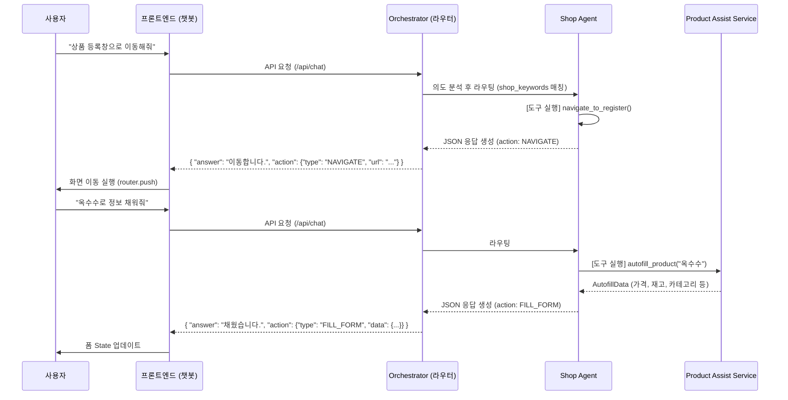

# 🛒 Shop Agent 구현 계획서 (Actionable AI)

이 문서는 챗봇에서 상품 등록 및 상점 관련 기능을 수행하기 위한 **Shop Agent** 도입 및 구현 계획을 정리한 문서입니다. 프론트엔드의 버튼 클릭 방식(직접 서비스 호출)은 유지하면서, 챗봇 대화를 통해서도 동일한 기능을 수행하고 화면을 제어(Action)할 수 있도록 설계합니다.

## 1. 구현 목표 (Goal)
- **UI 제어형 에이전트(Actionable AI):** 사용자의 채팅 입력("상품 등록창으로 가줘", "옥수수 알아서 채워줘")을 분석하여 단순 텍스트 답변뿐만 아니라 프론트엔드가 실행할 `Action` (화면 이동, 폼 채우기 등)을 반환합니다.
- **멀티 에이전트 통합:** `orchestrator.py`의 라우팅 구조에 `shop_agent`를 추가하여 의도에 맞는 분기 처리를 완성합니다.
- **기존 로직 재사용:** `product_assist_service.py`의 비즈니스 로직을 에이전트의 도구(Tool)로 감싸서(Wrap) 재사용합니다.

---

## 2. 시스템 아키텍처 흐름



---

## 3. 세부 구현 단계 (Step-by-Step)

### Step 1: 에이전트 도구(Tools) 생성
**위치:** `ai/app/agents/tools/shop_tools.py`
*   에이전트가 호출할 수 있는 `@tool` 함수들을 정의합니다.
*   `navigate_to_register_page()`: 상품 등록 페이지 경로를 반환.
*   `autofill_product_info(product_name: str)`: 내부적으로 `product_assist_service.autofill_product()`를 호출하고 그 결과를 JSON 형태로 직렬화하여 반환.

### Step 2: Shop Agent 정의
**위치:** `ai/app/agents/shop_agent.py`
*   `SHOP_AGENT_SYSTEM_PROMPT` 작성: "당신은 상품 등록을 돕는 도우미입니다. 답변 시 반드시 특정 JSON 포맷(action 포함)을 준수하세요."
*   `get_shop_agent()` 함수 작성: LangGraph의 `create_react_agent`를 활용하여 `shop_tools`가 장착된 에이전트를 생성합니다.

### Step 3: Orchestrator 연동 (라우팅 로직 수정)
**위치:** `ai/app/agents/orchestrator.py`
*   `router_node` 내부에 상품 관련 의도 파악 키워드 추가 (예: "상품", "등록", "판매", "채워줘", "수정", "상점" 등).
*   조건 달성 시 `"shop_agent"`로 라우팅.
*   서브 그래프 래퍼 `call_shop_agent` 함수 구현 및 `StateGraph` 노드 등록.

### Step 4: 응답 포맷 (Output Format) 통합
*   다른 팀원이 진행할 챗봇 라우터(`chat.py` 또는 `agent.py`)가 Orchestrator의 응답을 받을 때, 일반 텍스트인지 Action이 포함된 JSON 문자열인지 파싱하여 프론트엔드로 전달할 수 있도록 응답 규격을 합의합니다.

---

## 4. 프론트엔드 연동 규약 (참고용)
AI 백엔드는 최종적으로 다음과 같은 형식의 텍스트(또는 JSON 객체)를 반환할 것입니다. 프론트엔드 개발 시 이 규약을 바탕으로 액션을 처리하면 됩니다.

**예상 페이로드 예시:**
```json
{
  "answer": "요청하신 옥수수 상품 정보를 AI 추천 시세로 채워드렸습니다.",
  "action": {
    "type": "FILL_FORM",
    "payload": {
      "name": "옥수수",
      "price": 12500,
      "stock": 30,
      "categoryName": "채소",
      "description": "양평에서 자란 신선한 옥수수입니다.",
      "isKamisApplied": true
    }
  }
}
```
