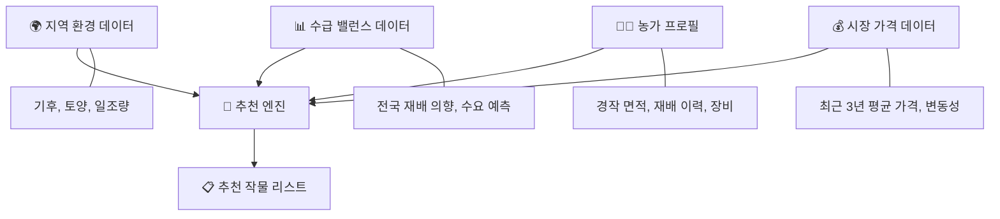
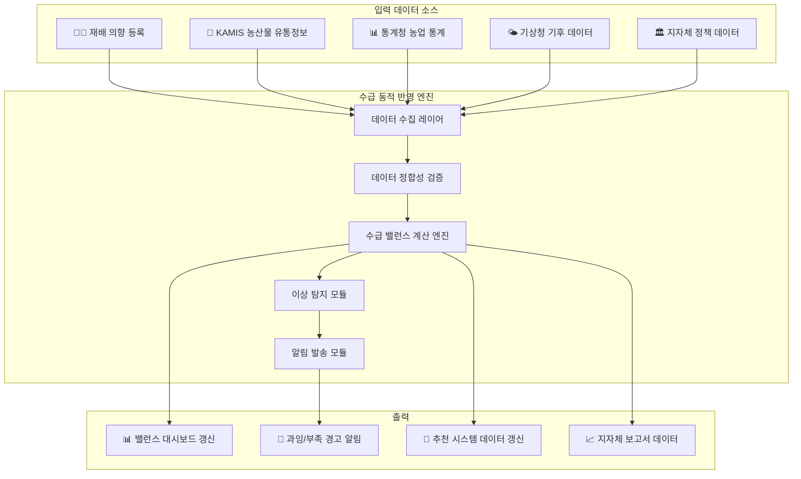
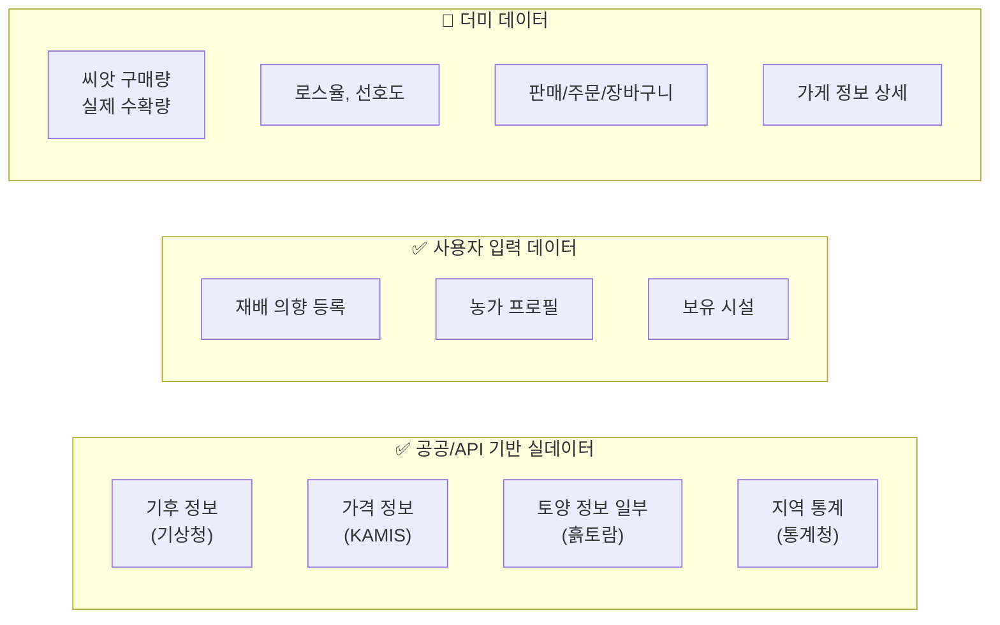
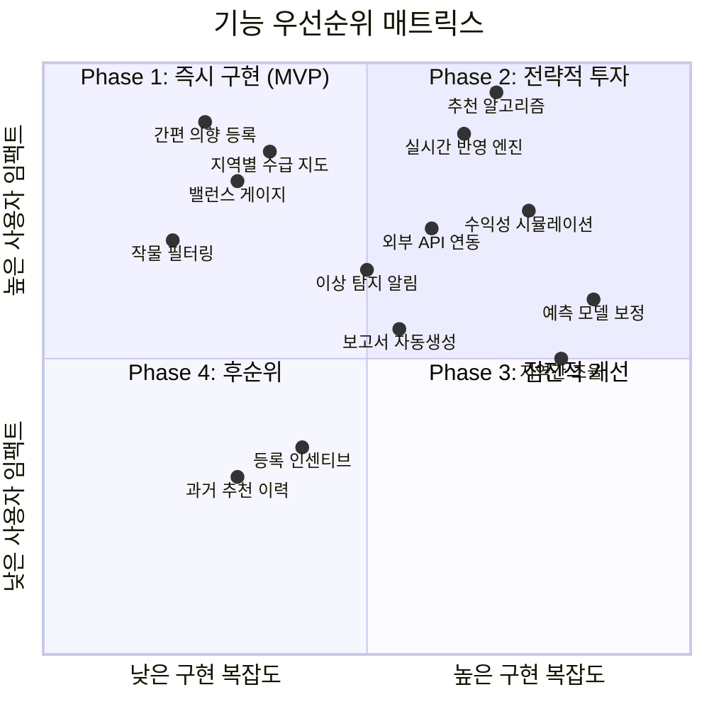
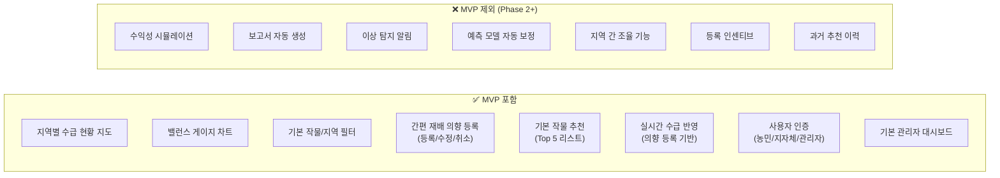
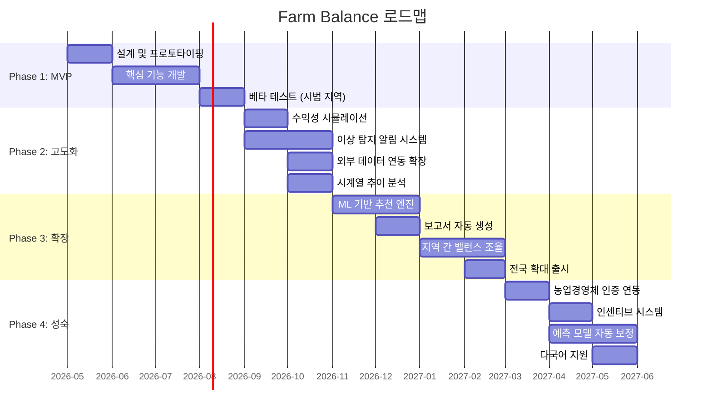

# 🌾 Farm Balance — Product Requirement Document (PRD)

> **농업 수급 밸런스 플랫폼**
> Version 1.0 | 2026-04-21 | 작성자: 서비스기획팀

---

## 목차

1. [문서 개요](#1-문서-개요)
2. [문제 정의](#2-문제-정의)
3. [제품 비전 및 목표](#3-제품-비전-및-목표)
4. [사용자 페르소나](#4-사용자-페르소나)
5. [핵심 기능 상세](#5-핵심-기능-상세)
6. [사용자 시나리오](#6-사용자-시나리오)
7. [기능 우선순위](#7-기능-우선순위)
8. [MVP 범위](#8-mvp-범위)
9. [비기능 요구사항](#9-비기능-요구사항)
10. [성공 지표 (KPI)](#10-성공-지표-kpi)
11. [리스크 및 제약사항](#11-리스크-및-제약사항)
12. [향후 로드맵](#12-향후-로드맵)

---

## 1. 문서 개요

| 항목 | 내용 |
|------|------|
| **제품명** | Farm Balance (팜 밸런스) |
| **제품 유형** | 웹 기반 농업 수급 밸런스 플랫폼 |
| **대상 사용자** | 농민, 지자체 담당자, 플랫폼 관리자 |
| **핵심 가치** | 데이터 기반 작물 수급 예측으로 농가 소득 안정화 및 지역 농업 경쟁력 강화 |
| **문서 버전** | v1.0 (Initial) |
| **최종 수정일** | 2026-04-21 |

---

## 2. 문제 정의

### 2.1 현황 분석

한국 농업은 구조적으로 **"쏠림 재배 → 과잉 공급 → 가격 폭락 → 이듬해 재배 기피 → 공급 부족 → 가격 폭등"** 의 악순환을 반복하고 있다. 이른바 **"수급 불균형의 롤러코스터"** 현상이다.


### 2.2 핵심 문제

| # | 문제 | 영향 | 심각도 |
|---|------|------|--------|
| P1 | **농민의 정보 비대칭** | 다른 농가의 재배 의향을 알 수 없어, 시장 흐름에 대한 판단 없이 작물을 선택한다. | 🔴 Critical |
| P2 | **지자체의 사후 대응** | 지자체는 수급 불균형이 발생한 *후에야* 인지하며, 선제적 정책 개입이 불가능하다. | 🔴 Critical |
| P3 | **실시간 수급 데이터 부재** | 전국 단위의 재배 의향·수급 현황을 실시간으로 통합 조회할 수 있는 시스템이 없다. | 🟠 High |
| P4 | **추천 시스템의 공백** | 농민에게 적절한 대체 작물이나 수익성 높은 작물을 추천하는 데이터 기반 시스템이 없다. | 🟠 High |

### 2.3 해결 방향

> **Farm Balance는 "재배 의향 등록 → 수급 밸런스 시각화 → 데이터 기반 작물 추천"의 선순환 구조를 만들어, 농가와 지자체 모두가 수급 균형을 사전에 조율할 수 있는 플랫폼을 제공한다.**

---

## 3. 제품 비전 및 목표

### 3.1 비전

> *"모든 농가가 데이터로 결정하고, 모든 지자체가 데이터로 조율하는 농업 생태계"*

### 3.2 미션

농업 수급 데이터를 **투명하게 공유**하고, **지능적으로 분석**하여, 농가의 합리적 의사결정과 지자체의 선제적 정책 수립을 지원한다.

### 3.3 핵심 목표

| 목표 | 측정 기준 | Target (1년 내) |
|------|----------|-----------------|
| 농가 재배 의향 등록률 향상 | 전체 등록 농가 중 의향 등록 비율 | ≥ 60% |
| 수급 불균형 사전 감지 | 과잉/부족 경고 발생 후 실제 발생 일치율 | ≥ 75% |
| 농가 소득 안정화 기여 | 플랫폼 이용 농가의 전년 대비 소득 변동 폭 감소율 | ≥ 15% |
| 지자체 정책 대응 속도 | 수급 이상 감지 ~ 정책 개입까지 소요 시간 | ≤ 7일 |

---

## 4. 사용자 페르소나

### 4.1 페르소나 A: 농민 — 김재현 (58세)

```
┌─────────────────────────────────────────────────────┐
│  👨‍🌾 김재현 (58세) | 충청남도 부여군                    │
│  경력: 30년 이상 벼·채소 혼합 재배                      │
│  기술 수준: 스마트폰 기본 활용 가능 (카카오톡, 네이버)     │
└─────────────────────────────────────────────────────┘
```

| 항목 | 내용 |
|------|------|
| **목표** | 올해 어떤 작물을 재배해야 수익을 극대화할 수 있는지 알고 싶다 |
| **행동 패턴** | 매년 1~2월 작물 선택 시 주변 농민에게 전화로 의견을 구하거나, 전년도 시세만 보고 결정 |
| **페인포인트** | ① 다른 지역 농가가 무엇을 심을지 알 수 없다 ② 작년에 잘 팔렸다고 올해도 되리란 보장이 없다 ③ 정부 보조금 정보를 늦게 접한다 |
| **기대 가치** | 전국 재배 동향을 한눈에 보고, 나에게 맞는 작물을 추천받고 싶다 |
| **핵심 니즈** | 간결한 UI, 직관적 시각화, 지역 기반 정보 필터링 |

### 4.2 페르소나 B: 지자체 담당자 — 이수진 (35세)

```
┌─────────────────────────────────────────────────────┐
│  👩‍💼 이수진 (35세) | 경상북도 안동시 농업기술센터         │
│  직급: 농업정책팀 주무관                                │
│  기술 수준: 엑셀·한글 활용 능숙, 데이터 분석 기초         │
└─────────────────────────────────────────────────────┘
```

| 항목 | 내용 |
|------|------|
| **목표** | 관할 지역의 작물 수급 현황을 실시간으로 파악하고, 과잉·부족 시 선제적으로 대응하고 싶다 |
| **행동 패턴** | 분기별 농가 방문 조사, 엑셀 기반 데이터 집계, 보고서 수작업 작성 |
| **페인포인트** | ① 농가 방문 조사에 2~3주 소요 ② 데이터 집계 후 이미 시기를 놓침 ③ 타 지자체와의 데이터 공유 체계 없음 |
| **기대 가치** | 관할 지역 수급 대시보드를 실시간으로 조회하고, 인접 지역과 비교 분석하고 싶다 |
| **핵심 니즈** | 대시보드 시각화, 데이터 다운로드(엑셀), 경고 알림, 보고서 자동 생성 |

### 4.3 페르소나 C: 플랫폼 관리자 — 박민수 (42세)

```
┌─────────────────────────────────────────────────────┐
│  🛠️ 박민수 (42세) | Farm Balance 운영팀                │
│  역할: 시스템 관리 및 데이터 품질 관리                    │
│  기술 수준: IT 시스템 운영 경험 풍부                     │
└─────────────────────────────────────────────────────┘
```

| 항목 | 내용 |
|------|------|
| **목표** | 플랫폼의 안정적 운영, 데이터 정합성 유지, 사용자 관리 |
| **행동 패턴** | 일일 데이터 정합성 체크, 사용자 문의 대응, 시스템 모니터링 |
| **페인포인트** | ① 외부 데이터(KAMIS, 통계청) 연동 오류 발생 시 수동 대응 필요 ② 사용자 인증 및 권한 관리 복잡 |
| **기대 가치** | 자동화된 데이터 파이프라인과 직관적인 관리 도구 |
| **핵심 니즈** | 데이터 연동 모니터링, 사용자 권한 관리, 시스템 헬스 대시보드 |

---

## 5. 핵심 기능 상세

### 5.1 작물 밸런스 조회

> 전국/지역별 작물의 수요-공급 밸런스를 시각적으로 조회하는 기능

#### 5.1.1 기능 개요

| 항목 | 설명 |
|------|------|
| **기능 ID** | F-001 |
| **기능명** | 작물 밸런스 조회 |
| **대상 사용자** | 농민, 지자체, 관리자 (전체) |
| **목적** | 특정 작물의 수급 현황을 한눈에 파악하여 의사결정 지원 |

#### 5.1.2 세부 요구사항

| # | 요구사항 | 우선순위 | 설명 |
|---|---------|----------|------|
| F-001-01 | **지역별 수급 현황 지도** | P0 | 전국 지도 위에 시군구 단위로 작물별 수급 상태(과잉/적정/부족)를 색상 코드로 표시 |
| F-001-02 | **작물별 밸런스 게이지** | P0 | 선택한 작물의 현재 공급량 vs 예상 수요량을 게이지 차트로 시각화 |
| F-001-03 | **시계열 추이 차트** | P1 | 최근 3년간 해당 작물의 월별 수급 추이를 라인 차트로 표시 |
| F-001-04 | **지역 필터링** | P0 | 시도 → 시군구 계층적 필터링으로 관심 지역만 조회 |
| F-001-05 | **작물 카테고리 필터** | P0 | 식량작물, 채소, 과일, 특용작물 등 대분류 → 세부 작물 선택 |
| F-001-06 | **동기 농가 수 표시** | P1 | 해당 작물의 재배 의향을 등록한 농가 수를 실시간 표시 |
| F-001-07 | **데이터 다운로드** | P2 | 조회 결과를 엑셀/CSV로 다운로드 (지자체 대상) |

#### 5.1.3 수급 상태 정의

| 상태 | 색상 | 조건 | 설명 |
|------|------|------|------|
| 🔴 과잉 경고 | Red | 공급 예측 ≥ 수요 예측 × 130% | 가격 하락 위험이 높아 재배 축소 권고 |
| 🟠 과잉 주의 | Orange | 수요 예측 × 110% ≤ 공급 예측 < 수요 예측 × 130% | 공급 과다 가능성 존재 |
| 🟢 적정 | Green | 수요 예측 × 90% ≤ 공급 예측 < 수요 예측 × 110% | 수급 균형 상태 |
| 🔵 부족 주의 | Blue | 수요 예측 × 70% ≤ 공급 예측 < 수요 예측 × 90% | 공급 부족 가능성 존재 |
| 🟣 부족 경고 | Purple | 공급 예측 < 수요 예측 × 70% | 가격 급등 위험, 재배 확대 권고 |

---

### 5.2 작물 추천 시스템

> 농가의 조건(지역, 토양, 경작 면적 등)과 시장 수급 데이터를 기반으로 최적 작물을 추천

#### 5.2.1 기능 개요

| 항목 | 설명 |
|------|------|
| **기능 ID** | F-002 |
| **기능명** | 작물 추천 시스템 |
| **대상 사용자** | 농민 |
| **목적** | 수급 밸런스, 수익성, 적합도를 종합 고려한 최적 작물 추천 |

#### 5.2.2 추천 알고리즘 입력 요소



#### 5.2.3 세부 요구사항

| # | 요구사항 | 우선순위 | 설명 |
|---|---------|----------|------|
| F-002-01 | **맞춤 추천 리스트** | P0 | 상위 5개 추천 작물을 순위와 함께 카드 형태로 표시 |
| F-002-02 | **추천 근거 표시** | P0 | 각 추천 작물에 대해 "왜 이 작물을 추천하는지" 핵심 근거 3가지 이상 표시 |
| F-002-03 | **수익성 시뮬레이션** | P1 | 추천 작물 선택 시 예상 수익 범위(최소~최대)를 시뮬레이션하여 보여줌 |
| F-002-04 | **비교 기능** | P1 | 추천 작물 2~3개를 병렬 비교할 수 있는 비교표 제공 |
| F-002-05 | **농가 프로필 기반 필터** | P0 | 경작 면적, 보유 장비, 재배 경험을 입력하면 추천 결과에 반영 |
| F-002-06 | **계절별 추천 갱신** | P1 | 파종 시기에 따라(봄작물/가을작물) 추천 결과가 자동 갱신 |
| F-002-07 | **과거 추천 이력** | P2 | 이전에 받은 추천 내역과 실제 재배 결과를 비교할 수 있는 히스토리 기능 |

#### 5.2.4 추천 점수 산정 기준

| 요소 | 가중치 | 산출 방식 |
|------|--------|----------|
| 수급 밸런스 적합도 | 35% | 부족 상태일수록 높은 점수 (과잉 작물은 감점) |
| 지역 환경 적합도 | 25% | 기후·토양·일조량과 작물 적정 조건 매칭률 |
| 예상 수익성 | 25% | 최근 3년 평균 가격 × 예상 수확량 − 평균 생산비 |
| 농가 역량 적합도 | 15% | 재배 이력·보유 장비·경작 면적과의 적합도 |

---

### 5.3 재배 의향 등록

> 농민이 올해 재배하려는 작물과 면적을 등록하여 전국 수급 데이터에 기여

#### 5.3.1 기능 개요

| 항목 | 설명 |
|------|------|
| **기능 ID** | F-003 |
| **기능명** | 재배 의향 등록 |
| **대상 사용자** | 농민 |
| **목적** | 개별 농가의 재배 계획을 수집하여 전국 수급 예측의 정확도를 높임 |

#### 5.3.2 세부 요구사항

| # | 요구사항 | 우선순위 | 설명 |
|---|---------|----------|------|
| F-003-01 | **간편 등록 폼** | P0 | 작물 선택 → 재배 면적 입력 → 파종 예정일 선택의 3단계 간편 등록 |
| F-003-02 | **복수 작물 등록** | P0 | 한 번에 여러 작물의 재배 의향을 등록할 수 있음 |
| F-003-03 | **등록 즉시 밸런스 반영** | P0 | 의향 등록 즉시 해당 지역의 수급 밸런스 게이지에 실시간 반영 |
| F-003-04 | **등록 수정/취소** | P0 | 파종 전까지 언제든 등록한 재배 의향을 수정하거나 취소 가능 |
| F-003-05 | **등록 확인 알림** | P1 | 등록 완료 시 등록 내용 요약과 해당 작물의 현재 수급 상태를 알림으로 발송 |
| F-003-06 | **이전 연도 자동 불러오기** | P1 | 전년도 재배 이력을 기반으로 올해 의향을 자동 채움(사용자가 수정 가능) |
| F-003-07 | **등록 인센티브** | P2 | 재배 의향 등록 농가에 대한 포인트·우선 정보 제공 등 인센티브 설계 |

#### 5.3.3 등록 데이터 구조

```
재배 의향 등록 데이터
├── 농가 정보
│   ├── 농가 ID (시스템 자동)
│   ├── 소재지 (시도/시군구/읍면동)
│   └── 경작 면적 (총)
├── 작물 정보 (복수 가능)
│   ├── 작물 코드
│   ├── 작물명
│   ├── 재배 예정 면적 (㎡)
│   ├── 파종 예정일
│   └── 예상 수확 시기
├── 메타 정보
│   ├── 등록 일시
│   ├── 최종 수정 일시
│   └── 상태 (등록/수정/취소)
└── 확인 상태
    ├── 미확인
    ├── 지자체 확인 완료
    └── 실재배 확인 완료
```

---

### 5.4 수급 동적 반영

> 재배 의향 데이터와 외부 데이터를 결합하여 수급 밸런스를 실시간으로 갱신하는 백엔드 엔진

#### 5.4.1 기능 개요

| 항목 | 설명 |
|------|------|
| **기능 ID** | F-004 |
| **기능명** | 수급 동적 반영 엔진 |
| **대상 사용자** | 시스템 내부 (모든 사용자에게 간접 영향) |
| **목적** | 수급 데이터를 실시간으로 갱신하여 플랫폼 전체의 데이터 신뢰도 유지 |

#### 5.4.2 데이터 흐름 아키텍처



#### 5.4.3 세부 요구사항

| # | 요구사항 | 우선순위 | 설명 |
|---|---------|----------|------|
| F-004-01 | **실시간 반영** | P0 | 재배 의향 등록/수정/취소 시 5분 이내에 밸런스 데이터에 반영 |
| F-004-02 | **외부 데이터 연동** | P0 | KAMIS, 통계청, 기상청 API와 정기 연동 (최소 일 1회) |
| F-004-03 | **수급 밸런스 계산** | P0 | `공급 예측 = 재배 의향 면적 × 단위 면적당 예상 수확량`<br>`수요 예측 = 과거 소비 데이터 + 계절 보정 + 인구 변동 보정` |
| F-004-04 | **이상 탐지 알림** | P1 | 특정 작물의 수급 비율이 임계치를 넘을 경우 관련 사용자에게 자동 알림 |
| F-004-05 | **데이터 이력 관리** | P1 | 모든 수급 변동 이력을 타임스탬프와 함께 보관 (최소 5년) |
| F-004-06 | **지역 간 밸런스 조율** | P2 | 인접 지역 간 과잉/부족 상호 보완 가능성을 자동 분석 |
| F-004-07 | **예측 모델 자동 보정** | P2 | 실제 수확 데이터가 수집될 때마다 예측 모델의 정확도를 자동 보정 |

---

### 5.5 데이터 출처 및 수집 전략

> Farm Balance의 모든 기능은 데이터에 기반한다. 본 섹션은 **"그래서 그 데이터는 어디서 오는가?"**에 대한 답변이다.

#### 5.5.1 데이터 분류 기준 (실데이터 / 사용자 입력 / 더미)

플랫폼에서 다루는 데이터는 획득 방식과 신뢰도에 따라 크게 3가지로 구분된다.

1. **공공/API 기반 실데이터** (초기부터 즉시 연동 가능한 실제 데이터)
   - 기상·기후 정보 (기상청)
   - 농산물 가격 정보 (KAMIS)
   - 지역/작물 기본 통계 (통계청)
   - 토양 정보 (흙토람 - 가능한 범위 내 연동)
2. **사용자 입력 데이터** (서비스 내에서 사용자가 직접 입력·축적)
   - 재배 의향 등록 데이터
   - 농가 프로필
   - 보유 시설
   - 과거 재배 이력
3. **더미 데이터** (초기 실제 확보가 불가능하여 MVP 단계에서 가상으로 구성)
   - 농업 관련: 씨앗 구매량, 실제 수확량, 로스율, 작물별 선호도
   - 커머스 관련: 농산물 판매 / 주문 / 장바구니 데이터
   - 기타: 가게 정보의 일부 상세 속성

#### 5.5.2 데이터 출처 총괄표

| # | 데이터 항목 | 출처 | 수집 방식 | 수집 주기 | MVP 전략 | Phase 2+ 전략 |
|---|-----------|------|----------|----------|----------|---------------|
| D-01 | **작물 시세·가격** | KAMIS (농산물유통정보) | Open API 연동 | 일 1회 | ✅ 실제 API 연동 | 실시간 연동 확대 |
| D-02 | **기후·기상 데이터** | 기상청 (기상자료개방포털) | Open API 연동 | 일 1회 | ✅ 실제 API 연동 | 시간대별 연동 |
| D-03 | **토양 정보** | 흙토람 (농촌진흥청) | 정적 데이터 수집 | 연 1회 갱신 | ⚠️ 주요 지역만 수집 + 더미 보완 | 전국 매핑 완료 |
| D-04 | **재배 의향 데이터** | 사용자 직접 입력 | 플랫폼 내 등록 | 실시간 | ✅ 핵심 데이터 — 사용자 입력 | 지자체 대행 등록 추가 |
| D-05 | **단위면적당 수확량** | 통계청 농업총조사 | 정적 데이터 수집 | 연 1회 | ⚠️ 주요 30개 작물 실데이터 + 나머지 더미 | 전체 작물 확대 |
| D-06 | **수요·소비 데이터** | 통계청 소비동향 + KAMIS 반출량 | Open API + 정적 수집 | 월 1회 | ⚠️ 과거 3년 평균 기반 추정 | ML 기반 수요 예측 |
| D-07 | **농가 생산비** | 통계청 농산물생산비조사 | 정적 데이터 수집 | 연 1회 | ⚠️ 주요 작물만 실데이터 + 더미 | 전체 작물 확대 |
| D-08 | **씨앗 구매량** | — (공식 데이터 부재) | — | — | 🔴 더미 데이터 | 종묘사·농협 데이터 연계 협의 |
| D-09 | **실제 수확량·로스율** | — (수확 후 직접 수집) | 사용자 입력 (수확 보고) | 수확 후 1회 | 🔴 더미 데이터 | 사용자 수확 보고 기능 도입 |
| D-10 | **지역 인구 변동** | 통계청 인구동향조사 | 정적 데이터 수집 | 연 1회 | ⚠️ 시군구별 정적 데이터 | 자동 연동 |
| D-11 | **부과 기능/B2B 데이터** | — (커머스/선호도 등) | — | — | 🔴 전체 더미 데이터 | 실사용자 기반 데이터 축적 |

#### 5.5.3 데이터 출처 상세

**D-01. 작물 시세·가격 — KAMIS**

| 항목 | 내용 |
|------|------|
| 출처 | [KAMIS 농산물유통정보](https://www.kamis.or.kr) |
| API | KAMIS Open API (일별 도·소매 가격 조회) |
| 제공 데이터 | 품목별 일자별 도매/소매 가격, 반입량, 거래량 |
| 커버리지 | 주요 농산물 약 200개 품목 |
| 제약사항 | 일 API 호출 한도 존재, 일부 특수 작물 미제공 |
| 용도 | 추천 시스템의 수익성 점수 산출, 시세 동향 표시 |

**D-02. 기후·기상 — 기상청**

| 항목 | 내용 |
|------|------|
| 출처 | [기상자료개방포털](https://data.kma.go.kr) |
| API | 기상청 Open API (지상관측, 중기예보) |
| 제공 데이터 | 지역별 기온, 강수량, 일조시간, 중기 예보 |
| 커버리지 | 전국 약 600개 관측소 |
| 용도 | 추천 시스템의 지역 환경 적합도 점수 산출 |

**D-03. 토양 정보 — 흙토람**

| 항목 | 내용 |
|------|------|
| 출처 | [흙토람](https://soil.rda.go.kr) (농촌진흥청) |
| 수집 방식 | 웹 크롤링 또는 데이터 덤프 요청 |
| 제공 데이터 | 필지별 토양 유형, 배수등급, pH, 유기물 함량 |
| MVP 전략 | **시범 지역(2~3개 시군구) 토양 데이터만 실제 수집**, 나머지 지역은 시군구 단위 평균값으로 더미 처리 |
| 용도 | 추천 시스템의 지역 환경 적합도 산출 보조 |

**D-04. 재배 의향 — 사용자 입력 (자체 수집)**

| 항목 | 내용 |
|------|------|
| 출처 | Farm Balance 플랫폼 사용자 직접 등록 |
| 데이터 구조 | 작물, 재배 면적(㎡), 파종 예정일, 예상 수확일 |
| 특성 | **Farm Balance의 핵심 고유 데이터** — 타 시스템에는 존재하지 않음 |
| 신뢰성 보장 | 지자체 교차 검증, 면적 정합성 자동 체크, 이상치 탐지 |
| 용도 | 공급 예측의 핵심 입력값 |

**D-05~07. 통계 데이터 — 통계청**

| 항목 | 내용 |
|------|------|
| 출처 | [KOSIS 국가통계포털](https://kosis.kr) |
| 수집 데이터 | 단위면적당 수확량, 농산물 소비동향, 농가 생산비 |
| 수집 방식 | 연 1회 정적 데이터 갱신 (CSV/API) |
| MVP 전략 | 주요 30개 작물(벼, 고추, 마늘, 배추, 토마토 등)은 실데이터 적용, 나머지는 카테고리 평균값으로 더미 처리 |

**D-08~09. 미확보 데이터 — MVP 더미 전략**

| 항목 | MVP 처리 방안 | 향후 확보 계획 |
|------|-------------|---------------|
| 씨앗 구매량 | 더미 데이터 (재배 의향 면적 기반 추정값 사용) | 종묘사·농협과의 데이터 제휴 추진 |
| 실제 수확량 | 더미 데이터 (통계청 평균 수확량 사용) | Phase 3에서 사용자 "수확 보고" 기능 도입 |
| 로스율 | 더미 데이터 (작물별 업계 평균 기본값 10~20% 적용) | 실제 수확 보고 데이터 축적 후 보정 |
| 기타 커머스/속성 | 판매/주문/장바구니, 가게·선호도 상세정보 더미 처리 | 기능 확장 시 실제 비즈니스 로직 적용 |

#### 5.5.4 데이터 흐름과 계산 공식

```
[공급 예측]
  공급 예측(톤) = Σ (재배 의향 면적 × 단위면적당 수확량 × (1 − 로스율))
                     ↑ D-04 사용자 입력    ↑ D-05 통계청         ↑ D-09 더미(MVP)

[수요 예측]
  수요 예측(톤) = 과거 3년 평균 소비량 × 계절 보정 계수 × 인구 변동 계수
                     ↑ D-06 통계청/KAMIS    ↑ 내부 산출         ↑ D-10 통계청

[수급 비율]
  수급 비율(%) = (공급 예측 / 수요 예측) × 100

[추천 점수 — 수익성]
  예상 수익(원) = (수확량 × KAMIS 3년 평균가) − (면적 × 평균 생산비)
                      ↑ D-05           ↑ D-01               ↑ D-07

[추천 점수 — 환경 적합도]
  환경 점수 = f(기상청 기후 데이터, 흙토람 토양 데이터, 작물 적정 조건)
                    ↑ D-02               ↑ D-03
```

#### 5.5.5 MVP 데이터 전략 요약



> **MVP 원칙:** 
> - **실데이터**: 초기부터 바로 API 연동 등 실제 데이터를 확보하여 붙인다. (기후, 가격, 기본 통계 등)
> - **사용자 입력**: 서비스 구조 안에서 자연스럽게 수집·축적한다. (재배 의향, 프로필 등)
> - **더미 데이터**: 비즈니스 확장 시 필요한 요소나 초기 수집 불가 항목(판매, 씨앗, 실제 수확량 등)은 형태만 갖추고 가상 데이터로 처리하되, 향후 점진적으로 실제화한다.

---

## 6. 사용자 시나리오

### 6.1 시나리오 1: 농민의 재배 의사결정

> **페르소나:** 김재현 (농민, 58세)
> **상황:** 2월 초, 올해 벼 대신 다른 작물로 전환할지 고민 중

```
Step 1️⃣  김재현은 Farm Balance에 로그인한다.
         → 메인 대시보드에서 "내 지역 수급 현황"을 확인한다.

Step 2️⃣  "작물 밸런스 조회" 메뉴에서 '벼'를 검색한다.
         → 충남 부여군에서 벼의 수급 상태가 🔴 과잉 경고임을 확인한다.
         → "올해 벼 재배 의향 농가가 전년 대비 25% 증가" 안내를 확인한다.

Step 3️⃣  "작물 추천" 메뉴로 이동한다.
         → 내 농가 프로필(부여군, 3,000㎡, 비닐하우스 보유)을 기준으로
            추천 작물이 표시된다:
            1위: 파프리카 (수급: 부족 주의, 예상 수익: ★★★★★)
            2위: 방울토마토 (수급: 적정, 예상 수익: ★★★★☆)
            3위: 시금치 (수급: 부족 주의, 예상 수익: ★★★☆☆)

Step 4️⃣  파프리카와 방울토마토를 비교 기능으로 상세 비교한다.
         → 추천 근거, 예상 수익 범위, 필요 장비를 확인한다.

Step 5️⃣  파프리카로 결정하고, "재배 의향 등록" 메뉴로 이동한다.
         → 파프리카 / 2,500㎡ / 3월 중순 파종을 등록한다.

Step 6️⃣  등록 확인 화면에서 현재 파프리카의 수급 상태와
         등록으로 인한 밸런스 변화를 확인한다.
         → "등록 완료! 현재 충남 지역 파프리카 수급: 🟢 적정" 안내 확인
```

### 6.2 시나리오 2: 지자체의 선제적 정책 개입

> **페르소나:** 이수진 (지자체 담당자, 35세)
> **상황:** 안동시 관내 고추 재배 의향이 급증하는 것을 감지

```
Step 1️⃣  이수진은 Farm Balance 지자체 대시보드에 접속한다.
         → "안동시 수급 현황 요약"에서 🔴 경고 배지 1건을 확인한다.

Step 2️⃣  경고를 클릭하면 상세 정보가 표시된다:
         → "고추: 재배 의향 면적이 전년 동기 대비 40% 증가"
         → "현재 수급 상태: 과잉 경고 (공급 예측 / 수요 예측 = 145%)"

Step 3️⃣  "지역 비교" 기능으로 인접 지역(영주, 예천)의 고추 수급을 확인한다.
         → 인접 지역도 과잉 추세임을 확인하여 전국적 쏠림으로 판단한다.

Step 4️⃣  "보고서 생성" 기능으로 안동시 고추 수급 분석 보고서를 자동 생성한다.
         → PDF 보고서에 시계열 그래프, 인접 지역 비교, 정책 제언이 포함된다.

Step 5️⃣  보고서를 기반으로 관내 농가에 "고추 재배 축소 권고 + 대체 작물 추천" 
         공지를 발송한다.
         → (향후) 플랫폼 내 공지 발송 기능 연동 예정
```

### 6.3 시나리오 3: 관리자의 데이터 품질 관리

> **페르소나:** 박민수 (플랫폼 관리자, 42세)
> **상황:** KAMIS 데이터 연동에서 오류가 감지됨

```
Step 1️⃣  박민수는 관리자 대시보드에 접속한다.
         → 시스템 헬스 패널에 "KAMIS 데이터 연동 실패" 경고를 확인한다.

Step 2️⃣  "데이터 연동 모니터링" 메뉴에서 상세 로그를 확인한다.
         → API 응답 타임아웃으로 인한 실패, 마지막 성공: 6시간 전

Step 3️⃣  수동 재연동을 트리거하고, 성공을 확인한다.
         → 누락된 6시간분의 데이터가 밸런스 엔진에 반영됨

Step 4️⃣  "사용자 관리" 메뉴에서 신규 지자체 계정 승인 요청 3건을 처리한다.
         → 관할 지역 확인 후 권한(지자체 레벨)을 부여한다.

Step 5️⃣  "데이터 정합성 리포트"를 확인한다.
         → 특정 농가의 재배 의향 면적이 보유 면적보다 큰 비정상 데이터 2건 발견
         → 해당 농가에 확인 요청 알림을 발송한다.
```

---

## 7. 기능 우선순위

### 7.1 우선순위 매트릭스

기능 우선순위는 **사용자 임팩트**와 **구현 복잡도**를 기준으로 산정한다.



### 7.2 우선순위 정리

| 순위 | 기능 | Phase | 근거 |
|------|------|-------|------|
| **P0** | 지역별 수급 현황 지도 | MVP | 핵심 가치 제안의 시각적 구현, 모든 사용자에게 즉각적 가치 |
| **P0** | 작물별 밸런스 게이지 | MVP | 수급 상태를 직관적으로 이해하기 위한 핵심 시각화 |
| **P0** | 간편 재배 의향 등록 | MVP | 데이터 수집의 핵심 루프, 플랫폼 가치의 원천 |
| **P0** | 지역/작물 필터링 | MVP | 기본적인 데이터 탐색 기능 |
| **P0** | 맞춤 추천 리스트 (기본) | MVP | 농민에게 가장 실질적인 가치 제공 |
| **P0** | 실시간 수급 반영 (기본) | MVP | 데이터 신뢰성의 근간 |
| **P1** | 추천 근거 표시 | Phase 2 | 추천 결과의 신뢰성 강화 |
| **P1** | 시계열 추이 차트 | Phase 2 | 중장기 판단을 위한 트렌드 시각화 |
| **P1** | 수익성 시뮬레이션 | Phase 2 | 의사결정의 경제적 근거 강화 |
| **P1** | 이상 탐지 알림 | Phase 2 | 지자체의 선제적 대응 지원 |
| **P1** | 외부 데이터 연동 확장 | Phase 2 | 데이터 정확도 향상 |
| **P2** | 보고서 자동 생성 | Phase 3 | 지자체 업무 효율화 |
| **P2** | 예측 모델 자동 보정 | Phase 3 | 장기적 데이터 품질 향상 |
| **P2** | 지역 간 밸런스 조율 | Phase 3 | 광역 수급 최적화 |
| **P2** | 등록 인센티브 시스템 | Phase 3 | 농가 참여율 향상 |

---

## 8. MVP 범위

### 8.1 MVP 정의

> **MVP 핵심 원칙:** "농민이 수급 현황을 조회하고, 재배 의향을 등록하면, 밸런스가 갱신되고, 기본 추천을 받을 수 있는 최소 루프"

### 8.2 MVP 기능 스코프



### 8.3 MVP 상세 스코프

| 영역 | 포함 | 제외 |
|------|------|------|
| **조회** | 전국 지도 기반 수급 현황, 작물별 밸런스 게이지, 시도/시군구 필터 | 시계열 추이 차트, 데이터 다운로드 |
| **추천** | 수급 밸런스 + 지역 기반 Top 5 추천 | 수익성 시뮬레이션, 비교 기능, 과거 이력 |
| **등록** | 작물·면적·파종일 기본 등록, 수정/취소 | 전년도 자동 불러오기, 인센티브 시스템 |
| **반영** | 의향 등록 기반 밸런스 재계산 (5분 내) | 외부 API 실시간 연동, 이상 탐지, 모델 보정 |
| **사용자** | 회원가입/로그인, 역할 기반 접근 제어 | 소셜 로그인, 농업경영체 인증 연동 |
| **관리** | 사용자 관리, 기본 시스템 모니터링 | 데이터 연동 모니터링, 정합성 리포트 |

### 8.4 MVP 개발 일정 (예상)

| Phase | 기간 | 주요 산출물 |
|-------|------|------------|
| **설계** | 2주 | UI/UX 와이어프레임, DB 스키마, API 명세 |
| **백엔드 개발** | 4주 | API 서버, DB 구축, 밸런스 계산 엔진 |
| **프론트엔드 개발** | 4주 | 대시보드, 조회 화면, 등록 폼, 추천 화면 |
| **통합 테스트** | 2주 | E2E 테스트, 성능 테스트, 사용성 테스트 |
| **베타 출시** | 1주 | 시범 지역(2~3개 시군구) 한정 출시 |
| **합계** | **13주** | - |

---

## 9. 비기능 요구사항

### 9.1 성능

| 항목 | 요구사항 |
|------|---------|
| 페이지 로딩 | 주요 화면 First Contentful Paint ≤ 2초 |
| API 응답 시간 | 일반 조회 API ≤ 500ms, 추천 API ≤ 2초 |
| 동시 사용자 | 최소 1,000명 동시 접속 지원 |
| 데이터 갱신 | 재배 의향 등록 후 밸런스 반영까지 ≤ 5분 |

### 9.2 보안

| 항목 | 요구사항 |
|------|---------|
| 인증 | JWT 기반 토큰 인증, 세션 타임아웃 30분 |
| 권한 | 역할 기반 접근 제어 (RBAC): 농민 / 지자체 / 관리자 |
| 데이터 보호 | 개인정보 암호화 저장 (AES-256), HTTPS 통신 필수 |
| 감사 로그 | 주요 데이터 변경 시 감사 로그 기록 (who, when, what) |

### 9.3 접근성 및 호환성

| 항목 | 요구사항 |
|------|---------|
| 반응형 | 모바일(360px) ~ 데스크톱(1920px) 반응형 지원 |
| 브라우저 | Chrome, Safari, Edge 최신 2개 버전 |
| 접근성 | WCAG 2.1 AA 기준 준수 |
| 언어 | 한국어 (v1), 다국어 확장 고려한 i18n 구조 |

### 9.4 데이터

| 항목 | 요구사항 |
|------|---------|
| 백업 | 일 1회 자동 백업, 30일 보관 |
| 보관 | 수급 데이터 최소 5년 보관 |
| 정합성 | 재배 의향 ↔ 밸런스 데이터 간 정합성 검증 배치 일 1회 |

---

## 10. 성공 지표 (KPI)

### 10.1 핵심 지표

| 카테고리 | 지표 | 목표 (출시 6개월) | 측정 방법 |
|----------|------|-------------------|----------|
| **참여** | 재배 의향 등록 농가 수 | ≥ 500 농가 | 등록 데이터 카운트 |
| **참여** | 월간 활성 사용자 (MAU) | ≥ 1,000 | 로그인 기반 Unique User |
| **활용** | 추천 결과 열람률 | ≥ 70% | 추천 페이지 조회 / 로그인 사용자 |
| **품질** | 수급 예측 정확도 | ≥ 70% | 예측 vs 실제 오차율 |
| **만족** | 사용자 만족도 (NPS) | ≥ 40 | 분기별 설문 조사 |
| **효율** | 지자체 보고서 작성 시간 절감 | ≥ 50% | 기존 대비 소요 시간 |

### 10.2 보조 지표

| 지표 | 목표 | 설명 |
|------|------|------|
| 재배 의향 등록 완료율 | ≥ 80% | 등록 시작 → 완료 전환율 |
| 평균 세션 시간 | ≥ 5분 | 사용자 참여 깊이 |
| 추천 → 등록 전환율 | ≥ 30% | 추천받은 작물을 실제 등록한 비율 |
| 데이터 연동 성공률 | ≥ 99.5% | 외부 API 연동 안정성 |

---

## 11. 리스크 및 제약사항

### 11.1 리스크

| # | 리스크 | 영향도 | 발생 가능성 | 대응 방안 |
|---|--------|--------|------------|----------|
| R1 | **농가 참여율 저조** | 🔴 High | 🟠 Medium | 초기 시범 지역 집중 운영, 지자체 협력 홍보, 인센티브 설계 |
| R2 | **데이터 신뢰도 이슈** | 🔴 High | 🟠 Medium | 의향 등록 데이터의 지자체 교차 검증 프로세스, 이상치 탐지 |
| R3 | **외부 데이터 연동 불안정** | 🟠 Medium | 🟠 Medium | 캐시 레이어 구축, Fallback 데이터 전략, 모니터링 알림 |
| R4 | **고령 농가의 디지털 접근성** | 🟠 Medium | 🔴 High | 심플 UI, 큰 글씨, 지자체 대행 등록 기능, 오프라인 연계 |
| R5 | **정책 변동 리스크** | 🟡 Low | 🟡 Low | 정책 데이터의 유연한 설정 구조, 모듈화 아키텍처 |

### 11.2 제약사항

| 항목 | 내용 |
|------|------|
| **법적 제약** | 개인정보보호법 준수 필수, 농가 위치 정보는 시군구 단위까지만 공개 |
| **데이터 제약** | KAMIS API 일 호출 한도 존재, 일부 품목 데이터 미제공 |
| **기술 제약** | MVP 단계에서는 ML 기반 추천보다 규칙 기반 추천으로 시작 |
| **예산 제약** | MVP는 클라우드 비용 최적화 우선, 트래픽 증가 시 스케일링 계획 필요 |

---

## 12. 향후 로드맵



---

## 부록

### A. 용어 정의

| 용어 | 정의 |
|------|------|
| **수급 밸런스** | 특정 작물의 예상 공급량과 예상 수요량의 비율 |
| **재배 의향** | 농가가 특정 작물을 재배할 계획이 있음을 플랫폼에 등록하는 행위 |
| **쏠림 재배** | 다수의 농가가 동일 작물에 집중 재배하는 현상 |
| **KAMIS** | 농산물유통정보시스템 (Korea Agricultural Marketing Information Service) |
| **밸런스 엔진** | 수급 데이터를 실시간으로 計산·갱신하는 백엔드 시스템 모듈 |

### B. 참고 자료

- 농림축산식품부, 「2025년 주요 농산물 수급 동향」
- 한국농촌경제연구원 (KREI), 「농업 전망 보고서」
- KAMIS 농산물유통정보 (kamis.or.kr)
- 통계청 농림어업조사

---

> **문서 이력**
>
> | 버전 | 날짜 | 작성자 | 변경 내용 |
> |------|------|--------|----------|
> | v1.0 | 2026-04-21 | 서비스기획팀 | 초안 작성 |
> | v1.1 | 2026-04-21 | 서비스기획팀 | 5.5 데이터 출처 및 수집 전략 섹션 추가 |
