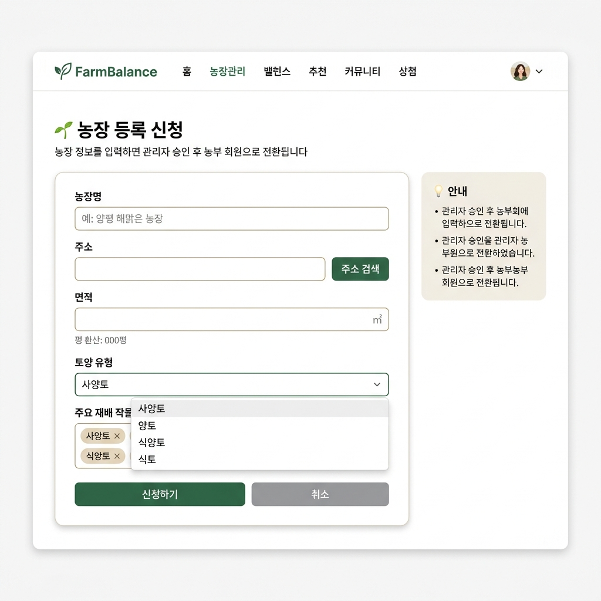
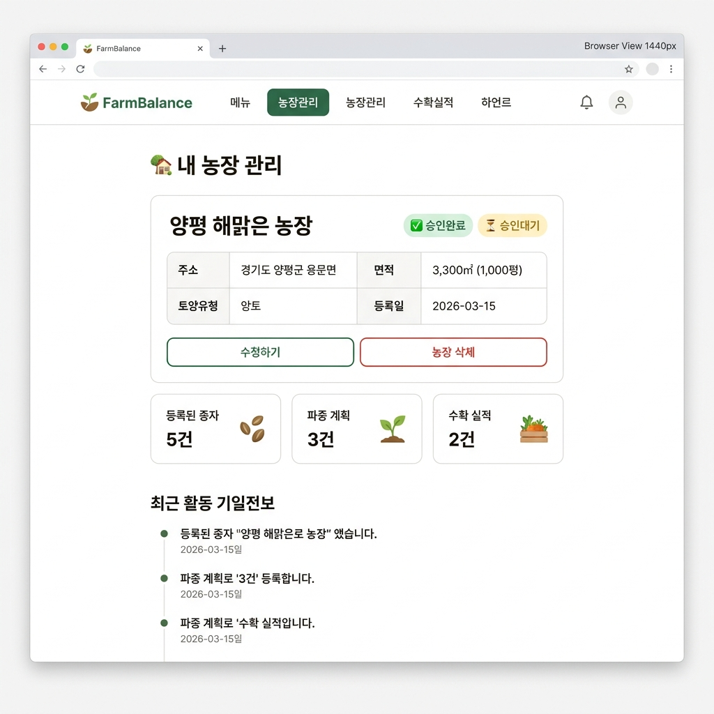
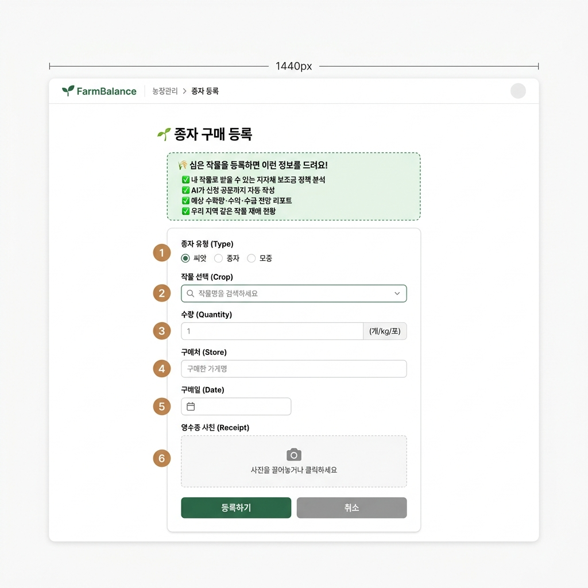
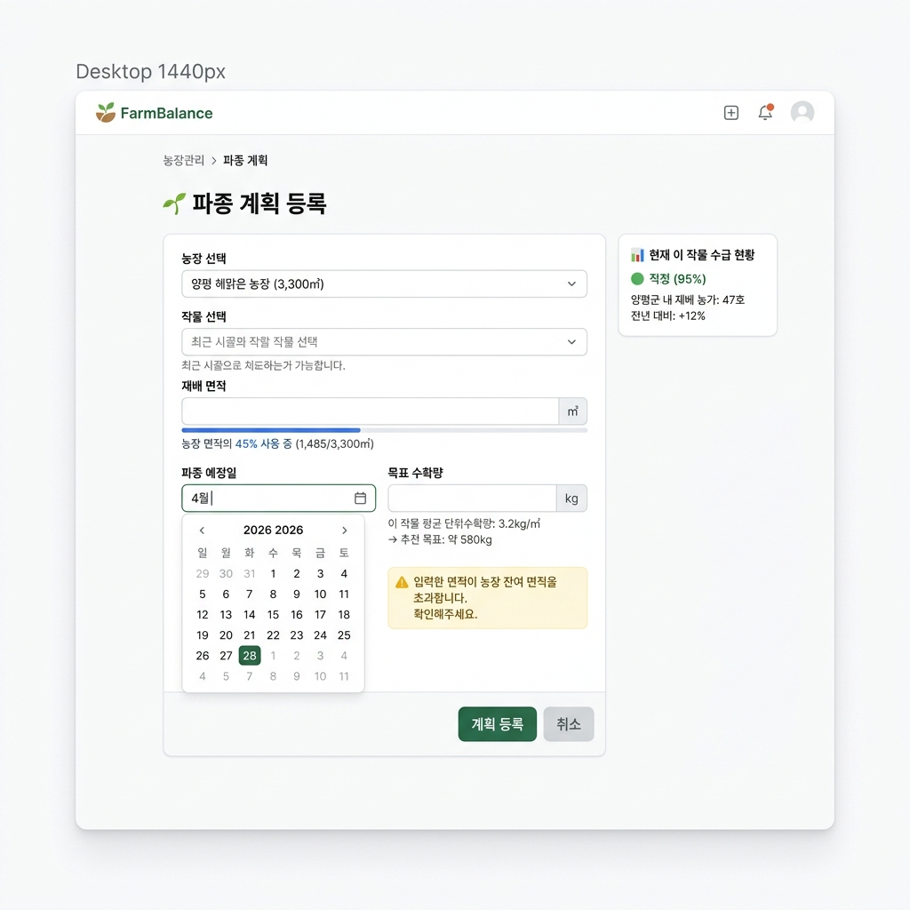
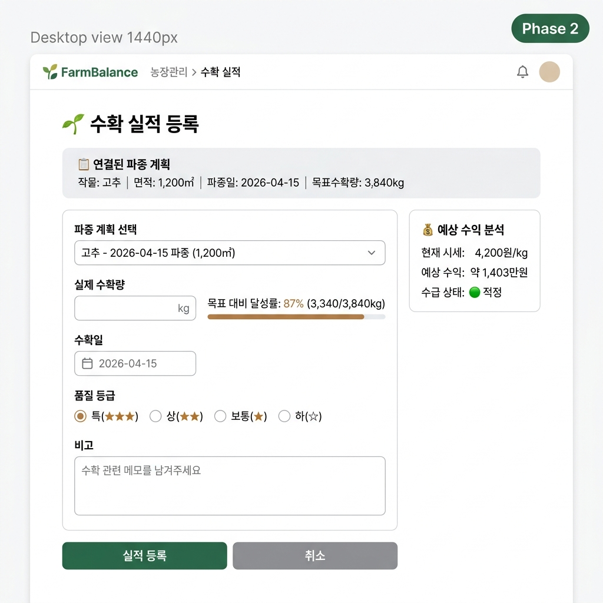

# 🌾 농장 관리 화면 초안 (S-10 ~ S-14)

> 화면 목록 IA `§3.2 농장 관리 화면` 기반으로 제작된 UI 초안입니다.

---

## S-10. 농장 등록 신청 (`/farm/register`)

| 항목 | 내용 |
|------|------|
| **입력 필드** | 농장명, 주소(검색), 면적(㎡/평 환산), 토양 유형(드롭다운), 주요 재배 작물(태그) |
| **버튼** | 신청하기 (Primary), 취소 (Secondary) |
| **우측 안내** | 승인 프로세스 안내 카드 |
| **접근 권한** | 일반유저 |
| **MVP** | ✅ |

---

## S-11. 농장 정보 관리 (`/farm`)

| 항목 | 내용 |
|------|------|
| **주요 구성** | 농장 기본 정보 카드 + 승인 상태 뱃지(승인완료/승인대기) |
| **통계 카드** | 등록된 종자 건수, 파종 계획 건수, 수확 실적 건수 |
| **하단** | 최근 활동 타임라인 (종자 등록, 파종 계획 등) |
| **액션** | 수정하기, 농장 삭제 |
| **접근 권한** | 일반유저, 농부 |
| **MVP** | ✅ |

---

## S-12. 종자 구매 등록 (`/farm/seed`)

| 항목 | 내용 |
|------|------|
| **유도 배너** | 🌾 "심은 작물을 등록하면 보조금 정책 분석 + 공문 자동 작성 + 예측 리포트 제공!" |
| **입력 필드** | 종자 유형(씨앗/종자/모종), 작물 선택(검색), 수량(개/kg/포), 구매처, 구매일, 영수증 사진 |
| **특징** | 등록 완료 시 → AI 정책 매칭 + 예측 리포트 즉시 표시 (등록 유도 핵심 인센티브) |
| **접근 권한** | 일반유저, 농부 |
| **MVP** | ✅ |

---

## S-13. 파종 계획 등록 (`/farm/plan`)

| 항목 | 내용 |
|------|------|
| **입력 필드** | 농장 선택, 작물 선택, 재배 면적(㎡ + 사용량 프로그레스 바), 파종 예정일(달력), 목표 수확량(kg) |
| **검증** | 농장 잔여 면적 초과 시 ⚠️ 경고 표시 (Soft Validation) |
| **우측 패널** | 현재 해당 작물 수급 현황 미니 카드 (적정/과잉/부족, 재배 농가 수, 전년 대비) |
| **도움말** | 작물별 평균 단위수확량 기반 추천 목표량 자동 표시 |
| **접근 권한** | 일반유저, 농부 |
| **MVP** | ✅ |

---

## S-14. 수확 실적 등록 (`/farm/harvest`)

| 항목 | 내용 |
|------|------|
| **연결 정보** | 연결된 파종 계획 요약 카드 (작물, 면적, 파종일, 목표수확량) |
| **입력 필드** | 파종 계획 선택, 실제 수확량(kg + 달성률 프로그레스바), 수확일, 품질 등급(특/상/보통/하), 비고 |
| **우측 패널** | 예상 수익 분석 카드 (현재 시세, 예상 수익, 수급 상태) |
| **접근 권한** | 일반유저, 농부 |
| **MVP** | ⬜ (Phase 2) |

---

## 디자인 공통 요소

| 항목 | 가이드 |
|------|--------|
| **컬러** | Primary: #2D6A4F (자연 녹색), 경고: #F59E0B (황색), 에러: #EF4444 (적색) |
| **글꼴 최소** | 16px (고령 농업인 배려) |
| **터치 영역** | 44px 이상 (모바일 대응) |
| **레이아웃** | 좌측 폼 + 우측 컨텍스트 정보 패턴 |
| **네비게이션** | FarmBalance 로고 + 메인 메뉴 + 브레드크럼 |
